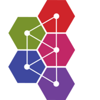
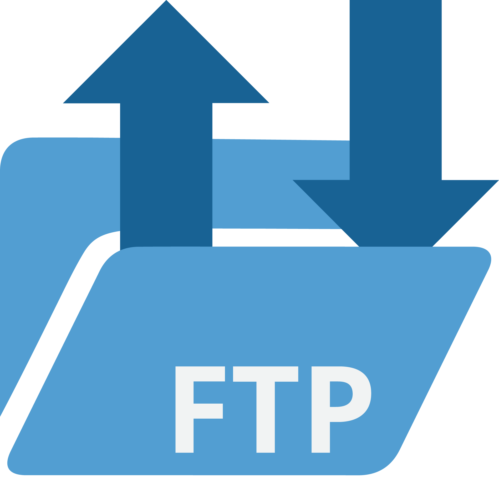
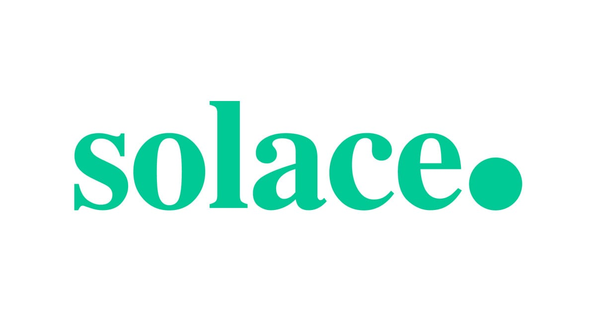
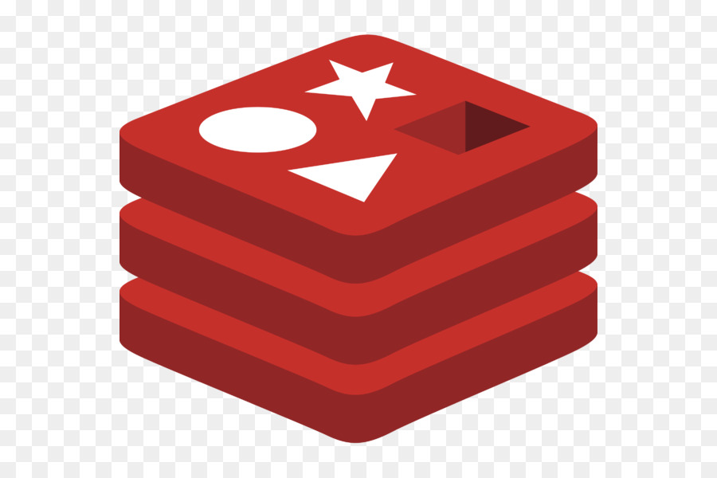
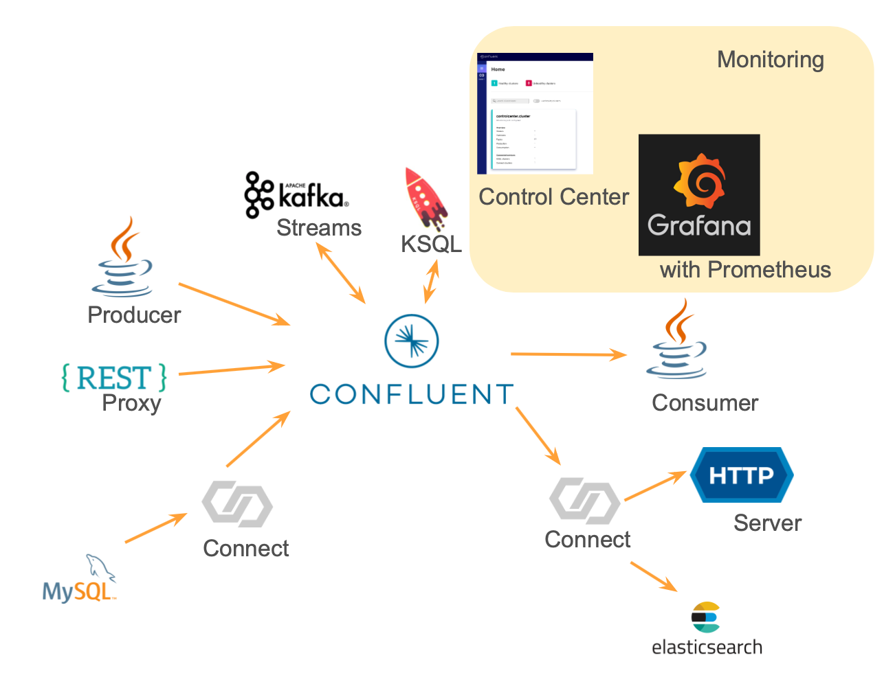

<!-- omit in toc -->
#    kafka-docker-playground 

Playground for Kafka/Confluent Docker experimentations...

ℹ️ [How to run](https://github.com/vdesabou/kafka-docker-playground/wiki/How-to-run)

<!-- omit in toc -->
## Table of Contents

- [🔗 Kafka Connectors](#-kafka-connectors)
- [☁️ Confluent Cloud](#️-confluent-cloud)
  - [Confluent Cloud Demo](#confluent-cloud-demo)
  - [🔗 Kafka Connectors connected to Confluent Cloud](#-kafka-connectors-connected-to-confluent-cloud)
  - [Other](#other)
- [🔄 Confluent Replicator and Mirror Maker 2](#-confluent-replicator-and-mirror-maker-2)
- [🔐 Environments](#-environments)
- [Confluent Commercial](#confluent-commercial)
- [CP-Ansible Playground](#cp-ansible-playground)
- [👾 Other Playgrounds](#-other-playgrounds)
- [📚 Useful Resources](#-useful-resources)

## 🔗 Kafka Connectors

Quick start examples from Confluent [docs](https://docs.confluent.io/current/connect/managing/index.html) but in Docker version for ease of use.

| Connector  | Product Category  | Latest Version (*) | Type | Release Date|  [Travis](https://travis-ci.com/github/vdesabou/kafka-docker-playground)
|---|---|---|---|---|---|
|  [ActiveMQ Sink](connect/connect-active-mq-sink)  | Message Queue  | 1.1.6 | Confluent Subscription | 2020-08-21 | ✅ 2020-11-05 
|  [ActiveMQ Source](connect/connect-active-mq-source)  | Message Queue  | 10.0.0 | Confluent Subscription | 2020-10-24 | ✅ 2020-10-22 
|  [Amazon CloudWatch Logs Source](connect/connect-aws-cloudwatch-logs-source)  | Analytics  | 1.0.4 | Confluent Subscription | 2020-06-03 | ✅ 2020-11-05 
|  [Amazon CloudWatch Metrics Sink](connect/connect-aws-cloudwatch-metrics-sink)  | Analytics  | 1.1.2 | Confluent Subscription | 2020-06-08 | ✅ 2020-11-05 
|  [Amazon DynamoDB Sink](connect/connect-aws-dynamodb-sink) | Database  | 1.1.3 | Confluent Subscription | 2020-11-02 | ✅ 2020-11-02 
|  [Amazon Kinesis Source](connect/connect-aws-kinesis-source) | Message Queue  | 1.3.1 | Confluent Subscription | 2020-10-30 | ✅ 2020-10-31 
|  [Amazon Redshift Sink](connect/connect-aws-redshift-sink) | Data Warehouse  | 1.0.3 | Confluent Subscription | 2020-10-21 | ❌ 
|  [Amazon Redshift Source](connect/connect-jdbc-aws-redshift-source) (using JDBC) | Data Warehouse  | 10.0.0 | Confluent Community License | 2020-10-07 | ✅ 2020-11-06 
|  [Amazon S3 Sink](connect/connect-aws-s3-sink) | Datastore  | 5.5.2 | Confluent Community License | 2020-09-30 | ❌ 
|  [Amazon S3 Source](connect/connect-aws-s3-source)  | Datastore  | 1.3.2 | Confluent Subscription | 2020-06-26 | ✅ 2020-11-06 
|  [Amazon SQS Source](connect/connect-aws-sqs-source)  | Message Queue  | 1.1.0 | Confluent Subscription | 2020-10-29 | ✅ 2020-11-06 
|  [AMPS Source](connect/connect-amps-source)  | Message Queue  | 1.0.0-preview | Confluent Subscription | 2020-07-08 | ✅ 2020-11-05 
|  [Apache Kudu Source](connect/connect-kudu-source)  | Database  | 1.0.1 | Confluent Subscription | 2020-01-07 | ✅ 2020-11-05 
|  [Apache Kudu Sink](connect/connect-kudu-sink)  | Database  | 1.0.1 | Confluent Subscription | 2020-01-07 | ✅ 2020-11-05 
|  [AWS Lambda Sink](connect/connect-aws-lambda-sink)  | SaaS Apps  | 1.0.5 | Confluent Subscription | 2020-11-02 | ✅ 2020-11-02 
|  [Azure Blob Storage Sink](connect/connect-azure-blob-storage-sink)  | Datastore | 1.5.0 | Confluent Subscription | 2020-10-07 | ✅ 2020-11-05 
|  [Azure Blob Storage Source](connect/connect-azure-blob-storage-source)  | Datastore | 1.3.2 | Confluent Subscription | 2020-06-26 | ✅ 2020-11-05 
|  [Azure Data Lake Storage Gen1 Sink](connect/connect-azure-data-lake-storage-gen1-sink)  | Datastore | 1.5.0 | Confluent Subscription | 2020-10-07 | ✅ 2020-11-05 
|  [Azure Data Lake Storage Gen2 Sink](connect/connect-azure-data-lake-storage-gen2-sink)  | Datastore | 1.5.0 | Confluent Subscription | 2020-10-07 | ✅ 2020-11-05 
|  [Azure Event Hubs Source](connect/connect-azure-event-hubs-source)  | Message Queue | 1.1.0 | Confluent Subscription | 2020-10-29 | ✅ 2020-11-06 
|  [Azure Functions Sink](connect/connect-azure-functions-sink) | SaaS Apps | 1.0.8 | Confluent Subscription | 2020-10-22 | ✅ 2020-10-30 
|  [Azure Search Sink](connect/connect-azure-search-sink)  | Analytics | 1.0.3 | Confluent Subscription | 2020-10-08 | ✅ 2020-11-05 
|  [Azure Service Bus Source](connect/connect-azure-service-bus-source)  | Message Queue | 1.1.2 | Confluent Subscription | 2020-10-30 | ✅ 2020-10-31 
|  [Azure SQL Data Warehouse Sink](connect/connect-azure-sql-data-warehouse-sink)  | Data Warehouse | 1.0.4 | Confluent Subscription | 2020-10-08 | ✅ 2020-11-05 
|  [Cassandra Sink](connect/connect-cassandra-sink)  | Database | 1.2.2 | Confluent Subscription | 2020-06-19 | ✅ 2020-11-05 
|  [Couchbase Sink](connect/connect-couchbase-sink)  | Database | 3.4.8 | Open Source (Couchbase) | | ✅ 2020-11-05 
|  [Couchbase Source](connect/connect-couchbase-source)  | Database | 3.4.8 | Open Source (Couchbase) | | ✅ 2020-11-05 
|  [Debezium CDC Microsoft SQL Server Source](connect/connect-debezium-sqlserver-source)  | CDC | 1.2.2 | Open Source (Debezium Community) |  | ✅ 2020-11-05 
|  [Debezium CDC MySQL Source](connect/connect-debezium-mysql-source)  | CDC | 1.2.2 | Open Source (Debezium Community) |  | ✅ 2020-11-05 
|  [Debezium CDC PostgreSQL Source](connect/connect-debezium-postgresql-source)  | CDC | 1.2.2 | Open Source (Debezium Community) |  | ✅ 2020-11-05 
|  [Debezium CDC MongoDB Source](connect/connect-debezium-mongodb-source)  | CDC | 1.2.2 | Open Source (Debezium Community) |  | ✅ 2020-11-05 
|  [Data Diode Sink](connect/connect-datadiode-source-sink) | Logs | 1.1.1 | Confluent Subscription | 2019-10-18 | ✅ 2020-11-05 
|  [Data Diode Source](connect/connect-datadiode-source-sink) | Logs | 1.1.1 | Confluent Subscription | 2019-10-18 | ✅ 2020-11-05 
|  [Datadog Metrics Sink](connect/connect-datadog-metrics-sink) | Analytics | 1.1.2 | Confluent Subscription | 2020-06-08 | ✅ 2020-10-22 
|  [ElasticSearch Sink](connect/connect-elasticsearch-sink) | Analytics | 10.0.2 | Confluent Community License | 2020-10-22 | ✅ 2020-11-06 
|  [FTPS Sink](connect/connect-ftps-sink) | Datastore |1.0.3-preview | Confluent Subscription | 2020-10-01 | ✅ 2020-11-05 
|  [FTPS Source](connect/connect-ftps-source) | Datastore |1.0.3-preview | Confluent Subscription | 2020-10-01 | ✅ 2020-11-05 
|  [Gemfire Sink](connect/connect-pivotal-gemfire-sink) | Database | 1.0.1 | Confluent Subscription | 2019-11-19 | ✅ 2020-11-05 
|  [Github Source](connect/connect-github-source) | SaaS Apps | 1.0.1 | Confluent Subscription | 2020-06-05 | ✅ 2020-11-05 
|  [Google BigQuery Sink](connect/connect-gcp-bigquery-sink) | Data Warehouse | 1.6.1 | Open Source (WePay) |  | ✅ 2020-11-06 
|  [Google Cloud BigTable Sink](connect/connect-gcp-bigtable-sink) | Database | 1.0.5 | Confluent Subscription | 2020-07-20 | ✅ 2020-10-29 
|  [Google Cloud Functions Sink](connect/connect-gcp-cloud-functions-sink) | SaaS Apps | 1.1.1 | Confluent Subscription | 2020-09-22 | ✅ 2020-11-06 
|  [Google Cloud Pub/Sub Source](connect/connect-gcp-pubsub-source) |  Message Queue | 1.0.5 | Confluent Subscription | 2020-10-29 | ✅ 2020-11-06 
|  [Google Cloud Spanner Sink](connect/connect-gcp-spanner-sink) |  Database | 1.0.2 | Confluent Subscription | 2019-10-30 | ✅ 2020-10-22 
|  [Google Cloud Storage Sink](connect/connect-gcp-gcs-sink) |  Datastore | 5.5.3 | Confluent Subscription | 2020-10-01 | ✅ 2020-10-29 
|  [Google Cloud Storage Source](connect/connect-gcp-gcs-source) |  Datastore | 1.3.2 | Confluent Subscription | 2020-06-26 | ✅ 2020-10-29 
|  [Google Firebase Realtime Database Sink](connect/connect-gcp-firebase-sink) |  Database | 1.1.1 | Confluent Subscription | 2020-01-07 | ✅ 2020-10-22 
|  [Google Firebase Realtime Database Source](connect/connect-gcp-firebase-source) |  Database | 1.1.1 | Confluent Subscription | 2020-01-07 | ✅ 2020-10-22 
|  [HBase Sink](connect/connect-hbase-sink) |  Database | 1.0.5 | Confluent Subscription | 2020-07-20 | ✅ 2020-11-05 
|  [HDFS 2 Source](connect/connect-hdfs2-source) |  Datastore | 1.3.2 | Confluent Subscription | 2020-06-26 | ✅ 2020-11-05 
|  [HDFS 3 Source](connect/connect-hdfs3-source) |  Datastore | 1.3.2 | Confluent Subscription | 2020-06-26 | ✅ 2020-11-06 
|  [HDFS 2 Sink](connect/connect-hdfs2-sink) |  Datastore | 10.0.0 | Confluent Community License | 2020-11-05 | ✅ 2020-11-05 
|  [HDFS 3 Sink](connect/connect-hdfs3-sink) |  Datastore | 1.0.6 | Confluent Subscription | 2020-11-03 | ✅ 2020-11-03 
|  [HTTP Sink](connect/connect-http-sink) |  SaaS Apps | 1.0.16 | Confluent Subscription | 2020-08-03 | ✅ 2020-11-05 
|  [IBM MQ Sink](connect/connect-ibm-mq-sink) |  Message Queue | 1.3.0 | Confluent Subscription | 2020-09-15 | ✅ 2020-11-06 
|  [IBM MQ Source](connect/connect-ibm-mq-source) |  Message Queue | 10.0.0 | Confluent Subscription | 2020-10-24 | ✅ 2020-10-22 
|  [InfluxDB Sink](connect/connect-influxdb-sink) |  Database | 1.2.1 | Confluent Subscription | 2020-09-30 | ✅ 2020-11-06 
|  [InfluxDB Source](connect/connect-influxdb-source) |  Database | 1.2.1 | Confluent Subscription | 2020-09-30 | ✅ 2020-11-06 
|  [JDBC Hive Sink](connect/connect-jdbc-hive-sink) |  Database | 10.0.0 | Confluent Community License | 2020-10-07 | ✅ 2020-11-06 
|  [JDBC MySQL Sink](connect/connect-jdbc-mysql-sink) |  Database | 10.0.0 | Confluent Community License | 2020-10-07 | ✅ 2020-11-06 
|  [JDBC Oracle 11 Sink](connect/connect-jdbc-oracle11-sink) |  Database | 10.0.0 | Confluent Community License | 2020-10-07 | ✅ 2020-11-06 
|  [JDBC Oracle 12 Sink](connect/connect-jdbc-oracle11-sink) |  Database | 10.0.0 | Confluent Community License | 2020-10-07 | ✅ 2020-11-06 
|  [JDBC PostGreSQL Sink](connect/connect-jdbc-postgresql-sink) |  Database | 10.0.0 | Confluent Community License | 2020-10-07 | ✅ 2020-11-06 
|  [JDBC Microsoft SQL Server Sink](connect/connect-jdbc-sqlserver-sink) |  Database | 10.0.0 | Confluent Community License | 2020-10-07 | ✅ 2020-11-06 
|  [JDBC Vertica Sink](connect/connect-jdbc-vertica-sink) |  Database | 10.0.0 | Confluent Community License | 2020-10-07 | ✅ 2020-11-06 
|  [JDBC MySQL Source](connect/connect-jdbc-mysql-source) |  Database | 10.0.0 | Confluent Community License | 2020-10-07 | ✅ 2020-11-06 
|  [JDBC Oracle 11 Source](connect/connect-jdbc-oracle11-source) |  Database | 10.0.0 | Confluent Community License | 2020-10-07 | ✅ 2020-11-06 
|  [JDBC Oracle 12 Source](connect/connect-jdbc-oracle11-source) |  Database | 10.0.0 | Confluent Community License | 2020-10-07 | ✅ 2020-11-06 
|  [JDBC PostGreSQL Source](connect/connect-jdbc-postgresql-source) |  Database | 10.0.0 | Confluent Community License | 2020-10-07 | ✅ 2020-11-06 
|  [JDBC Microsoft SQL Server Source](connect/connect-jdbc-sqlserver-source) |  Database | 10.0.0 | Confluent Community License | 2020-10-07 | ✅ 2020-11-06 
|  [JIRA Source](connect/connect-jira-source) |  SaaS Apps | 1.0.0-preview | Confluent Subscription | 2020-03-30 | ✅ 2020-11-05 
|  [JMS ActiveMQ Sink](connect/connect-jms-active-mq-sink) |  Message Queue | 1.3.0 | Confluent Subscription | 2020-09-15 | ✅ 2020-11-05 
|  [JMS Solace Sink](connect/connect-jms-solace-sink) |  Message Queue | 1.3.0 | Confluent Subscription | 2020-09-15 | ✅ 2020-11-05 
|  [JMS TIBCO EMS Sink](connect/connect-jms-tibco-sink) |  Message Queue | 1.3.0 | Confluent Subscription | 2020-09-15 | ✅ 2020-11-05 
|  [JMS TIBCO EMS Source](connect/connect-jms-tibco-source) |  Message Queue | 10.0.0 | Confluent Subscription | 2020-10-24 | ✅ 2020-10-22 
|  [Mapr Sink](connect/connect-mapr-sink) |  Datastore | 1.1.1 | Confluent Subscription | 2020-02-10 | ❌ 
|  [Minio Sink](connect/connect-minio-s3-sink) |  Datastore | 5.5.2 | Confluent Community License | 2020-09-30 | ❌ 
|  [MongoDB Sink](connect/connect-mongodb-sink) |  Database | 1.2.0 | Open Source (MongoDB) | 2020-07-08 | ✅ 2020-11-06 
|  [MongoDB Source](connect/connect-mongodb-source) |  Database | 1.2.0 | Open Source (MongoDB) | 2020-07-08 | ✅ 2020-11-06 
|  [MQTT Sink](connect/connect-mqtt-sink) |  IoT | 1.4.0 | Confluent Subscription | 2020-10-29 | ✅ 2020-11-06 
|  [MQTT Source](connect/connect-mqtt-source) |  IoT | 1.4.0 | Confluent Subscription | 2020-10-29 | ✅ 2020-11-06 
|  [Neo4j Sink](connect/connect-neo4j-sink) |  Database | 1.0.9 | Open Source (Neo4j, Inc.) | 2020-09-02 | ✅ 2020-11-06 
|  [OmniSci Sink](connect/connect-omnisci-sink) |  Database | 1.0.2 | Confluent Subscription | 2019-08-20 | ✅ 2020-11-06 
|  [PagerDuty Sink](connect/connect-pagerduty-sink) |  SaaS Apps | 1.0.1 | Confluent Subscription | 2020-07-20 | ✅ 2020-10-22 
|   [Prometheus Sink](connect/connect-prometheus-sink) |  Analytics | 1.1.2-preview | Confluent Subscription | 2020-06-08 | ✅ 2020-11-06 
|  [RabbitMQ Sink](connect/connect-rabbitmq-sink) |  Message Queue | 1.4.1 | Confluent Subscription | 2020-10-31 | ✅ 2020-10-22 
|   [RabbitMQ Source](connect/connect-rabbitmq-source) |  Message Queue | 1.4.1 | Confluent Subscription | 2020-10-31 | ✅ 2020-10-31 
|  [Redis Sink](connect/connect-redis-sink) |  Database | 0.0.2.11 | Open Source (Jeremy Custenborder) | 2020-01-22 | ✅ 2020-11-05 
|  [SalesForce Bulk API Sink](connect/connect-salesforce-bulkapi-sink) |  SaaS Apps | 1.7.4 | Confluent Subscription | 2020-11-04 | ✅ 2020-11-04 
|  [SalesForce Bulk API Source](connect/connect-salesforce-bulkapi-source) |  SaaS Apps | 1.7.4 | Confluent Subscription | 2020-11-04 | ✅ 2020-11-04 
|  [SalesForce CDC Source](connect/connect-salesforce-cdc-source) |  SaaS Apps | 1.7.4 | Confluent Subscription | 2020-11-04 | ✅ 2020-11-04 
|  [SalesForce Platform Events Sink](connect/connect-salesforce-platform-events-sink) |  SaaS Apps | 1.7.4 | Confluent Subscription | 2020-11-04 | ✅ 2020-11-04 
|  [SalesForce Platform Events Source](connect/connect-salesforce-platform-events-source) |  SaaS Apps | 1.7.4 | Confluent Subscription | 2020-11-04 | ✅ 2020-11-04 
|  [SalesForce PushTopics Source](connect/connect-salesforce-pushtopics-source) |  SaaS Apps | 1.7.4 | Confluent Subscription | 2020-11-04 | ✅ 2020-11-04 
|  [SalesForce SObject Sink](connect/connect-salesforce-sobject-sink) |  SaaS Apps | 1.7.4 | Confluent Subscription | 2020-11-04 | ✅ 2020-11-04 
|  [ServiceNow Sink](connect/connect-servicenow-sink) |  SaaS Apps | 2.0.1 | Confluent Subscription | 2020-07-28 | ❌ 
|  [ServiceNow Source](connect/connect-servicenow-source) |  SaaS Apps | 2.0.1 | Confluent Subscription | 2020-07-28 | ❌ 
|  [SFTP Sink](connect/connect-sftp-sink) |  Datastore | 2.1.3 | Confluent Subscription | 2020-10-30 | ✅ 2020-10-31 
|  [SFTP Sink](connect/connect-sftp-source) |  Datastore | 2.1.3 | Confluent Subscription | 2020-10-30 | ✅ 2020-10-31 
|  [SNMP Trap Source](connect/connect-snmp-source) |  IoT | 1.1.2 | Confluent Subscription | 2020-04-09 | ✅ 2020-11-06 
|   [Snowflake Sink](connect/connect-snowflake-sink) |  Data Warehouse | 1.5.0 | Open Source (Snowflake, Inc.) | 2020-09-30 | ❌ 
|  [Solace Sink](connect/connect-solace-sink) |  Message Queue | 1.3.0 | Confluent Subscription | 2020-09-15 | ✅ 2020-11-05 
|  [Solace Source](connect/connect-solace-source) |  Message Queue | 1.2.0 | Confluent Subscription | 2020-08-26 | ✅ 2020-11-05 
|  [Splunk Sink](connect/connect-splunk-sink) |  Analytics | 2.0 | Open Source (Splunk) |  | ✅ 2020-11-05 
|  [Splunk Source](connect/connect-splunk-source) |  Analytics | 1.0.2 | Confluent Subscription | 2020-01-08 | ✅ 2020-11-05 
|  [Spool Dir Source](connect/connect-spool-dir-source) |  Datastore | 2.0.46 | Open Source (Jeremy Custenborder) | 2020-08-26 | ✅ 2020-11-05 
|  [Syslog Source](connect/connect-syslog-source) |  Logs | 1.3.2 | Confluent Subscription | 2020-11-03 | ✅ 2020-11-03 
|  [TIBCO EMS Sink](connect/connect-tibco-sink) |  Message Queue | 1.3.0 | Confluent Subscription | 2020-09-15 | ✅ 2020-11-06 
|  [TIBCO EMS Source](connect/connect-tibco-source) |  Message Queue | 1.2.0 | Confluent Subscription | 2020-08-26 | ✅ 2020-11-06 
|  [Vertica Sink](connect/connect-vertica-sink) |  Database | 1.2.2 | Confluent Subscription | 2020-09-07 | ✅ 2020-11-06 
|  [Zendesk Source](connect/connect-zendesk-source) |  SaaS Apps | 1.0.3 | Confluent Subscription | 2020-11-03 | ✅ 2020-10-22 

\* You can change default connector version by setting `CONNECTOR_TAG` environment variable before starting a test, get more details [here](https://github.com/vdesabou/kafka-docker-playground/wiki/How-to-run#default-connector-version)

## ☁️ Confluent Cloud

### [Confluent Cloud Demo](ccloud/ccloud-demo)

  - How to connect your components to Confluent Cloud
  - How to monitor your Confluent Cloud cluster
  - How to restrict access
  - etc...

### 🔗 Kafka Connectors connected to Confluent Cloud

  -  [ServiceNow](ccloud/connect-servicenow-source) source
  -  [ServiceNow](ccloud/connect-servicenow-sink) sink
  -  [MongoDB](ccloud/connect-debezium-mongodb-source) source
  -  [Firebase](ccloud/connect-gcp-firebase-sink)

### Other

  - Using [cp-ansible](ccloud/cp-ansible-playground/) with Confluent Cloud
  - Demo using [dabz/ccloudexporter](https://github.com/Dabz/ccloudexporter) in order to pull [Metrics API](https://docs.confluent.io/current/cloud/metrics-api.html) data from Confluent Cloud cluster and export it to Prometheus (Grafana dashboard is also available)
  -  [.NET](ccloud/client-dotnet) client (producer/consumer)
  -  [Go](ccloud/client-go) client (producer/consumer)
  -  [kafka-admin](ccloud/kafka-admin) Managing topics and ACLs using [matt-mangia/kafka-admin](https://github.com/matt-mangia/kafka-admin)
  -  Confluent Replicator [OnPrem to cloud and Cloud to Cloud examples](ccloud/replicator)
  -  [Multi-Cluster Schema Registry](ccloud/multiple-sr-hybrid) with hybrid configuration (onprem/confluent cloud)
  - [Confluent REST Proxy Security Plugin](ccloud/rest-proxy-security-plugin) with Principal Propagation
  - [Confluent Schema Registry Security Plugin](ccloud/schema-registry-security-plugin)
  - [Migrate Schemas to Confluent Cloud](ccloud/migrate-schemas-to-confluent-cloud) using Confluent Replicator
  - [Confluent Cloud Networking](ccloud/haproxy) using HAProxy

## 🔄 Confluent Replicator and Mirror Maker 2

Using Multi-Data-Center setup with `US` 🇺🇸 and `EUROPE` 🇪🇺 clusters.

-  [Using Confluent Replicator as connector](replicator/connect)
  - Using [PLAINTEXT](environment/mdc-plaintext)
  - Using [SASL_PLAIN](environment/mdc-sasl-plain)
  - Using [Kerberos](environment/mdc-kerberos)
- 👾 [Using Confluent Replicator as executable](replicator/executable)
  - Using [PLAINTEXT](environment/mdc-plaintext)
  - Using [SASL_PLAIN](environment/mdc-sasl-plain)
  - Using [Kerberos](environment/mdc-kerberos)
-  [Using Mirror Maker 2](replicator/mirrormaker2)
  - Using [PLAINTEXT](environment/mdc-plaintext)

## 🔐 Environments

Single cluster:

- [PLAINTEXT](environment/plaintext): no security
- [SASL_PLAIN](environment/sasl-plain): no SSL encryption, SASL/PLAIN authentication
- [SASL/SCRAM](environment/sasl-scram) no SSL encryption, SASL/SCRAM-SHA-256 authentication
- [SASL_SSL](environment/sasl-ssl): SSL encryption, SASL/PLAIN authentication
- [2WAY_SSL](environment/2way-ssl): SSL encryption, SSL authentication
- [Kerberos](environment/kerberos): no SSL encryption, Kerberos GSSAPI authentication
- [SSL_Kerberos](environment/ssl_kerberos) SSL encryption, Kerberos GSSAPI authentication
- [LDAP Authorizer with SASL/PLAIN](environment/ldap_authorizer_sasl_plain) no SSL encryption, SASL/PLAIN authentication, LDAP Authorizer for ACL authorization
- [RBAC with SASL/PLAIN](environment/rbac-sasl-plain) RBAC with no SSL encryption, SASL/PLAIN authentication

Multi-Data-Center setup:

- [PLAINTEXT](environment/mdc-plaintext): no security
- [SASL_PLAIN](environment/mdc-sasl-plain): no SSL encryption, SASL/PLAIN authentication
- [Kerberos](environment/mdc-kerberos): no SSL encryption, Kerberos GSSAPI authentication

## Confluent Commercial

- Control Center
  - [Control Center in "Read-Only" mode](other/control-center-readonly-mode/)
  - [Configuring Control Center with LDAP authentication](other/control-center-ldap-auth)
- Tiered Storage
  - [Tiered storage with AWS S3](other/tiered-storage-with-aws)
  - [Tiered storage with Minio](other/tiered-storage-with-minio) (unsupported)
- [Confluent Rebalancer](other/rebalancer)
- [JMS Client](other/jms-client)
- [RBAC with SASL/PLAIN](environment/rbac-sasl-plain) RBAC with no SSL encryption, SASL/PLAIN authentication
- [Audit Logs](other/audit-logs)
- [Confluent REST Proxy Security Plugin](other/rest-proxy-security-plugin) with SASL_SSL and 2WAY_SSL Principal Propagation

## [CP-Ansible Playground](other/cp-ansible-playground)

Easily play with Confluent Platform Ansible playbooks by using Ubuntu based Docker images generated daily from this [cp-ansible-playground](https://github.com/vdesabou/cp-ansible-playground) repository

There is also a Confluent Cloud version available [here](ccloud/cp-ansible-playground/)

## 👾 Other Playgrounds

- [Confluent Replicator](connect/connect-replicator) [also with [SASL_SSL](connect/connect-replicator/README.md#with-sasl-ssl-authentication) and [2WAY_SSL](connect/connect-replicator/README.md#with-ssl-authentication)]
- Testing [Separate principals](https://docs.confluent.io/current/connect/security.html#separate-principals) (`connector.client.config.override.policy`) for [Source connector (SFTP source)](other/connect-override-policy-sftp-source)
- Testing [Separate principals](https://docs.confluent.io/current/connect/security.html#separate-principals) (`connector.client.config.override.policy`) for [Source connector (SFTP sink)](other/connect-override-policy-sftp-sink)
- [How to write logs to files when using docker-compose](other/write-logs-to-files)
- [Publish logs to kafka with Elastic Filebeat](other/filebeat-to-kafka)
-  [.NET](other/client-dotnet) basic producer
-  [Monitor Confluent Platform with Datadog](tools/datadog)

## 📚 Useful Resources

- [A Kafka Story 📖](https://github.com/framiere/a-kafka-story): A step by step guide to use Kafka ecosystem (Kafka Connect, KSQL, Java Consumers/Producers, etc..) with Docker
- [Kafka Boom Boom 💥](https://github.com/Dabz/kafka-boom-boom): An attempt to break kafka
- [Kafka Security playbook 🔒](https://github.com/Dabz/kafka-security-playbook): demonstrates various security configurations with Docker
- [MDC and single views 🌍](https://github.com/framiere/mdc-with-replicator-and-regexrouter): Multi-Data-Center setup using Confluent [Replicator](https://docs.confluent.io/current/connect/kafka-connect-replicator/index.html)
- [Kafka Platform Prometheus 📊](https://github.com/jeanlouisboudart/kafka-platform-prometheus): Simple demo of how to monitor Kafka Platform using Prometheus and Grafana.
