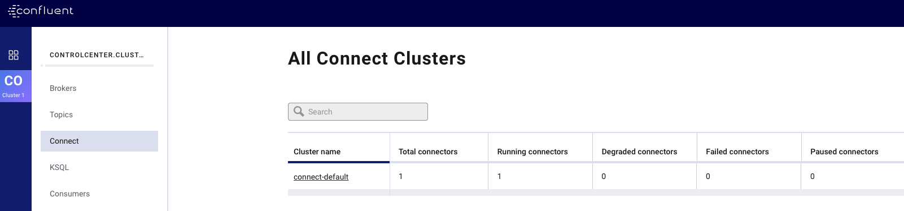
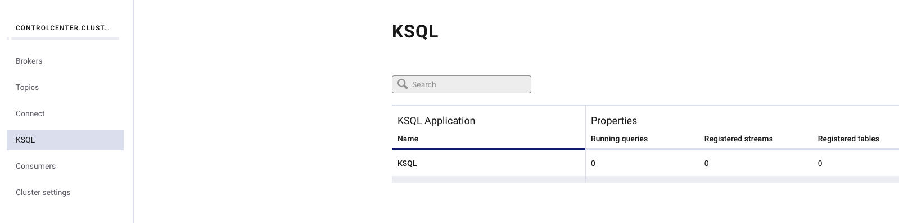

# Confluent Cloud Demo

- [Confluent Cloud Demo](#confluent-cloud-demo)
  - [Objective](#objective)
  - [Pre-requisites](#pre-requisites)
  - [How to run](#how-to-run)
  - [What it does](#what-it-does)
    - [Java Producer](#java-producer)
    - [Kafka Streams](#kafka-streams)
    - [Java Consumer](#java-consumer)
    - [Connect](#connect)
      - [HTTP Sink Connector](#http-sink-connector)
      - [JDBC MySQL Source Connector](#jdbc-mysql-source-connector)
    - [Monitoring](#monitoring)
      - [Control Center](#control-center)
      - [Grafana](#grafana)
    - [Schema Registry](#schema-registry)
    - [KSQL](#ksql)
    - [REST Proxy](#rest-proxy)
  - [📚 Other useful resources](#%f0%9f%93%9a-other-useful-resources)

## Objective

Confluent Cloud project based on [cp-all-in-one-cloud](https://github.com/confluentinc/examples/tree/5.3.1-post/cp-all-in-one-cloud).

## Pre-requisites

* `docker-compose` (example `brew cask install docker`)
* [Confluent Cloud CLI](https://docs.confluent.io/current/cloud-quickstart.html#step-2-install-ccloud-cli)
* [An initialized Confluent Cloud cluster used for development only](https://confluent.cloud)

## How to run

1. Create `$HOME/.ccloud/config`

On the host from which you are running Docker, ensure that you have properly initialized Confluent Cloud CLI and have a valid configuration file at `$HOME/.ccloud/config`.

Example:

```bash
$ cat $HOME/.ccloud/config
bootstrap.servers=<BROKER ENDPOINT>
ssl.endpoint.identification.algorithm=https
security.protocol=SASL_SSL
sasl.mechanism=PLAIN
sasl.jaas.config=org.apache.kafka.common.security.plain.PlainLoginModule required username\="<API KEY>" password\="<API SECRET>";

// Schema Registry specific settings
basic.auth.credentials.source=USER_INFO
schema.registry.basic.auth.user.info=<SR_API_KEY>:<SR_API_SECRET>
schema.registry.url=<SR ENDPOINT>

// license
confluent.license=<YOUR LICENSE>
```

2. (Optional) Enable Confluent Cloud Schema Registry

By default, the demo uses Confluent Schema Registry running in a local Docker container. If you prefer to use Confluent Cloud Schema Registry instead, you need to first set it up:

   a. [Enable](http://docs.confluent.io/current/quickstart/cloud-quickstart.html#step-3-configure-sr-ccloud) Confluent Cloud Schema Registry prior to running the demo

   b. Validate your credentials to Confluent Cloud Schema Registry

   ```bash
   $ curl -u $(grep "^schema.registry.basic.auth.user.info" $HOME/.ccloud/config | cut -d'=' -f2) $(grep "^schema.registry.url" $HOME/.ccloud/config | cut -d'=' -f2)/subjects
   ```

3. Start the demo

Run with local Docker Schema Registry:

```bash
./start.sh
or
./start.sh SCHEMA_REGISTRY_DOCKER
```

Run with Confluent Cloud Schema Registry:

```bash
./start.sh SCHEMA_REGISTRY_CONFLUENT_CLOUD
```

## What it does

### Java Producer

The Java [producer](https://github.com/vdesabou/kafka-docker-playground/blob/master/ccloud-demo/producer/src/main/java/com/github/vdesabou/SimpleProducer.java) (docker service `producer`) is sending messages every 5 seconds to topic `customer-avro` using Avro schema:

```json
{
     "type": "record",
     "namespace": "com.github.vdesabou",
     "name": "Customer",
     "version": "1",
     "fields": [
       { "name": "count", "type": "long", "doc": "count" },
       { "name": "first_name", "type": "string", "doc": "First Name of Customer" },
       { "name": "last_name", "type": "string", "doc": "Last Name of Customer" },
       { "name": "address", "type": "string", "doc": "Address of Customer" }
     ]
}
```

N.B:

- The key is fixed and set with `alice`
- [Interceptors](https://docs.confluent.io/current/control-center/installation/clients.html#java-producers-and-consumers) for Java producer are set

### Kafka Streams

The Kafka Streams [application](https://github.com/vdesabou/kafka-docker-playground/blob/master/ccloud-demo/streams/src/main/java/com/github/vdesabou/SimpleStream.java) (docker service `streams`) called `simple-stream` is listening topic `customer-avro` and is just counting the number of messages received.

N.B:

- [Interceptors](https://docs.confluent.io/current/control-center/installation/clients.html#kstreams) for Kafka Streams are set

### Java Consumer

The Java [consumer](https://github.com/vdesabou/kafka-docker-playground/blob/master/ccloud-demo/consumer/src/main/java/com/github/vdesabou/SimpleConsumer.java) (docker service `consumer`) is listening on topic `customer-avro` and it just printing the records.

N.B:

- [Interceptors](https://docs.confluent.io/current/control-center/installation/clients.html#java-producers-and-consumers) for Java consumer are set


### Connect

A local Connect instance (docker service `connect`) is installed and bootstrapping the Confluent Cloud broker.

N.B:

- [Interceptors](https://docs.confluent.io/current/control-center/installation/clients.html#kconnect-long) for Kafka Connect are set


#### HTTP Sink Connector

An HTTP sink connector called `HttpSinkBasicAuth` is created and listening on topic `customer-avro`:

```bash
$ docker exec -e BOOTSTRAP_SERVERS="$BOOTSTRAP_SERVERS" -e CLOUD_KEY="$CLOUD_KEY" -e CLOUD_SECRET="$CLOUD_SECRET" connect \
     curl -X POST \
     -H "Content-Type: application/json" \
     --data '{
          "name": "HttpSinkBasicAuth",
          "config": {
               "topics": "customer-avro",
               "tasks.max": "1",
               "connector.class": "io.confluent.connect.http.HttpSinkConnector",
               "key.converter": "org.apache.kafka.connect.storage.StringConverter",
               "value.converter": "org.apache.kafka.connect.storage.StringConverter",
               "confluent.topic.ssl.endpoint.identification.algorithm" : "https",
               "confluent.topic.sasl.mechanism" : "PLAIN",
               "confluent.topic.request.timeout.ms" : "20000",
               "confluent.topic.bootstrap.servers": "'"$BOOTSTRAP_SERVERS"'",
               "retry.backoff.ms" : "500",
               "confluent.topic.sasl.jaas.config" : "org.apache.kafka.common.security.plain.PlainLoginModule required username=\"'$CLOUD_KEY'\" password=\"'$CLOUD_SECRET'\";",
               "confluent.topic.security.protocol" : "SASL_SSL",
               "confluent.topic.replication.factor": "1",
               "http.api.url": "http://http-service-basic-auth:8080/api/messages",
               "auth.type": "BASIC",
               "connection.user": "admin",
               "connection.password": "password"
          }}' \
     http://localhost:8083/connectors | jq .
```


Messages are published on HTTP server listening on port `8080`

```bash
$ curl admin:password@localhost:9080/api/messages | jq .
```

Example:

```json
[
  {
    "id": 1,
    "message": "\u0000\u0000\u0001???\u0001\u000eDevante\fHickle\u001c122 Hiram Fork"
  },
  {
    "id": 2,
    "message": "\u0000\u0000\u0001???\u0001\fErnest\nSipes*4276 Luettgen Squares"
  },
  {
    "id": 3,
    "message": "\u0000\u0000\u0001???\u0001\fRickey\u0014Williamson*50825 Mozelle Freeway"
  }
]
```

#### JDBC MySQL Source Connector

A JDBC MySQL source connector called `mysql-source` is created and using a MySQL table called `application`:

Note: the topic `mysql-application` used by this connector shall be created before using command:

```bash
$ ccloud kafka topic create mysql-application --partitions 6
```

```bash
$ docker exec connect \
     curl -X POST \
     -H "Content-Type: application/json" \
     --data '{
               "name": "mysql-source",
               "config": {
                    "connector.class":"io.confluent.connect.jdbc.JdbcSourceConnector",
                    "tasks.max":"1",
                    "connection.url":"jdbc:mysql://mysql:3306/db?user=user&password=password&useSSL=false",
                    "table.whitelist":"application",
                    "mode":"timestamp+incrementing",
                    "timestamp.column.name":"last_modified",
                    "incrementing.column.name":"id",
                    "topic.prefix":"mysql-"
          }}' \
     http://localhost:8083/connectors | jq .
```


We can consume messages from topic `mysql-application` using multiple ways:

* Using `kafka-avro-console-consumer`:

```bash
$ docker-compose exec -e BOOTSTRAP_SERVERS="$BOOTSTRAP_SERVERS" -e SASL_JAAS_CONFIG="$SASL_JAAS_CONFIG" -e BASIC_AUTH_CREDENTIALS_SOURCE="$BASIC_AUTH_CREDENTIALS_SOURCE" -e SCHEMA_REGISTRY_BASIC_AUTH_USER_INFO="$SCHEMA_REGISTRY_BASIC_AUTH_USER_INFO" -e SCHEMA_REGISTRY_URL="$SCHEMA_REGISTRY_URL" connect bash -c 'kafka-avro-console-consumer --topic mysql-application --bootstrap-server $BOOTSTRAP_SERVERS --consumer-property ssl.endpoint.identification.algorithm=https --consumer-property sasl.mechanism=PLAIN --consumer-property security.protocol=SASL_SSL --consumer-property sasl.jaas.config="$SASL_JAAS_CONFIG" --property basic.auth.credentials.source=$BASIC_AUTH_CREDENTIALS_SOURCE --property schema.registry.basic.auth.user.info="$SCHEMA_REGISTRY_BASIC_AUTH_USER_INFO" --property schema.registry.url=$SCHEMA_REGISTRY_URL --from-beginning --max-messages 2'
```

* Using `confluent` cli and Docker Schema Registry:

```bash
$ confluent local consume mysql-application -- --cloud --value-format avro --property schema.registry.url=http://127.0.0.1:8085 --from-beginning --max-messages 2
```

* Using `confluent` cli and Confluent Cloud Schema Registry:

```bash
$ confluent local consume mysql-application -- --cloud --value-format avro --property schema.registry.url=$SCHEMA_REGISTRY_URL --property basic.auth.credentials.source=USER_INFO --property schema.registry.basic.auth.user.info="$SCHEMA_REGISTRY_BASIC_AUTH_USER_INFO" --from-beginning --max-messages 2
```

Results:

```json
{"id":1,"name":"kafka","team_email":"kafka@apache.org","last_modified":1573054234000}
{"id":2,"name":"another","team_email":"another@apache.org","last_modified":1573054378000}
```

### Monitoring

#### Control Center

A local Control Center instance (docker service `control-center`) is installed and reachable at [http://127.0.0.1:9021](http://127.0.0.1:9021]).

* Brokers overview section will report error ***Please set up Confluent Metrics Reporter***


This is [expected](https://docs.confluent.io/current/cloud/connect/c3-cloud-config.html#limitations) as Confluent Cloud does not provide the instrumentation from Confluent Metrics Reporter outside of the Confluent Cloud.

* You can access your local Connect cluster:



* You can access your local KSQL instance:



* In the case you're using local schema-registry instance (docker service `schema-registry`), you can see the schemas:


#### Grafana

[JMX Exporter](https://github.com/prometheus/jmx_exporter), [Prometheus](https://github.com/prometheus/prometheus) and [Grafana](https://grafana.com) are installed in order to provide a demo of clients monitoring.

Open a brower and visit http://127.0.0.1:3000 (login/password is `admin/admin`)

N.B: only Producer and Consumer dashboards are available. Zookeeper and Brokers metrics are not exposed for Confluent Cloud.

### Schema Registry

A local Schema Registry instance (docker service `schema-registry`) is installed and bootstrapping the Confluent Cloud broker.

You can either use it (by running `./start.sh`or `./start.sh SCHEMA_REGISTRY_DOCKER`) or use Confluent Cloud Schema Registry (by running `./start.sh SCHEMA_REGISTRY_CONFLUENT_CLOUD`).

### KSQL

As [Confluent Cloud KSQL](https://docs.confluent.io/current/cloud/limits.html#ccloud-ksql-preview) is still in preview, you can instead install local KSQL instance (docker service `ksql-server`) which is bootstrapping the Confluent Cloud broker.

You can access KSQL CLI using this command:

```bash
$ docker exec -i ksql-cli bash -c 'echo -e "\n\n⏳ Waiting for KSQL to be available before launching CLI\n"; while [ $(curl -s -o /dev/null -w %{http_code} http://ksql-server:8089/) -eq 000 ] ; do echo -e $(date) "KSQL Server HTTP state: " $(curl -s -o /dev/null -w %{http_code} http:/ksql-server:8089/) " (waiting for 200)" ; sleep 5 ; done; ksql http://ksql-server:8089'
```

Example:

```
ksql> show topics;

 Kafka Topic                                                                                   | Registered | Partitions | Partition Replicas | Consumers | ConsumerGroups
---------------------------------------------------------------------------------------------------------------------------------------------------------------------------
 _confluent-monitoring                                                                         | false      | 1          | 3                  | 1         | 1
 _schemas                                                                                      | false      | 1          | 3                  | 0         | 0
 connect-configs                                                                               | false      | 1          | 3                  | 0         | 0
 connect-offsets                                                                               | false      | 25         | 3                  | 0         | 0
 connect-status                                                                                | false      | 5          | 3                  | 0         | 0
 customer-avro                                                                                 | false      | 6          | 3                  | 18        | 3
 simple-stream-KSTREAM-REDUCE-STATE-STORE-0000000003-changelog                                 | false      | 6          | 3                  | 0         | 0
 simple-stream-KSTREAM-REDUCE-STATE-STORE-0000000003-repartition                               | false      | 6          | 3                  | 6         | 1
---------------------------------------------------------------------------------------------------------------------------------------------------------------------------
```

### REST Proxy

A local REST Proxy instance (docker service `rest-proxy`) is installed and reachable on port `8082`.

Make REST calls using `v2` of the REST API (e.g. `application/vnd.kafka.v2+json`) because `v2` has no ZooKeeper dependency. Using `v1` of the API (e.g. `application/vnd.kafka.v1+json`) will not work because v1 has a ZooKeeper dependency that does not work with Confluent Cloud.

Examples:

```bash
$ curl "http://localhost:8082/topics/customer-avro"
```

```json
{
    "configs": {
        "cleanup.policy": "delete",
        "compression.type": "producer",
        "delete.retention.ms": "86400000",
        "file.delete.delay.ms": "60000",
        "flush.messages": "9223372036854775807",
        "flush.ms": "9223372036854775807",
        "follower.replication.throttled.replicas": "",
        "index.interval.bytes": "4096",
        "leader.replication.throttled.replicas": "",
        "max.compaction.lag.ms": "9223372036854775807",
        "max.message.bytes": "2097164",
        "message.downconversion.enable": "true",
        "message.format.version": "2.1-IV2",
        "message.timestamp.difference.max.ms": "9223372036854775807",
        "message.timestamp.type": "CreateTime",
        "min.cleanable.dirty.ratio": "0.5",
        "min.compaction.lag.ms": "0",
        "min.insync.replicas": "2",
        "preallocate": "false",
        "retention.bytes": "-1",
        "retention.ms": "604800000",
        "segment.bytes": "1073741824",
        "segment.index.bytes": "10485760",
        "segment.jitter.ms": "0",
        "segment.ms": "604800000",
        "unclean.leader.election.enable": "false"
    },
    "name": "customer-avro"
}
```

Get broker ids:

```bash
$ curl "http://localhost:8082/brokers"
```

Result:

```json
{"brokers":[0,5,2,8,4,1,6,7,3]}
```

## 📚 Other useful resources

* [Using Confluent CLI with Avro And Confluent Cloud Schema Registry](https://github.com/confluentinc/examples/tree/5.3.1-post/clients/cloud/confluent-cli#example-2-avro-and-confluent-cloud-schema-registry)

* [Other clients example](https://github.com/confluentinc/examples/blob/5.3.1-post/clients/cloud/README.md)

* [Beginner Cloud](https://github.com/confluentinc/examples/tree/5.3.1-post/ccloud/beginner-cloud)
