# Confluent Cloud Demo

- [Confluent Cloud Demo](#confluent-cloud-demo)
  - [⚠️ Disclaimer](#️-disclaimer)
  - [Prerequisites](#prerequisites)
  - [How to run locally](#how-to-run-locally)
  - [How to run with AWS CloudFormation](#how-to-run-with-aws-cloudformation)
  - [Connecting components to Confluent Cloud](#connecting-components-to-confluent-cloud)
    - [Java Producer](#java-producer)
    - [Kafka Streams](#kafka-streams)
    - [Java Consumer](#java-consumer)
    - [Connect](#connect)
      - [Use with Insomnia](#use-with-insomnia)
      - [JDBC MySQL Source Connector](#jdbc-mysql-source-connector)
      - [HTTP Sink Connector](#http-sink-connector)
      - [Elasticsearch Sink Connector](#elasticsearch-sink-connector)
    - [Schema Registry](#schema-registry)
      - [Use with Insomnia](#use-with-insomnia-1)
    - [KSQL](#ksql)
    - [REST Proxy](#rest-proxy)
      - [Use with Insomnia](#use-with-insomnia-2)
    - [Control Center](#control-center)
  - [Monitoring](#monitoring)
    - [Metrics API](#metrics-api)
      - [Use with Insomnia](#use-with-insomnia-3)
      - [Export to Prometheus](#export-to-prometheus)
    - [Control Center](#control-center-1)
      - [Monitoring multiple clusters](#monitoring-multiple-clusters)
      - [Differences between Confluent Cloud UI and local Control Center connected to Confluent Cloud](#differences-between-confluent-cloud-ui-and-local-control-center-connected-to-confluent-cloud)
      - [Alerts](#alerts)
      - [Read-Only mode](#read-only-mode)
    - [Grafana](#grafana)
      - [Producer Dashboard](#producer-dashboard)
      - [Consumer Dashboard](#consumer-dashboard)
      - [Connect Dashboard](#connect-dashboard)
      - [Consumer Lag Dashboard](#consumer-lag-dashboard)
      - [CCloud Exporter Metrics API Dashboard](#ccloud-exporter-metrics-api-dashboard)
    - [New Relic](#new-relic)
    - [Splunk](#splunk)
    - [How to monitor consumer lag](#how-to-monitor-consumer-lag)
  - [📚 Other useful resources](#-other-useful-resources)

## ⚠️ Disclaimer

This demo is for reference purposes only and should be used to see a sample workflow using Confluent Cloud CLI

If you choose to run it against your Confluent Cloud cluster, be aware that it:

- creates and deletes topics, service accounts, API keys, and ACLs
- is for demo purposes only
- should be used only on a non-production cluster

## Prerequisites

All you have to do is to be already logged in with [confluent CLI](https://docs.confluent.io/confluent-cli/current/overview.html#confluent-cli-overview).

By default, a new Confluent Cloud environment with a Cluster will be created.

You can configure the cluster by setting environment variables:

* `CLUSTER_CLOUD`: The Cloud provider` (possible values: `aws`, `gcp` and `azure`, default `aws`)
* `CLUSTER_REGION`: The Cloud region (use `confluent kafka region list` to get the list, default `eu-west-2`)
* `ENVIRONMENT` (optional): The environment id where want your new cluster (example: `env-xxxxx`) 

In case you want to use your own existing cluster, you need to setup these environment variables:

* `ENVIRONMENT`: The environment id where your cluster is located (example: `env-xxxxx`) 
* `CLUSTER_NAME`: The cluster name
* `CLUSTER_CLOUD`: The Cloud provider (possible values: `aws`, `gcp` and `azure`)
* `CLUSTER_REGION`: The Cloud region (example `us-east-2)
* `CLUSTER_CREDS`: The API_KEY:API_KEY_SECRET to use, it should be separated with semi-colon (example: `<API_KEY>:<API_KEY_SECRET>`)
* `SCHEMA_REGISTRY_CREDS` (optional, if not set new ones will be used): The Schema Registry API_KEY:API_KEY_SECRET to use, it should be separated with semi-colon (example: `<SR_API_KEY>:<SR_API_KEY_SECRET>`)

* (Optional) Enable Confluent Cloud Schema Registry

By default, the demo uses Confluent Schema Registry running in a local Docker container. If you prefer to use Confluent Cloud Schema Registry instead, you need to first set it up:

   a. [Enable](https://docs.confluent.io/current/cloud/quickstart/schema-registry.html#enable-sr-for-ccloud) Confluent Cloud Schema Registry prior to running the demo

   b. Validate your credentials to Confluent Cloud Schema Registry

   ```bash
   $ curl -u $(grep "^schema.registry.basic.auth.user.info" $HOME/.confluent/config | cut -d'=' -f2) $(grep "^schema.registry.url" $HOME/.confluent/config | cut -d'=' -f2)/subjects
   ```
## How to run locally

Start the demo:

Run with local Docker Schema Registry:

```bash
./start.sh
or
./start.sh SCHEMA_REGISTRY_DOCKER
```

Run with Confluent Cloud Schema Registry:

```bash
./start.sh SCHEMA_REGISTRY_CONFLUENT_CLOUD
```

## How to run with AWS CloudFormation

* Create stack in AWS CloudFormation and upload [this](cloudformation/kafka-docker-playground-ccloud-demo.json?raw=true) template file:


* Fill information as requested (default EC2 instance type and root volume are recommended):

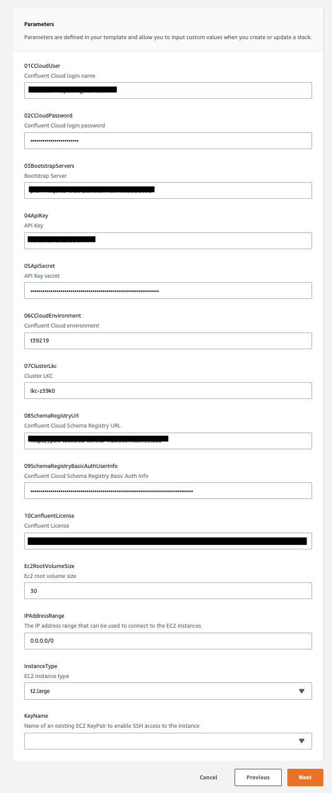

* After about 15 minutes, the stack will be created and you can see in *outputs* tab the URLs for connecting to Control Center and Grafana (`admin`/`admin`)


## Connecting components to Confluent Cloud


Connecting your components to your Confluent Cloud cluster is easy. This is described in Confluent [documentation](https://docs.confluent.io/current/cloud/connect/index.html).

In this demo, we're deploying the following components in our local machine (using Docker) and connecting them to our Confluent Cloud cluster:

### Java Producer

The Java [producer](https://github.com/vdesabou/kafka-docker-playground/blob/master/ccloud-demo/producer/src/main/java/com/github/vdesabou/SimpleProducer.java) (docker service `producer`) is sending messages every 5 seconds to topic `customer-avro` using Avro schema:

```json
{
     "type": "record",
     "namespace": "com.github.vdesabou",
     "name": "Customer",
     "version": "1",
     "fields": [
       { "name": "count", "type": "long", "doc": "count" },
       { "name": "first_name", "type": "string", "doc": "First Name of Customer" },
       { "name": "last_name", "type": "string", "doc": "Last Name of Customer" },
       { "name": "address", "type": "string", "doc": "Address of Customer" }
     ]
}
```

Specific properties to connect to Confluent Cloud:

```java
props.put("bootstrap.servers", "<BOOTSTRAP_SERVERS>");
props.put("ssl.endpoint.identification.algorithm", "https");
props.put("sasl.mechanism", "PLAIN");
props.put("sasl.jaas.config", "org.apache.kafka.common.security.plain.PlainLoginModule required username=\"<API KEY>\" password=\"<API SECRET>\";");
props.put("security.protocol", "SASL_SSL");

// Schema Registry specific settings
props.put("schema.registry.url", "<SCHEMA_REGISTRY_URL>");
// Required if using Confluent Cloud Schema Registry
props.put("basic.auth.credentials.source", "USER_INFO");
props.put("schema.registry.basic.auth.user.info", "<SR_API_KEY>:<SR_API_SECRET>");
```

N.B:

- The key is fixed and set with `alice`
- [Interceptors](https://docs.confluent.io/current/control-center/installation/clients.html#java-producers-and-consumers) for Java producer are set:

```java
props.put("interceptor.classes","io.confluent.monitoring.clients.interceptor.MonitoringProducerInterceptor");
props.put("confluent.monitoring.interceptor.bootstrap.servers","<BOOTSTRAP_SERVERS>");
props.put("confluent.monitoring.interceptor.security.protocol", "SASL_SSL");
props.put("confluent.monitoring.interceptor.sasl.jaas.config", "org.apache.kafka.common.security.plain.PlainLoginModule required username=\"<API KEY>\" password=\"<API SECRET>\";");
props.put("confluent.monitoring.interceptor.sasl.mechanism", "PLAIN");
```

Link to Confluent [documentation](https://github.com/confluentinc/examples/tree/5.3.2-post/clients/cloud/java)

### Kafka Streams

The Kafka Streams [application](https://github.com/vdesabou/kafka-docker-playground/blob/master/ccloud-demo/streams/src/main/java/com/github/vdesabou/SimpleStream.java) (docker service `streams`) called `simple-stream` is listening topic `customer-avro` and is just counting the number of messages received.

Specific properties to connect to Confluent Cloud:

```java
props.put("bootstrap.servers", "<BOOTSTRAP_SERVERS>");
props.put("sasl.mechanism", "PLAIN");
props.put("sasl.jaas.config", "org.apache.kafka.common.security.plain.PlainLoginModule required username=\"<API KEY>\" password=\"<API SECRET>\";");
props.put("security.protocol", "SASL_SSL");

// Schema Registry specific settings
props.put("schema.registry.url", "<SCHEMA_REGISTRY_URL>");
// Required if using Confluent Cloud Schema Registry
props.put("basic.auth.credentials.source", "USER_INFO");
props.put("schema.registry.basic.auth.user.info", "<SR_API_KEY>:<SR_API_SECRET>");
```

N.B:

- [Interceptors](https://docs.confluent.io/current/control-center/installation/clients.html#kstreams) for Kafka Streams are set

```java
props.put("producer.interceptor.classes","io.confluent.monitoring.clients.interceptor.MonitoringProducerInterceptor");
props.put("consumer.interceptor.classes","io.confluent.monitoring.clients.interceptor.MonitoringConsumerInterceptor");
props.put("confluent.monitoring.interceptor.bootstrap.servers","<BOOTSTRAP_SERVERS>");
props.put("confluent.monitoring.interceptor.security.protocol", "SASL_SSL");
props.put("confluent.monitoring.interceptor.sasl.jaas.config", "org.apache.kafka.common.security.plain.PlainLoginModule required username=\"<API KEY>\" password=\"<API SECRET>\";");
props.put("confluent.monitoring.interceptor.sasl.mechanism", "PLAIN");
```

Link to Confluent [documentation](https://docs.confluent.io/current/cloud/connect/streams-cloud-config.html)

### Java Consumer

The Java [consumer](https://github.com/vdesabou/kafka-docker-playground/blob/master/ccloud-demo/consumer/src/main/java/com/github/vdesabou/SimpleConsumer.java) (docker service `consumer`) is listening on topic `customer-avro` and it just printing the records.

Specific properties to connect to Confluent Cloud:

```java
props.put("bootstrap.servers", "<BOOTSTRAP_SERVERS>");
props.put("ssl.endpoint.identification.algorithm", "https");
props.put("sasl.mechanism", "PLAIN");
props.put("sasl.jaas.config", "org.apache.kafka.common.security.plain.PlainLoginModule required username=\"<API KEY>\" password=\"<API SECRET>\";");
props.put("security.protocol", "SASL_SSL");

// Schema Registry specific settings
props.put("schema.registry.url", "<SCHEMA_REGISTRY_URL>");
// Required if using Confluent Cloud Schema Registry
props.put("basic.auth.credentials.source", "USER_INFO");
props.put("schema.registry.basic.auth.user.info", "<SR_API_KEY>:<SR_API_SECRET>");
```

N.B:

- [Interceptors](https://docs.confluent.io/current/control-center/installation/clients.html#java-producers-and-consumers) for Java consumer are set

```java
props.put("interceptor.classes","io.confluent.monitoring.clients.interceptor.MonitoringConsumerInterceptor");
props.put("confluent.monitoring.interceptor.bootstrap.servers","<BOOTSTRAP_SERVERS>");
props.put("confluent.monitoring.interceptor.security.protocol", "SASL_SSL");
props.put("confluent.monitoring.interceptor.sasl.jaas.config", "org.apache.kafka.common.security.plain.PlainLoginModule required username=\"<API KEY>\" password=\"<API SECRET>\";");
props.put("confluent.monitoring.interceptor.sasl.mechanism", "PLAIN");
```

Link to Confluent [documentation](https://github.com/confluentinc/examples/tree/5.3.2-post/clients/cloud/java)

### Connect

A local Connect instance (docker service `connect`) is installed and bootstrapping the Confluent Cloud broker.

* Docker configuration:

```yml
connect:
  image: vdesabou/kafka-docker-playground-connect:${CONNECT_TAG}
  hostname: connect
  container_name: connect
  environment:
    CONNECT_BOOTSTRAP_SERVERS: <BOOTSTRAP_SERVERS>
    CONNECT_REST_PORT: 8083
    CONNECT_GROUP_ID: "connect"
    CONNECT_CONFIG_STORAGE_TOPIC: connect-configs-cloud
    CONNECT_OFFSET_STORAGE_TOPIC: connect-offsets-cloud
    CONNECT_STATUS_STORAGE_TOPIC: connect-status-cloud
    CONNECT_REPLICATION_FACTOR: 3
    CONNECT_CONFIG_STORAGE_REPLICATION_FACTOR: 3
    CONNECT_OFFSET_STORAGE_REPLICATION_FACTOR: 3
    CONNECT_STATUS_STORAGE_REPLICATION_FACTOR: 3
    CONNECT_KEY_CONVERTER: "org.apache.kafka.connect.storage.StringConverter"
    CONNECT_VALUE_CONVERTER: "io.confluent.connect.avro.AvroConverter"
    CONNECT_VALUE_CONVERTER_SCHEMAS_ENABLE: "true"
    CONNECT_VALUE_CONVERTER_SCHEMA_REGISTRY_URL: <SCHEMA_REGISTRY_URL>
    CONNECT_VALUE_CONVERTER_BASIC_AUTH_CREDENTIALS_SOURCE: USER_INFO
    CONNECT_VALUE_CONVERTER_SCHEMA_REGISTRY_BASIC_AUTH_USER_INFO: <SR_API_KEY>:<SR_API_SECRET>
    CONNECT_INTERNAL_KEY_CONVERTER: "org.apache.kafka.connect.json.JsonConverter"
    CONNECT_INTERNAL_VALUE_CONVERTER: "org.apache.kafka.connect.json.JsonConverter"
    CONNECT_REST_ADVERTISED_HOST_NAME: "connect"
    CONNECT_PLUGIN_PATH: "/usr/share/java,/usr/share/confluent-hub-components"
    CONNECT_LOG4J_ROOT_LOGLEVEL: INFO
    CONNECT_LOG4J_LOGGERS: org.reflections=ERROR
    # Connect worker
    CONNECT_SECURITY_PROTOCOL: SASL_SSL
    CONNECT_SASL_JAAS_CONFIG: org.apache.kafka.common.security.plain.PlainLoginModule required username="<API KEY>" password="<API SECRET>";
    CONNECT_SASL_MECHANISM: PLAIN
    CONNECT_SSL_ENDPOINT_IDENTIFICATION_ALGORITHM: "HTTPS"
    # Connect producer
    CONNECT_PRODUCER_SECURITY_PROTOCOL: SASL_SSL
    CONNECT_PRODUCER_SASL_JAAS_CONFIG: org.apache.kafka.common.security.plain.PlainLoginModule required username="<API KEY>" password="<API SECRET>";
    CONNECT_PRODUCER_SASL_MECHANISM: PLAIN
```

N.B:

- [Interceptors](https://docs.confluent.io/current/control-center/installation/clients.html#kconnect-long) for Kafka Connect are set

```yml
    CONNECT_PRODUCER_INTERCEPTOR_CLASSES: "io.confluent.monitoring.clients.interceptor.MonitoringProducerInterceptor"
    CONNECT_PRODUCER_CONFLUENT_MONITORING_INTERCEPTOR_SECURITY_PROTOCOL: SASL_SSL
    CONNECT_PRODUCER_CONFLUENT_MONITORING_INTERCEPTOR_SASL_JAAS_CONFIG: org.apache.kafka.common.security.plain.PlainLoginModule required username="<API KEY>" password="<API SECRET>";
    CONNECT_PRODUCER_CONFLUENT_MONITORING_INTERCEPTOR_SASL_MECHANISM: PLAIN
    # Connect consumer
    CONNECT_CONSUMER_SECURITY_PROTOCOL: SASL_SSL
    CONNECT_CONSUMER_SASL_JAAS_CONFIG: org.apache.kafka.common.security.plain.PlainLoginModule required username="<API KEY>" password="<API SECRET>";
    CONNECT_CONSUMER_SASL_MECHANISM: PLAIN
    CONNECT_CONSUMER_INTERCEPTOR_CLASSES: "io.confluent.monitoring.clients.interceptor.MonitoringConsumerInterceptor"
    CONNECT_CONSUMER_CONFLUENT_MONITORING_INTERCEPTOR_SECURITY_PROTOCOL: SASL_SSL
    CONNECT_CONSUMER_CONFLUENT_MONITORING_INTERCEPTOR_SASL_JAAS_CONFIG: org.apache.kafka.common.security.plain.PlainLoginModule required username="<API KEY>" password="<API SECRET>";
    CONNECT_CONSUMER_CONFLUENT_MONITORING_INTERCEPTOR_SASL_MECHANISM: PLAIN
```

Link to Confluent [documentation](https://docs.confluent.io/current/cloud/connect/connect-cloud-config.html)

#### Use with Insomnia

You can use [Connect REST API](https://docs.confluent.io/current/connect/references/restapi.html#kconnect-long-rest-interface) with [insomnia](https://insomnia.rest/) (install it on Mac OS with `brew cask install insomnia`).
Then go to Preferences->Data and import this [JSON file](insomnia/connect-rest-api.json?raw=true).

You can set variables for your cluster by modifying sub environment called `Ccloud Demo Connect REST API`:

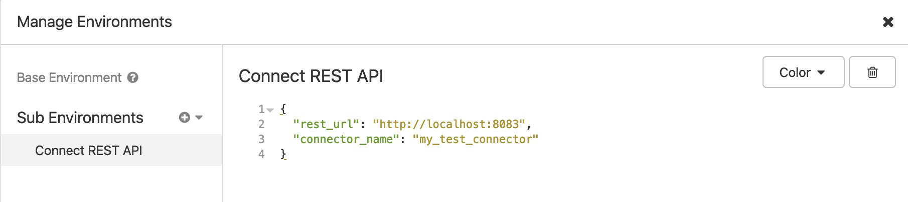

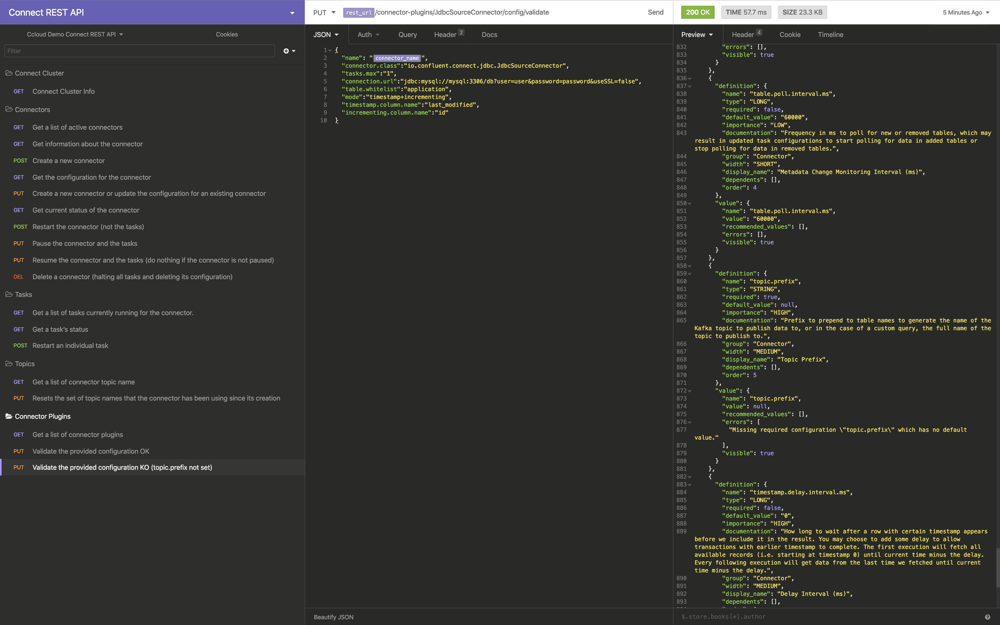

#### JDBC MySQL Source Connector

A JDBC MySQL source connector called `mysql-source` is created and using a MySQL table called `application`:

Note: the topic `mysql-application` used by this connector shall be created before using command:

```bash
$ confluent kafka topic create mysql-application --partitions 1
```

```bash
$ curl -X PUT \
     -H "Content-Type: application/json" \
     --data '{
               "connector.class":"io.confluent.connect.jdbc.JdbcSourceConnector",
                    "tasks.max":"1",
                    "connection.url":"jdbc:mysql://mysql:3306/db?user=user&password=password&useSSL=false",
                    "table.whitelist":"application",
                    "mode":"timestamp+incrementing",
                    "timestamp.column.name":"last_modified",
                    "incrementing.column.name":"id",
                    "topic.prefix":"mysql-"
          }' \
     http://localhost:8083/connectors/mysql-source/config | jq .
```


We can consume messages from topic `mysql-application` using multiple ways:

* Using `kafka-avro-console-consumer`:

```bash
$ docker-compose exec -e BOOTSTRAP_SERVERS="<BOOTSTRAP_SERVERS" -e >SASL_JAAS_CONFIG="org.apache.kafka.common.security.plain.PlainLoginModule required username="<API KEY>" password="<API SECRET>";" -e BASIC_AUTH_CREDENTIALS_SOURCE="USER_INFO" -e SCHEMA_REGISTRY_BASIC_AUTH_USER_INFO="<SR_API_KEY>:<SR_API_SECRET>" -e SCHEMA_REGISTRY_URL="<SCHEMA_REGISTRY_URL" connect bash -c >'kafka-avro-console-consumer --topic mysql-application --bootstrap-server <BOOTSTRAP_SERVERS --consumer-property >ssl.endpoint.identification.algorithm=https --consumer-property sasl.mechanism=PLAIN --consumer-property security.protocol=SASL_SSL --consumer-property sasl.jaas.config="org.apache.kafka.common.security.plain.PlainLoginModule required username="<API KEY>" password="<API SECRET>";" --property basic.auth.credentials.source=USER_INFO --property schema.registry.basic.auth.user.info="<SR_API_KEY>:<SR_API_SECRET>" --property schema.registry.url=<SCHEMA_REGISTRY_URL --from-beginning >--max-messages 2'
```

* Using `confluent` cli and Docker Schema Registry:

```bash
$ confluent local consume mysql-application -- --cloud --value-format avro --property schema.registry.url=http://127.0.0.1:8085 --from-beginning --max-messages 2
```

* Using `confluent` cli and Confluent Cloud Schema Registry:

```bash
$ confluent local consume mysql-application -- --cloud --value-format avro --property schema.registry.url=<SCHEMA_REGISTRY_URL --property >basic.auth.credentials.source=USER_INFO --property schema.registry.basic.auth.user.info="<SR_API_KEY>:<SR_API_SECRET>" --from-beginning --max-messages 2
```

Results:

```json
{"id":1,"name":"kafka","team_email":"kafka@apache.org","last_modified":1573054234000}
{"id":2,"name":"another","team_email":"another@apache.org","last_modified":1573054378000}
```

#### HTTP Sink Connector

An HTTP sink connector called `http-sink` is created and listening on topic `mysql-application`:

```bash
$ curl -X PUT \
     -H "Content-Type: application/json" \
     --data '{
          "topics": "mysql-application",
               "tasks.max": "1",
               "connector.class": "io.confluent.connect.http.HttpSinkConnector",
               "key.converter": "org.apache.kafka.connect.storage.StringConverter",
               "value.converter": "org.apache.kafka.connect.storage.StringConverter",
               "confluent.topic.ssl.endpoint.identification.algorithm" : "https",
               "confluent.topic.sasl.mechanism" : "PLAIN",
               "confluent.topic.request.timeout.ms" : "20000",
               "confluent.topic.bootstrap.servers": "'"<BOOTSTRAP_SERVERS"'",>
               "confluent.topic.sasl.jaas.config" : "org.apache.kafka.common.security.plain.PlainLoginModule required username=\"'$CLOUD_KEY'\" password=\"'$CLOUD_SECRET'\";",
               "confluent.topic.security.protocol" : "SASL_SSL",
               "confluent.topic.replication.factor": "3",
               "reporter.bootstrap.servers": "'"$BOOTSTRAP_SERVERS"'",
               "reporter.admin.sasl.mechanism" : "PLAIN",
               "reporter.admin.sasl.jaas.config" : "org.apache.kafka.common.security.plain.PlainLoginModule required username=\"'$CLOUD_KEY'\" password=\"'$CLOUD_SECRET'\";",
               "reporter.admin.security.protocol" : "SASL_SSL",
               "reporter.producer.sasl.mechanism" : "PLAIN",
               "reporter.producer.sasl.jaas.config" : "org.apache.kafka.common.security.plain.PlainLoginModule required username=\"'$CLOUD_KEY'\" password=\"'$CLOUD_SECRET'\";",
               "reporter.producer.security.protocol" : "SASL_SSL",
               "reporter.error.topic.name": "error-responses",
               "reporter.error.topic.replication.factor": 3,
               "reporter.result.topic.name": "success-responses",
               "reporter.result.topic.replication.factor": 3,
               "retry.backoff.ms" : "500",
               "http.api.url": "http://http-service-basic-auth:8080/api/messages",
               "auth.type": "BASIC",
               "connection.user": "admin",
               "connection.password": "password"
          }' \
     http://localhost:8083/connectors/http-sink/config | jq .
```


Messages are published on HTTP server listening on port `8080`

```bash
$ curl admin:password@localhost:9083/api/messages | jq .
```

Example:

```json
[
  {
    "id": 1,
    "message": "\u0000\u0000\u0000\u0000\u0002\u0002\nkafka kafka@apache.org?????["
  },
  {
    "id": 2,
    "message": "\u0000\u0000\u0000\u0000\u0002\u0004\u000eanother$another@apache.org?????["
  }
]
```

#### Elasticsearch Sink Connector

An Elasticsearch sink connector called `elasticsearch-sink` is created and listening on topic `mysql-application`:

```bash
$ curl -X PUT \
     -H "Content-Type: application/json" \
     --data '{
        "connector.class": "io.confluent.connect.elasticsearch.ElasticsearchSinkConnector",
          "tasks.max": "1",
          "topics": "mysql-application",
          "key.ignore": "true",
          "connection.url": "http://elasticsearch:9200",
          "type.name": "kafka-connect",
          "name": "elasticsearch-sink"
          }' \
     http://localhost:8083/connectors/elasticsearch-sink/config | jq .
```

We check that the data is available in Elasticsearch using:

```bash
$ curl -XGET 'http://localhost:9200/mysql-application/_search?pretty'
```

Result:

```json
{
  "took" : 296,
  "timed_out" : false,
  "_shards" : {
    "total" : 5,
    "successful" : 5,
    "skipped" : 0,
    "failed" : 0
  },
  "hits" : {
    "total" : 2,
    "max_score" : 1.0,
    "hits" : [
      {
        "_index" : "mysql-application",
        "_type" : "kafka-connect",
        "_id" : "mysql-application+3+0",
        "_score" : 1.0,
        "_source" : {
          "id" : 2,
          "name" : "another",
          "team_email" : "another@apache.org",
          "last_modified" : 1574932446000
        }
      },
      {
        "_index" : "mysql-application",
        "_type" : "kafka-connect",
        "_id" : "mysql-application+4+0",
        "_score" : 1.0,
        "_source" : {
          "id" : 1,
          "name" : "kafka",
          "team_email" : "kafka@apache.org",
          "last_modified" : 1574932363000
        }
      }
    ]
  }
}
```

### Schema Registry

A local Schema Registry instance (docker service `schema-registry`) is installed and bootstrapping the Confluent Cloud broker.

You can either use it (by running `./start.sh`or `./start.sh SCHEMA_REGISTRY_DOCKER`) or use Confluent Cloud Schema Registry (by running `./start.sh SCHEMA_REGISTRY_CONFLUENT_CLOUD`).

* Docker configuration:

```yml
schema-registry:
  image: confluentinc/cp-schema-registry:${TAG}
  hostname: schema-registry
  container_name: schema-registry
  ports:
    - '8085:8085'
  environment:
    SCHEMA_REGISTRY_HOST_NAME: schema-registry
    SCHEMA_REGISTRY_LISTENERS: http://0.0.0.0:8085
    SCHEMA_REGISTRY_KAFKASTORE_SSL_ENDPOINT_IDENTIFIED_ALGORITHM: "https"
    SCHEMA_REGISTRY_KAFKASTORE_REQUEST_TIMEOUT_MS: 20000
    SCHEMA_REGISTRY_KAFKASTORE_RETRY_BACKOFF_MS: 500
    SCHEMA_REGISTRY_KAFKASTORE_SECURITY_PROTOCOL: SASL_SSL
    SCHEMA_REGISTRY_KAFKASTORE_BOOTSTRAP_SERVERS: <BOOTSTRAP_SERVERS>
    SCHEMA_REGISTRY_KAFKASTORE_SASL_JAAS_CONFIG: org.apache.kafka.common.security.plain.PlainLoginModule required username="<API KEY>" password="<API SECRET>";
    SCHEMA_REGISTRY_KAFKASTORE_SASL_MECHANISM: "PLAIN"
```

Link to Confluent [documentation](https://docs.confluent.io/current/cloud/connect/schema-reg-cloud-config.html)

#### Use with Insomnia

You can use [Schema Registry HTTP API](https://docs.confluent.io/current/schema-registry/develop/api.html#sr-api-reference) with [insomnia](https://insomnia.rest/) (install it on Mac OS with `brew cask install insomnia`).
Then go to Preferences->Data and import this [JSON file](insomnia/schema-registry.json?raw=true).

You can set variables for your cluster by modifying sub environment called `Confluent Cloud Schema Registry`:


### KSQL

As [Confluent Cloud KSQL](https://docs.confluent.io/current/cloud/limits.html#ccloud-ksql-preview) is still in preview, you can instead install local KSQL instance (docker service `ksql-server`) which is bootstrapping the Confluent Cloud broker.

* Docker configuration:

```yml
ksql-server:
  image: ${CP_KSQL_IMAGE}:${TAG}
  hostname: ksql-server
  container_name: ksql-server
  ports:
    - "8089:8089"
  environment:
    KSQL_HOST_NAME: ksql-server
    KSQL_CONFIG_DIR: "/etc/ksql"
    KSQL_LOG4J_OPTS: "-Dlog4j.configuration=file:/etc/ksql/log4j-rolling.properties"
    KSQL_LISTENERS: "http://0.0.0.0:8089"
    KSQL_AUTO_OFFSET_RESET: "earliest"
    KSQL_COMMIT_INTERVAL_MS: 0
    KSQL_CACHE_MAX_BYTES_BUFFERING: 0
    KSQL_KSQL_SCHEMA_REGISTRY_URL: <SCHEMA_REGISTRY_URL>
    KSQL_KSQL_SCHEMA_REGISTRY_BASIC_AUTH_CREDENTIALS_SOURCE: USER_INFO
    KSQL_KSQL_SCHEMA_REGISTRY_BASIC_AUTH_USER_INFO: <SR_API_KEY>:<SR_API_SECRET>
    KSQL_BOOTSTRAP_SERVERS: <BOOTSTRAP_SERVERS>
    KSQL_SECURITY_PROTOCOL: SASL_SSL
    KSQL_SASL_JAAS_CONFIG: org.apache.kafka.common.security.plain.PlainLoginModule required username="<API KEY>" password="<API SECRET>";
    KSQL_SASL_MECHANISM: "PLAIN"
    KSQL_SSL_ENDPOINT_IDENTIFICATION_ALGORITHM: "HTTPS"
    KSQL_KSQL_STREAMS_PRODUCER_RETRIES: 2147483647
    KSQL_KSQL_STREAMS_PRODUCER_CONFLUENT_BATCH_EXPIRE_MS: 9223372036854775807
    KSQL_KSQL_STREAMS_PRODUCER_REQUEST_TIMEOUT_MS: 300000
    KSQL_KSQL_STREAMS_PRODUCER_MAX_BLOCK_MS: 9223372036854775807
    KSQL_KSQL_STREAMS_PRODUCER_DELIVERY_TIMEOUT_MS: 2147483647
    KSQL_KSQL_STREAMS_REPLICATION_FACTOR: 3
    KSQL_KSQL_INTERNAL_TOPIC_REPLICAS: 3
    KSQL_KSQL_SINK_REPLICAS: 3
    # Producer Confluent Monitoring Interceptors for Control Center streams monitoring
    KSQL_PRODUCER_INTERCEPTOR_CLASSES: "io.confluent.monitoring.clients.interceptor.MonitoringProducerInterceptor"
    KSQL_PRODUCER_CONFLUENT_MONITORING_INTERCEPTOR_SASL_MECHANISM: PLAIN
    KSQL_PRODUCER_CONFLUENT_MONITORING_INTERCEPTOR_SECURITY_PROTOCOL: SASL_SSL
    KSQL_PRODUCER_CONFLUENT_MONITORING_INTERCEPTOR_SASL_JAAS_CONFIG: org.apache.kafka.common.security.plain.PlainLoginModule required username="<API KEY>" password="<API SECRET>";
    # Consumer Confluent Monitoring Interceptors for Control Center streams monitoring
    KSQL_CONSUMER_INTERCEPTOR_CLASSES: "io.confluent.monitoring.clients.interceptor.MonitoringConsumerInterceptor"
    KSQL_CONSUMER_CONFLUENT_MONITORING_INTERCEPTOR_SASL_MECHANISM: PLAIN
    KSQL_CONSUMER_CONFLUENT_MONITORING_INTERCEPTOR_SECURITY_PROTOCOL: SASL_SSL
    KSQL_CONSUMER_CONFLUENT_MONITORING_INTERCEPTOR_SASL_JAAS_CONFIG: org.apache.kafka.common.security.plain.PlainLoginModule required username="<API KEY>" password="<API SECRET>";
```

You can access KSQL CLI using this command:

```bash
$ docker exec -i ksql-cli bash -c 'echo -e "\n\n⏳ Waiting for KSQL to be available before launching CLI\n"; while [ $(curl -s -o /dev/null -w %{http_code} http://ksql-server:8089/) -eq 000 ] ; do echo -e $(date) "KSQL Server HTTP state: " $(curl -s -o /dev/null -w %{http_code} http:/ksql-server:8089/) " (waiting for 200)" ; sleep 5 ; done; ksql http://ksql-server:8089'
```

Example:

```
ksql> show topics;

 Kafka Topic                                                                                   | Registered | Partitions | Partition Replicas | Consumers | ConsumerGroups
---------------------------------------------------------------------------------------------------------------------------------------------------------------------------
 _confluent-monitoring                                                                         | false      | 1          | 3                  | 1         | 1
 _schemas                                                                                      | false      | 1          | 3                  | 0         | 0
 connect-configs                                                                               | false      | 1          | 3                  | 0         | 0
 connect-offsets                                                                               | false      | 25         | 3                  | 0         | 0
 connect-status                                                                                | false      | 5          | 3                  | 0         | 0
 customer-avro                                                                                 | false      | 6          | 3                  | 18        | 3
 simple-stream-KSTREAM-REDUCE-STATE-STORE-0000000003-changelog                                 | false      | 6          | 3                  | 0         | 0
 simple-stream-KSTREAM-REDUCE-STATE-STORE-0000000003-repartition                               | false      | 6          | 3                  | 6         | 1
---------------------------------------------------------------------------------------------------------------------------------------------------------------------------
```

* KSQL CLI Docker configuration:

```yml
ksql-cli:
  image: ${CP_KSQL_CLI_IMAGE}
  container_name: ksql-cli
  entrypoint: /bin/sh
  tty: true
```

Link to Confluent [documentation](https://docs.confluent.io/current/cloud/connect/ksql-cloud-config.html)

### REST Proxy

A local REST Proxy instance (docker service `rest-proxy`) is installed and reachable on port `8082`.

* Docker configuration:

```yml
rest-proxy:
  image: confluentinc/cp-kafka-rest:${TAG}
  depends_on:
    - schema-registry
  ports:
    - 8082:8082
  hostname: rest-proxy
  container_name: rest-proxy
  environment:
    KAFKA_REST_HOST_NAME: rest-proxy
    KAFKA_REST_LISTENERS: "http://0.0.0.0:8082"
    KAFKA_REST_SCHEMA_REGISTRY_URL: <SCHEMA_REGISTRY_URL>
    KAFKA_REST_CLIENT_BASIC_AUTH_CREDENTIALS_SOURCE: USER_INFO
    KAFKA_REST_CLIENT_SCHEMA_REGISTRY_BASIC_AUTH_USER_INFO: <SR_API_KEY>:<SR_API_SECRET>
    KAFKA_REST_BOOTSTRAP_SERVERS: <BOOTSTRAP_SERVERS>
    KAFKA_REST_SSL_ENDPOINT_IDENTIFIED_ALGORITHM: "https"
    KAFKA_REST_SECURITY_PROTOCOL: SASL_SSL
    KAFKA_REST_SASL_JAAS_CONFIG: org.apache.kafka.common.security.plain.PlainLoginModule required username="<API KEY>" password="<API SECRET>";
    KAFKA_REST_SASL_MECHANISM: "PLAIN"
    KAFKA_REST_CLIENT_BOOTSTRAP_SERVERS: <BOOTSTRAP_SERVERS>
    KAFKA_REST_CLIENT_SSL_ENDPOINT_IDENTIFIED_ALGORITHM: "https"
    KAFKA_REST_CLIENT_SECURITY_PROTOCOL: SASL_SSL
    KAFKA_REST_CLIENT_SASL_JAAS_CONFIG: org.apache.kafka.common.security.plain.PlainLoginModule required username="<API KEY>" password="<API SECRET>";
    KAFKA_REST_CLIENT_SASL_MECHANISM: "PLAIN"
```

Make REST calls using `v2` of the REST API (e.g. `application/vnd.kafka.v2+json`) because `v2` has no ZooKeeper dependency. Using `v1` of the API (e.g. `application/vnd.kafka.v1+json`) will not work because v1 has a ZooKeeper dependency that does not work with Confluent Cloud.

Examples:

```bash
$ curl "http://localhost:8082/topics/customer-avro"
```

```json
{
    "configs": {
        "cleanup.policy": "delete",
        "compression.type": "producer",
        "delete.retention.ms": "86400000",
        "file.delete.delay.ms": "60000",
        "flush.messages": "9223372036854775807",
        "flush.ms": "9223372036854775807",
        "follower.replication.throttled.replicas": "",
        "index.interval.bytes": "4096",
        "leader.replication.throttled.replicas": "",
        "max.compaction.lag.ms": "9223372036854775807",
        "max.message.bytes": "2097164",
        "message.downconversion.enable": "true",
        "message.format.version": "2.1-IV2",
        "message.timestamp.difference.max.ms": "9223372036854775807",
        "message.timestamp.type": "CreateTime",
        "min.cleanable.dirty.ratio": "0.5",
        "min.compaction.lag.ms": "0",
        "min.insync.replicas": "2",
        "preallocate": "false",
        "retention.bytes": "-1",
        "retention.ms": "604800000",
        "segment.bytes": "1073741824",
        "segment.index.bytes": "10485760",
        "segment.jitter.ms": "0",
        "segment.ms": "604800000",
        "unclean.leader.election.enable": "false"
    },
    "name": "customer-avro"
}
```

Get broker ids:

```bash
$ curl "http://localhost:8082/brokers"
```

Result:

```json
{"brokers":[0,5,2,8,4,1,6,7,3]}
```

#### Use with Insomnia

You can use [REST Proxy API v3](https://docs.confluent.io/platform/current/kafka-rest/api.html#crest-api-v3) with [insomnia](https://insomnia.rest/) (install it on Mac OS with `brew cask install insomnia`).
Then go to Preferences->Data and import this [JSON file](insomnia/rest-proxy-api-v3?raw=true).

You can set variables for your cluster by modifying sub environment called `REST Proxy API v3`:

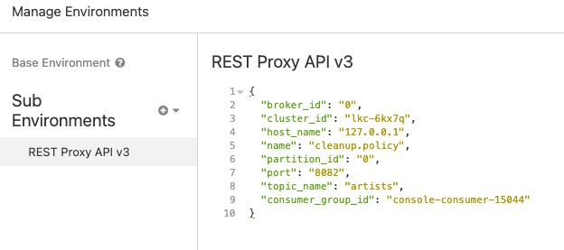

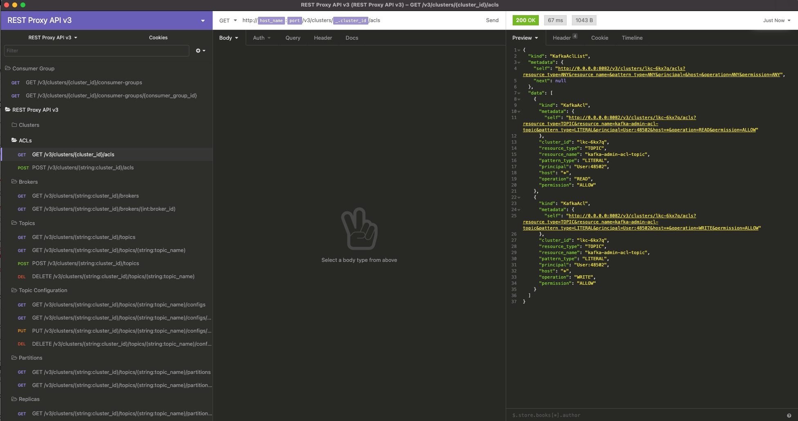

Link to Confluent [documentation](https://docs.confluent.io/current/cloud/connect/ksql-cloud-config.html)


### Control Center

A local Control Center instance (docker service `control-center`) is installed and reachable at [http://127.0.0.1:9021](http://127.0.0.1:9021]).

Link to Confluent [documentation](https://docs.confluent.io/current/cloud/connect/c3-cloud-config.html)

* Docker configuration:

```yml
control-center:
  image: confluentinc/cp-enterprise-control-center:${TAG}
  hostname: control-center
  container_name: control-center
  depends_on:
    - schema-registry
  ports:
    - "9021:9021"
  environment:
    CONTROL_CENTER_BOOTSTRAP_SERVERS: <BOOTSTRAP_SERVERS>
    CONTROL_CENTER_KSQL_URL: "http://ksql-server:8089"
    CONTROL_CENTER_KSQL_ADVERTISED_URL: "http://localhost:8089"
    CONTROL_CENTER_SCHEMA_REGISTRY_URL: <SCHEMA_REGISTRY_URL>
    CONTROL_CENTER_SCHEMA_REGISTRY_BASIC_AUTH_CREDENTIALS_SOURCE: USER_INFO
    CONTROL_CENTER_SCHEMA_REGISTRY_BASIC_AUTH_USER_INFO: <SR_API_KEY>:<SR_API_SECRET>
    CONTROL_CENTER_CONNECT_CLUSTER: "connect:8083"
    CONTROL_CENTER_STREAMS_SECURITY_PROTOCOL: SASL_SSL
    CONTROL_CENTER_STREAMS_SASL_JAAS_CONFIG: org.apache.kafka.common.security.plain.PlainLoginModule required username="<API KEY>" password="<API SECRET>";
    CONTROL_CENTER_STREAMS_SASL_MECHANISM: PLAIN
    CONTROL_CENTER_REPLICATION_FACTOR: 3
    CONTROL_CENTER_MONITORING_INTERCEPTOR_TOPIC_REPLICATION: 3
    CONTROL_CENTER_INTERNAL_TOPICS_REPLICATION: 3
    CONTROL_CENTER_COMMAND_TOPIC_REPLICATION: 3
    CONTROL_CENTER_METRICS_TOPIC_REPLICATION: 3
    CONFLUENT_METRICS_TOPIC_REPLICATION: 3
    CONTROL_CENTER_STREAMS_NUM_STREAM_THREADS: 3
    CONTROL_CENTER_INTERNAL_TOPICS_PARTITIONS: 1
    CONTROL_CENTER_MONITORING_INTERCEPTOR_TOPIC_PARTITIONS: 1
    CONTROL_CENTER_METRICS_TOPIC_MAX_MESSAGE_BYTES: 8388608
    CONFLUENT_LICENSE: "$CONFLUENT_LICENSE"
    PORT: 9021
```

## Monitoring

### Metrics API

See Confluent [docs](https://docs.confluent.io/current/cloud/metrics-api.html).

Pull server-side metrics easily over public internet using HTTPS

👍Use Cloud API key generated using

```bash
$ confluent api-key create --resource cloud
```
👎Use user account login/password

Aggregated at the topic level and cluster level

Examples:

* Bytes produced per minute grouped by topic
* Bytes consumed per minute grouped by topic
* Max retained bytes per hour over two hours for a given topic
* Max retained bytes per hour over two hours for a given cluster

Full API specification is available [here](https://api.telemetry.confluent.cloud/docs)

#### Use with Insomnia

You can use metrics API with [insomnia](https://insomnia.rest/) (install it on Mac OS with `brew cask install insomnia`), then go in Preferences->Plugins and install plugin called `insomnia-plugin-customtimestamp`.
Then go to Preferences->Data and import this [JSON file](insomnia/metrics-api.json?raw=true).

You can set variables for your cluster by modifying sub environment called `Metrics API`:


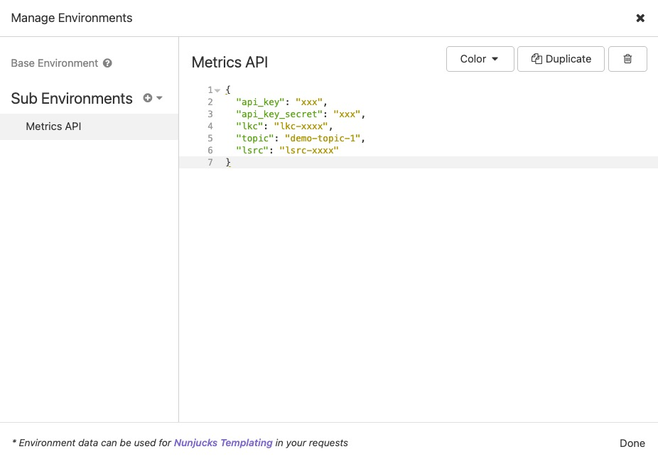

```json
{
  "api_key": "xxx",
  "api_key_secret": "xxx",
  "lkc": "lkc-xxxx",
  "topic": "demo-topic-1",
  "lsrc": "lsrc-xxxx"
}
```

Example:


#### Export to Prometheus
 
This demo is using [dabz/ccloudexporter](https://github.com/Dabz/ccloudexporter) in order to pull Metrics API data from Confluent Cloud cluster and be exported to Prometheus. A Grafana dashboard is also available, see [below](#ccloud-exporter-metrics-api-dashboard).

DEPRECATED - Use export endpoint instead

As of December 2021, Confluent recommends using the [export endpoint of the Confluent Cloud Metrics API](https://api.telemetry.confluent.cloud/docs#tag/Version-2/paths/~1v2~1metrics~1{dataset}~1export/get) to extract metrics instead of running a separate service such as the ccloudexporter. This endpoint can be scraped directly with a Prometheus server or other Open Metrics compatible scrapers.

### Control Center

#### Monitoring multiple clusters

You can monitor multiple Confluent Cloud clusters in Control Center:

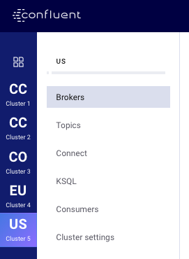

The configuration will look like:

```yml
CONTROL_CENTER_KAFKA_CLUSTER1_BOOTSTRAP_SERVERS: <CLUSTER 1 BOOTSTRAP_SERVERS>
CONTROL_CENTER_KAFKA_CLUSTER1_SECURITY_PROTOCOL: SASL_SSL
CONTROL_CENTER_KAFKA_CLUSTER1_SASL_JAAS_CONFIG: 'org.apache.kafka.common.security.plain.PlainLoginModule required username="<CLUSTER 1 API KEY>" password="<CLUSTER 1 SECRET>";'
CONTROL_CENTER_KAFKA_CLUSTER1_SASL_MECHANISM: PLAIN

CONTROL_CENTER_KAFKA_CLUSTER2_BOOTSTRAP_SERVERS: <CLUSTER 2 BOOTSTRAP_SERVERS>
CONTROL_CENTER_KAFKA_CLUSTER2_SECURITY_PROTOCOL: SASL_SSL
CONTROL_CENTER_KAFKA_CLUSTER2_SASL_JAAS_CONFIG: 'org.apache.kafka.common.security.plain.PlainLoginModule required username="<CLUSTER 2 API KEY>" password="<CLUSTER 2 SECRET>";'
CONTROL_CENTER_KAFKA_CLUSTER2_SASL_MECHANISM: PLAIN

CONTROL_CENTER_KAFKA_CLUSTER3_BOOTSTRAP_SERVERS: <CLUSTER 3 BOOTSTRAP_SERVERS>
CONTROL_CENTER_KAFKA_CLUSTER3_SECURITY_PROTOCOL: SASL_SSL
CONTROL_CENTER_KAFKA_CLUSTER3_SASL_JAAS_CONFIG: 'org.apache.kafka.common.security.plain.PlainLoginModule required username="<CLUSTER 3 API KEY>" password="<CLUSTER 3 SECRET>";'
CONTROL_CENTER_KAFKA_CLUSTER3_SASL_MECHANISM: PLAIN
```

However, if you want to connect to multiple Confluent Cloud Schema Registrie or a mix of OnPrem and Confluent Cloud Schema Registries, then you will have to implement a workaround, see [Multi-Cluster Schema Registry](../../ccloud/multiple-sr-hybrid/README.md) with hybrid configuration (onprem/confluent cloud)

#### Differences between Confluent Cloud UI and local Control Center connected to Confluent Cloud

See the [screenshots](./ccloud_control_center_comparison) on this page.

In summary, the main benefits to have a local Control Center connected to Confluent Cloud are:

* Being able to access your local Connect cluster in Control Center UI
* Being able to access your local KSQL cluster in Control Center UI
* Being able to setup [Alerts], see below

Other than that, Confluent Cloud UI is very similar (assuming that [Configuring Access to the UI Dashboard](https://docs.confluent.io/current/cloud/vpc.html#configuring-access-to-the-ui-dashboard) has been setup, otherwise Topics, Consumers and KSQL tabs will be empty and show a banner to setup proxy)

#### Alerts

You can setup [alerts](https://docs.confluent.io/current/control-center/alerts/index.html) in Control Center.
Here is a table indicating which triggers are available when Control Center is connected to a Confluent Cloud cluster:

Note: Most of Broker, Cluster and Topic triggers are not available because Confluent Cloud [does not expose](https://docs.confluent.io/current/cloud/connect/c3-cloud-config.html#limitations) those metrics.

|  Component type | Criteria  | Available | Appear in History
|---|---|---|---|
|  Broker  | Bytes in  | no  |   |
|  Broker  | Bytes out  | no  |   |
|  Broker  | Fetch request latency  | no  |   |
|  Broker  | Production request count | no  |   |
|  Broker  | Production request latency  | no  |   |
|  Cluster  | Active Controller count  | no  |   |
|  Cluster  | Cluster down  | yes  |   |
|  Cluster  | Leader election rate | no  |   |
|  Cluster  | Offline topic partitions | no  |   |
|  Cluster  | Unclean election count  | no  |   |
|  Cluster  | Under replicated topic partitions  | no  |   |
|  Cluster  | ZK Disconnected  | no  |   |
|  Cluster  | Zookeeper expiration rate  | no  |   |
|  Consumer group  | Average latency (ms)  | yes  | yes  |
|  Consumer group  | Consumer lag  | yes  |  no * |
|  Consumer group  | Consumer lead | yes  | yes  |
|  Consumer group  | Consumption difference  | yes  |  yes |
|  Consumer group  | Maximum latency (ms)  | yes  |  yes |
|  Topic  | Bytes in  | no  |   |
|  Topic  | Bytes out  | no  |   |
|  Topic  | Out of sync replica count | no  |   |
|  Topic  | Production request count | no  |   |
|  Topic  | Under replicated topic partitions  | no  |   |

\* Expected, as per the [docs](https://docs.confluent.io/current/control-center/alerts/navigate.html#alerts-history):

```
Any alerts triggered by consumer lag, cluster status, or broker status events do not populate history. Alert emails sent do not contain an email link to alerts history.
```

To setup email alerts, here is an example:

```yml
CONTROL_CENTER_MAIL_ENABLED: "true"
CONTROL_CENTER_MAIL_HOST_NAME: "smtp.gmail.com"
CONTROL_CENTER_MAIL_PORT: 587
CONTROL_CENTER_MAIL_FROM: "john.doe@gmail.com"
CONTROL_CENTER_MAIL_USERNAME: "john.doe@gmail.com"
CONTROL_CENTER_MAIL_PASSWORD: "xxxx"
CONTROL_CENTER_MAIL_STARTTLS_REQUIRED: "true"
CONTROL_CENTER_MAIL_SSL_CHECKSERVERIDENTITY: "true"
CONTROL_CENTER_MAIL_BOUNCE_ADDRESS: "john.doe@gmail.com"
```

#### Read-Only mode

You can setup Control Center in read-only mode, using UI HTTP Basic Authentication, see example [here](../../other/control-center-readonly-mode/README.md).

### Grafana

[JMX Exporter](https://github.com/prometheus/jmx_exporter), [Prometheus](https://github.com/prometheus/prometheus) and [Grafana](https://grafana.com) are installed in order to provide a demo of clients monitoring.

* Docker configuration:

```yml
alertmanager:
  image: prom/alertmanager:v0.18.0
  hostname: alertmanager
  container_name: alertmanager
  ports:
    - 9093:9093

node-exporter:
  image: prom/node-exporter:v0.18.1
  hostname: node-exporter
  container_name: node-exporter
  volumes:
    - /proc:/host/proc:ro
    - /sys:/host/sys:ro
    - /:/rootfs:ro
  command:
    - '--path.procfs=/host/proc'
    - '--path.sysfs=/host/sys'
    - '--collector.filesystem.ignored-mount-points'
    - '^(aufs|proc|nsfs|shm|cgroup|tmpfs|binfmt_misc|debugfs|devpts|fusectl|hugetlbfs|fuse.lxcfs|mqueue|pstore|securityfs|sysfs|autofs|devtmpfs|configfs)'

prometheus:
  image: prom/prometheus
  hostname: prometheus
  container_name: prometheus
  ports:
    - 9090:9090
  volumes:
    - ./prometheus/:/etc/prometheus/
  depends_on:
    - node-exporter
    - kafka-lag-exporter
    - alertmanager

kafka-lag-exporter:
  image: lightbend/kafka-lag-exporter:0.6.6
  hostname: kafka-lag-exporter
  container_name: kafka-lag-exporter
  restart: always
  volumes:
    - ./kafka-lag-exporter/application.conf:/opt/docker/conf/application.conf
    - ./kafka-lag-exporter/logback.xml:/opt/docker/conf/logback.xml

ccloud_exporter:
  image: dabz/ccloudexporter:latest
  hostname: ccloud_exporter
  container_name: ccloud_exporter
  environment:
    CCLOUD_USER: ${API_KEY_CLOUD} # confluent api-key create --resource cloud
    CCLOUD_PASSWORD: ${API_SECRET_CLOUD} # confluent api-key create --resource cloud
    CCLOUD_CLUSTER: ${CCLOUD_CLUSTER}
  command: ccloudexporter ${CCLOUD_CLUSTER}

grafana:
  image: grafana/grafana:7.4.1
  hostname: grafana
  container_name: grafana
  environment:
    GF_INSTALL_PLUGINS: grafana-piechart-panel
  ports:
    - 3000:3000
  volumes:
    - ./grafana/provisioning/:/etc/grafana/provisioning/
  depends_on:
    - prometheus
```

Open a brower and visit http://127.0.0.1:3000 (login/password is `admin/admin`)

You should see 3 dashboards:

#### Producer Dashboard


#### Consumer Dashboard


#### Connect Dashboard

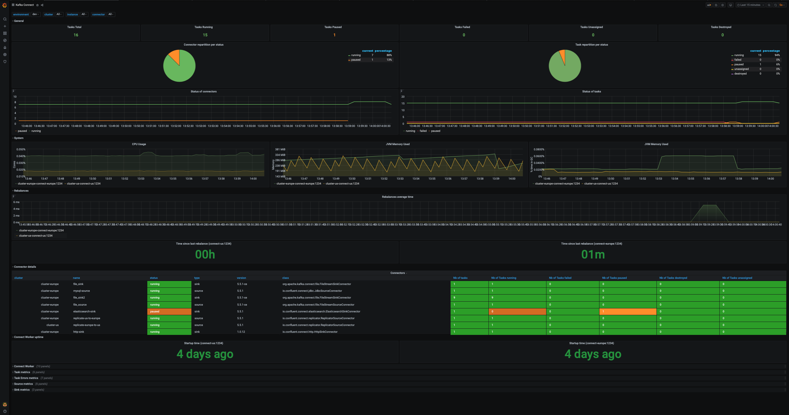

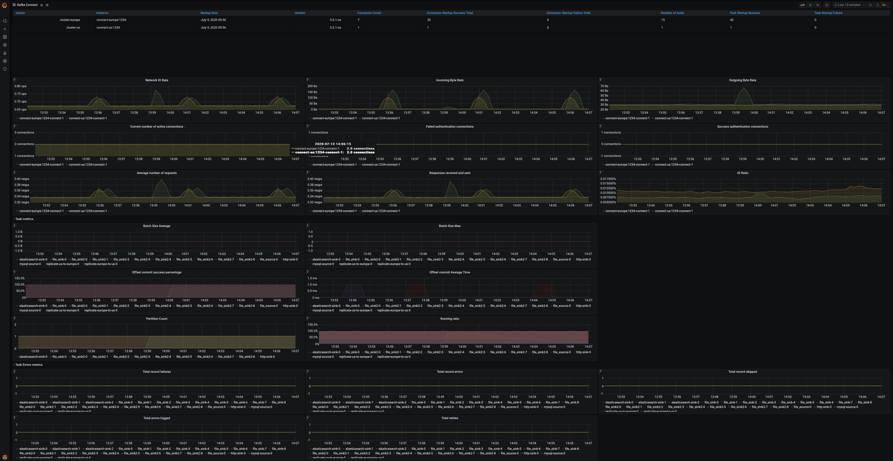

#### Consumer Lag Dashboard

This demo is using [lightbend/kafka-lag-exporter](https://github.com/lightbend/kafka-lag-exporter) in order to pull consumer lags metrics from Confluent Cloud cluster and be exported to Prometheus.


#### CCloud Exporter Metrics API Dashboard

This demo is using [dabz/ccloudexporter](https://github.com/Dabz/ccloudexporter) in order to pull Metrics API data from Confluent Cloud cluster and be exported to Prometheus.


### New Relic

In order to integrate with New Relic, you can set up the [Prometheus remote write integration](https://docs.newrelic.com/docs/integrations/prometheus-integrations/install-configure-remote-write/set-your-prometheus-remote-write-integration/) very easily:

* Sign in with your New Relic account
* Go to this [page](https://docs.newrelic.com/docs/integrations/prometheus-integrations/install-configure-remote-write/set-your-prometheus-remote-write-integration/#setup) and click on `Add Prometheus data` button. You will land on this page:


Set a name for the data source (for example `demo`) and then click on `Generate url`, it will give a `remote_write` like:

```
remote_write:
- url: https://metric-api.eu.newrelic.com/prometheus/v1/write?prometheus_server=demo
  bearer_token: eu01xxxxxxxxxxxxxxxxxxxxxxxxxxxxxx
```

Open `prometheus.yml` [file](https://github.com/vdesabou/kafka-docker-playground/blob/master/ccloud/ccloud-demo/prometheus/prometheus.yml#L1) and copy the `remote_write` URL at the same level as global:

Example:

```yml
global:
  scrape_interval:     15s # By default, scrape targets every 15 seconds.
  evaluation_interval: 15s # By default, scrape targets every 15 seconds.
remote_write:
- url: https://metric-api.eu.newrelic.com/prometheus/v1/write?prometheus_server=new_relic_demo
  bearer_token: eu01xxxxxxxxxxxxxxxxxxxxxxxxxxxxxx
```

That's it ! All the data available in the prometheus instance will be available in New Relic:

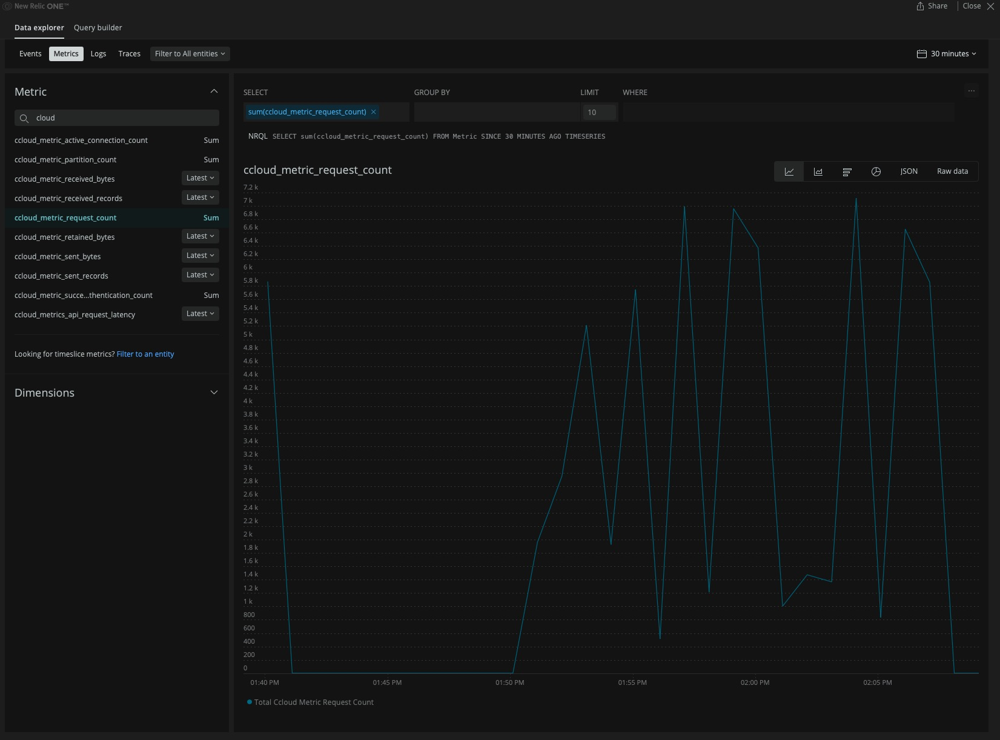

Note: if you prefer to use Telegraf, there is an example in [Dabz/ccloudexporter](https://github.com/Dabz/ccloudexporter) which was added with that [pull request](https://github.com/Dabz/ccloudexporter/pull/81).

### Splunk

This is an example taken from [Dabz/ccloudexporter](https://github.com/Dabz/ccloudexporter#splunk)

Check Splunk UI [http://127.0.0.1:18000](http://127.0.0.1:18000/en-US/app/search/analytics_workspace)(`admin`/`changeme`)

Metrics will show up like this:

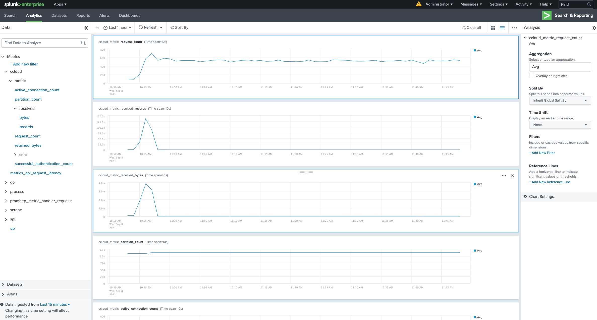

### How to monitor consumer lag

You have several ways to monitor consumer lag:

1. [Monitor Consumer Lag via the Confluent Cloud Interface](https://docs.confluent.io/current/cloud/using/monitor-lag.html#monitor-consumer-lag-via-the-ccloud-interface)


Note: if the cluster is [VPC peered](https://docs.confluent.io/current/cloud/vpc.html), you need to follow [Configuring Access to the UI Dashboard](https://docs.confluent.io/current/cloud/vpc.html#configuring-access-to-the-ui-dashboard) in order to have access to consumer interface.

2. Monitor Consumer Lag via Control Center connected to your Confluent Cloud cluster

If you have a Control Center connected to your Confluent Cloud cluster, as explained [above](#control-center), then you can see consumer lag:


3. [Monitor Offset Lag via Java Client Metrics](https://docs.confluent.io/current/cloud/using/monitor-lag.html#monitor-offset-lag-via-java-client-metrics)

This requires to monitor JMX metric `records-lag-max`from your Java consumer

4. Using kafka-consumer-groups CLI for Confluent Cloud

You need to create a file like this:

Example:

```
$ cat client.properties

ssl.endpoint.identification.algorithm=https
sasl.mechanism=PLAIN
request.timeout.ms=20000
retry.backoff.ms=500
sasl.jaas.config=org.apache.kafka.common.security.plain.PlainLoginModulerequired username="<API_KEY>" password="<API_SECRET>";
security.protocol=SASL_SSL
```

Then you can call `kafka-consumer-groups` command:

```bash
./kafka-consumer-groups --bootstrap-server ${BOOTSTRAP_SERVERS} --command-config /path/to/your/client.properties --list
```

```bash
./kafka-consumer-groups --bootstrap-server ${BOOTSTRAP_SERVERS} --command-config /path/to/your/client.properties --group <your consumer group> --describe
```

Example:

```bash
$ kafka-consumer-groups --bootstrap-server <BOOTSTRAP_SERVERS> --command-config /tmp/client.properties --list

_confluent-controlcenter-5-3-1-1
customer-avro-app
connect-http-sink
simple-stream
_confluent-controlcenter-5-4-0-1
_confluent-controlcenter-5-4-0-1-command
_confluent-controlcenter-5-3-1-1-command
```

```bash
$ kafka-consumer-groups --bootstrap-server <BOOTSTRAP_SERVERS> --command-config /tmp/client.properties --group customer-avro-app --describe

GROUP             TOPIC           PARTITION  CURRENT-OFFSET  LOG-END-OFFSET  LAG             CONSUMER-ID                                     HOST                                      CLIENT-ID
customer-avro-app customer-avro   2          0               0               0               consumer-1-c0b84633-8bdf-452c-ab69-387726e4234b 152.227.102.84.rev.sfr.net/84.102.227.152 consumer-1
customer-avro-app customer-avro   3          1366            1366            0               consumer-1-c0b84633-8bdf-452c-ab69-387726e4234b 152.227.102.84.rev.sfr.net/84.102.227.152 consumer-1
customer-avro-app customer-avro   1          0               0               0               consumer-1-c0b84633-8bdf-452c-ab69-387726e4234b 152.227.102.84.rev.sfr.net/84.102.227.152 consumer-1
customer-avro-app customer-avro   5          0               0               0               consumer-1-c0b84633-8bdf-452c-ab69-387726e4234b 152.227.102.84.rev.sfr.net/84.102.227.152 consumer-1
customer-avro-app customer-avro   0          0               0               0               consumer-1-c0b84633-8bdf-452c-ab69-387726e4234b 152.227.102.84.rev.sfr.net/84.102.227.152 consumer-1
customer-avro-app customer-avro   4          0               0               0               consumer-1-c0b84633-8bdf-452c-ab69-387726e4234b 152.227.102.84.rev.sfr.net/84.102.227.152 consumer-1
```

Note: for Confluent customers, you can refer to this Knowledge Base [article](https://support.confluent.io/hc/en-us/articles/360022562212-kafka-consumer-groups-command-for-Confluent-Cloud)

5. Using [lightbend/kafka-lag-exporter](https://github.com/lightbend/kafka-lag-exporter) and Prometheus

This is explained [above](#consumer-lag-dashboard). This is using Kafka's Admin API [describeConsumerGroups()](https://kafka.apache.org/24/javadoc/org/apache/kafka/clients/admin/Admin.html#describeConsumerGroups-java.util.Collection-) method.


## 📚 Other useful resources

* [Confluent Examples](https://github.com/confluentinc/examples/tree/master/ccloud) Github repository

* [A Confluent Cloud Story](https://github.com/framiere/a-confluent-cloud-story)
