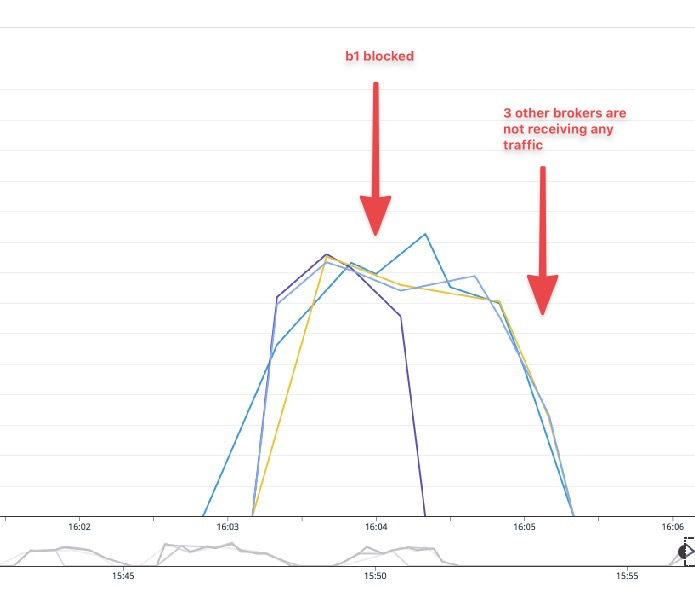
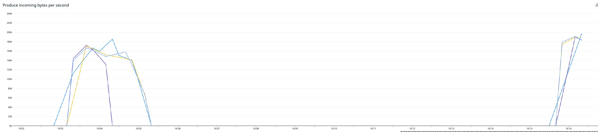

# Testing KafkaJS with timeout

This is a test using a Confluent Cloud cluster:


KafkaJS Producer (using `kafkajs@1.15.0`) (`client` docker container) ----> HAProxy router (`haproxy`)   -----> Confluent Cloud

The goal of using HAProxy is to be able to block incoming response from one of the Confluent Cloud brokers, using iptable rule

## How to run

```bash
export PKC_ENDPOINT=pkc-xxxxx.confluent.cloud
export CLOUD_KEY=xxxxx
export CLOUD_SECRET=xxxxx
./repro-timeout.sh
```

After some time, you can execute the following command to block incoming responses from one broker:


```bash
$ date;docker exec --privileged --user root -i haproxy bash -c 'iptables -A INPUT -p tcp -s 35.205.238.172 -j DROP'
```

In that example, `35.205.238.172` is the IP address of broker `b1-pkc-r5djp.europe-west1.gcp.confluent.cloud` which can be found doing nslookup:

```bash
nslookup b1-pkc-r5djp.europe-west1.gcp.confluent.cloud                                          
Non-authoritative answer:
Name:   b1-pkc-r5djp.europe-west1.gcp.confluent.cloud
Address: 35.205.238.172
```

## Results:

Traffic from b1 broker is blocked at `16:04:09`

```bash
date;docker exec --privileged --user root -i haproxy bash -c 'iptables -A INPUT -p tcp -s 35.205.238.172 -j DROP' 
Tue Sep 28 16:04:09 CEST 2021
```

Incoming traffic drops immediately for broker b1 (as expected), but after about one minute, it drops to 0 as well for all other brokers:



After some time, iptable rule is removed:

```bash
date;docker exec --privileged --user root -i haproxy bash -c 'iptables -D INPUT -p tcp -s 35.205.238.172 -j DROP'
Tue Sep 28 16:15:45 CEST 2021
```

And traffic restarts on all 4 brokers:




Logs with DEBUG can be found [here](https://github.com/vdesabou/kafka-docker-playground/blob/master/ccloud/client-kafkajs/producer.log.tgz?raw=true)