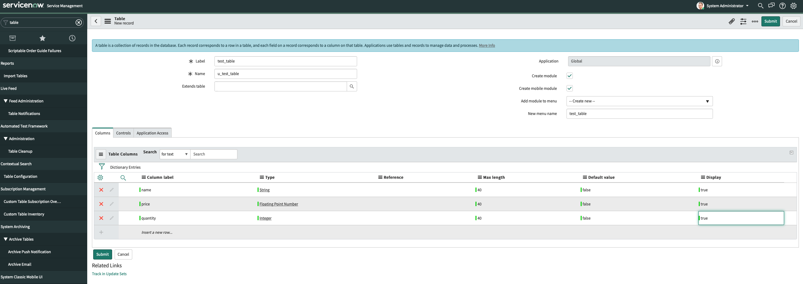
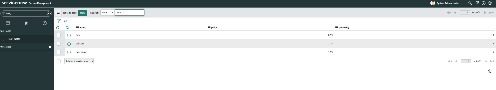

# ServiceNow Sink connector (using Confluent Cloud)


## Objective

Quickly test [ServiceNow Sink](https://docs.confluent.io/current/connect/kafka-connect-servicenow/sink-connector/index.html#quick-start) connector using Confluent Cloud.

## Prerequisites

All you have to do is to be already logged in with [confluent CLI](https://docs.confluent.io/confluent-cli/current/overview.html#confluent-cli-overview).

By default, a new Confluent Cloud environment with a Cluster will be created.

You can configure the cluster by setting environment variables:

* `CLUSTER_CLOUD`: The Cloud provider (possible values: `aws`, `gcp` and `azure`, default `aws`)
* `CLUSTER_REGION`: The Cloud region (use `confluent kafka region list` to get the list, default `eu-west-2`)
* `CLUSTER_TYPE`: The type of cluster (possible values: `basic`, `standard` and `dedicated`, default `basic`)
* `ENVIRONMENT` (optional): The environment id where want your new cluster (example: `env-xxxxx`) 

In case you want to use your own existing cluster, you need to setup these environment variables:

* `ENVIRONMENT`: The environment id where your cluster is located (example: `env-xxxxx`) 
* `CLUSTER_NAME`: The cluster name
* `CLUSTER_CLOUD`: The Cloud provider (possible values: `aws`, `gcp` and `azure`)
* `CLUSTER_REGION`: The Cloud region (example `us-east-2`)
* `CLUSTER_CREDS`: The Kafka api key and secret to use, it should be separated with semi-colon (example: `<API_KEY>:<API_KEY_SECRET>`)
* `SCHEMA_REGISTRY_CREDS` (optional, if not set, new one will be created): The Schema Registry api key and secret to use, it should be separated with semi-colon (example: `<SR_API_KEY>:<SR_API_KEY_SECRET>`)

## Register a test account

Go to [ServiceNow developer portal](https://developer.servicenow.com) and register an account.
Click on `Manage`->`Instance` and register for a New-York instance. After some time (about one hour in my case) on the waiting list, you should receive an email with details of your test instance.

## Create the test_table in ServiceNow



## How to run


Simply run:

```bash
$ playground run -f servicenow-sink<use tab key to activate fzf completion (see https://kafka-docker-playground.io/#/cli?id=%e2%9a%a1-setup-completion), otherwise use full path, or relative path> <SERVICENOW_URL> <SERVICENOW_PASSWORD>
```

Note: you can also export these values as environment variable

## Details of what the script is doing

Sending messages to topic `test_table`

```bash
$ docker exec -i -e BOOTSTRAP_SERVERS="$BOOTSTRAP_SERVERS" -e SASL_JAAS_CONFIG="$SASL_JAAS_CONFIG" -e SCHEMA_REGISTRY_BASIC_AUTH_USER_INFO="$SCHEMA_REGISTRY_BASIC_AUTH_USER_INFO" -e SCHEMA_REGISTRY_URL="$SCHEMA_REGISTRY_URL" connect kafka-avro-console-producer --broker-list $BOOTSTRAP_SERVERS --producer-property ssl.endpoint.identification.algorithm=https --producer-property sasl.mechanism=PLAIN --producer-property security.protocol=SASL_SSL --producer-property sasl.jaas.config="$SASL_JAAS_CONFIG" --property basic.auth.credentials.source=USER_INFO --property schema.registry.basic.auth.user.info="$SCHEMA_REGISTRY_BASIC_AUTH_USER_INFO" --property schema.registry.url=$SCHEMA_REGISTRY_URL --property schema.registry.url=$SCHEMA_REGISTRY_URL --topic test_table --property value.schema='{"type":"record","name":"myrecord","fields":[{"name":"u_name","type":"string"},{"name":"u_price", "type": "float"}, {"name":"u_quantity", "type": "int"}]}' << EOF
{"u_name": "scissors", "u_price": 2.75, "u_quantity": 3}
{"u_name": "tape", "u_price": 0.99, "u_quantity": 10}
{"u_name": "notebooks", "u_price": 1.99, "u_quantity": 5}
EOF
```

Creating ServiceNow Sink connector

```bash
$ curl -X PUT \
     -H "Content-Type: application/json" \
     --data '{
               "connector.class": "io.confluent.connect.servicenow.ServiceNowSinkConnector",
                "topics": "test_table",
                "servicenow.url": "$SERVICENOW_URL",
                "tasks.max": "1",
                "servicenow.table": "u_test_table",
                "servicenow.user": "admin",
                "servicenow.password": "$SERVICENOW_PASSWORD",
                "key.converter": "io.confluent.connect.avro.AvroConverter",
                "key.converter.schema.registry.url": "http://schema-registry:8081",
                "value.converter": "io.confluent.connect.avro.AvroConverter",
                "value.converter.schema.registry.url": "http://schema-registry:8081",
                "reporter.bootstrap.servers": "${file:/data:bootstrap.servers}",
                "reporter.admin.ssl.endpoint.identification.algorithm" : "https",
                "reporter.admin.sasl.mechanism" : "PLAIN",
                "reporter.admin.sasl.jaas.config" : "org.apache.kafka.common.security.plain.PlainLoginModule required username=\"\${file:/data:sasl.username}\" password=\"\${file:/data:sasl.password}\";",
                "reporter.admin.security.protocol" : "SASL_SSL",
                "reporter.producer.ssl.endpoint.identification.algorithm" : "https",
                "reporter.producer.sasl.mechanism" : "PLAIN",
                "reporter.producer.sasl.jaas.config" : "org.apache.kafka.common.security.plain.PlainLoginModule required username=\"\${file:/data:sasl.username}\" password=\"\${file:/data:sasl.password}\";",
                "reporter.producer.security.protocol" : "SASL_SSL",
                "reporter.error.topic.name": "test-error",
                "reporter.error.topic.replication.factor": 3,
                "reporter.error.topic.key.format": "string",
                "reporter.error.topic.value.format": "string",
                "reporter.result.topic.name": "test-result",
                "reporter.result.topic.key.format": "string",
                "reporter.result.topic.value.format": "string",
                "reporter.result.topic.replication.factor": 3,
                "confluent.topic.ssl.endpoint.identification.algorithm" : "https",
                "confluent.topic.sasl.mechanism" : "PLAIN",
                "confluent.topic.bootstrap.servers": "${file:/data:bootstrap.servers}",
                "confluent.topic.sasl.jaas.config" : "org.apache.kafka.common.security.plain.PlainLoginModule required username=\"\${file:/data:sasl.username}\" password=\"\${file:/data:sasl.password}\";",
                "confluent.topic.security.protocol" : "SASL_SSL",
                "confluent.topic.replication.factor": "3"
          }' \
     http://localhost:8083/connectors/servicenow-sink/config | jq .
```

Confirm that the messages were delivered to the ServiceNow table:

```bash
$ docker exec -e SERVICENOW_URL="$SERVICENOW_URL" -e SERVICENOW_PASSWORD="$SERVICENOW_PASSWORD" connect \
   curl -X GET \
    "${SERVICENOW_URL}/api/now/table/u_test_table" \
    --user admin:"$SERVICENOW_PASSWORD" \
    -H 'Accept: application/json' \
    -H 'Content-Type: application/json' \
    -H 'cache-control: no-cache'
```

Results:

```json
{
    "result": [
        {
            "sys_created_by": "admin",
            "sys_created_on": "2020-01-31 15:09:12",
            "sys_id": "7a91d5ffdb2a00107b7e5385ca96194b",
            "sys_mod_count": "0",
            "sys_tags": "",
            "sys_updated_by": "admin",
            "sys_updated_on": "2020-01-31 15:09:12",
            "u_name": "tape",
            "u_price": "0.99",
            "u_quantity": "10"
        },
        {
            "sys_created_by": "admin",
            "sys_created_on": "2020-01-31 15:09:11",
            "sys_id": "ba9195ffdb2a00107b7e5385ca961973",
            "sys_mod_count": "0",
            "sys_tags": "",
            "sys_updated_by": "admin",
            "sys_updated_on": "2020-01-31 15:09:11",
            "u_name": "scissors",
            "u_price": "2.75",
            "u_quantity": "3"
        },
        {
            "sys_created_by": "admin",
            "sys_created_on": "2020-01-31 15:09:12",
            "sys_id": "be9195ffdb2a00107b7e5385ca961975",
            "sys_mod_count": "0",
            "sys_tags": "",
            "sys_updated_by": "admin",
            "sys_updated_on": "2020-01-31 15:09:12",
            "u_name": "notebooks",
            "u_price": "1.99",
            "u_quantity": "5"
        }
    ]
}
```

Or using UI:



N.B: Control Center is reachable at [http://127.0.0.1:9021](http://127.0.0.1:9021])
