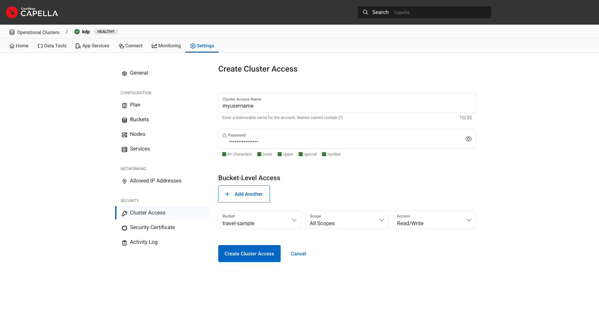
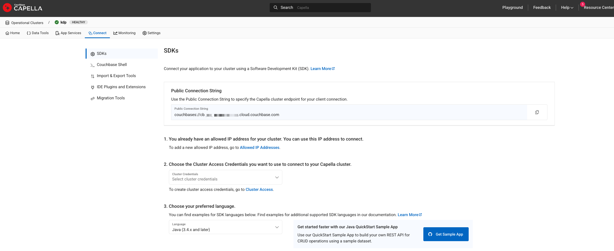

# Fully Managed Couchbase Source connector

## Objective

Quickly test [Fully Managed Couchbase Source](https://docs.confluent.io/cloud/current/connectors/cc-couchbase-db-source/cc-couchbase-db-source.html) connector.

## Prerequisites

See [here](https://kafka-docker-playground.io/#/how-to-use?id=%f0%9f%8c%a4%ef%b8%8f-confluent-cloud-examples)

You also need to [create a free Couchbase Capella account](https://cloud.couchbase.com/sign-up). And a cluster.

Go to Settings->Allowed IP Addresses and add your confluent cloud cluster egress ip addresses:


Then go to Security->Cluster Access and create cluster access (allow access to bucket `travel-sample`):



That will give you environment variable `COUCHBASE_USERNAME` and `COUCHBASE_PASSWORD`

Then go to `Connect` menu and copy the *Public Connection String*:



That will give you environment variable `COUCHBASE_CONNECTION_URL` 

## How to run

Simply run:

```
$ just use <playground run> command and search for couchbase.sh in this folder
```
