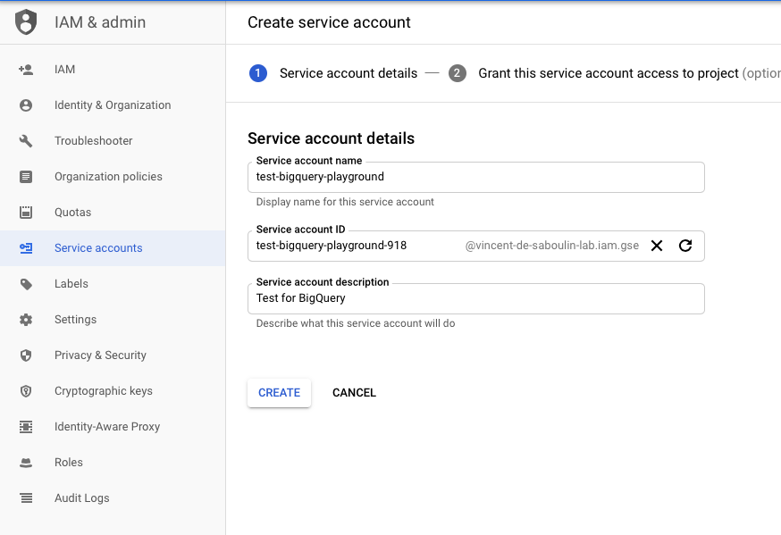
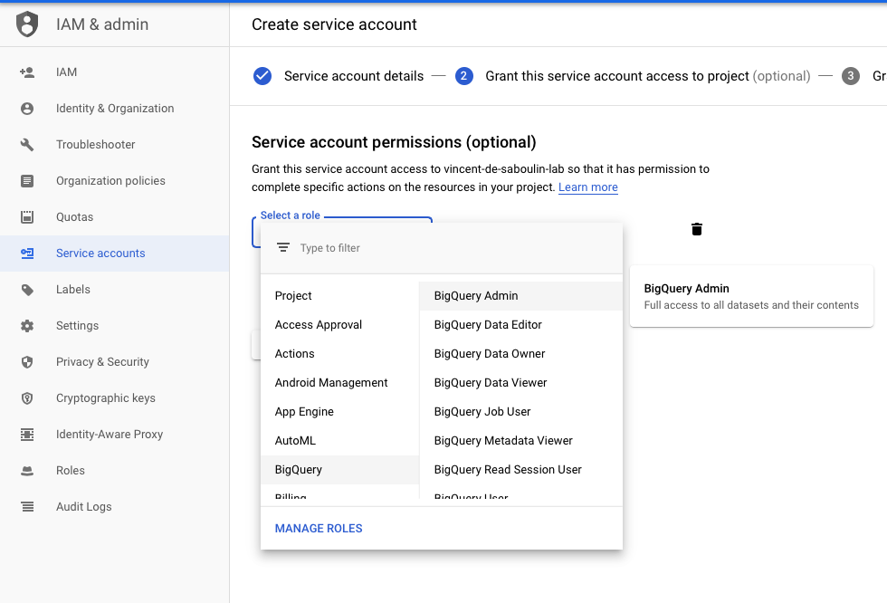
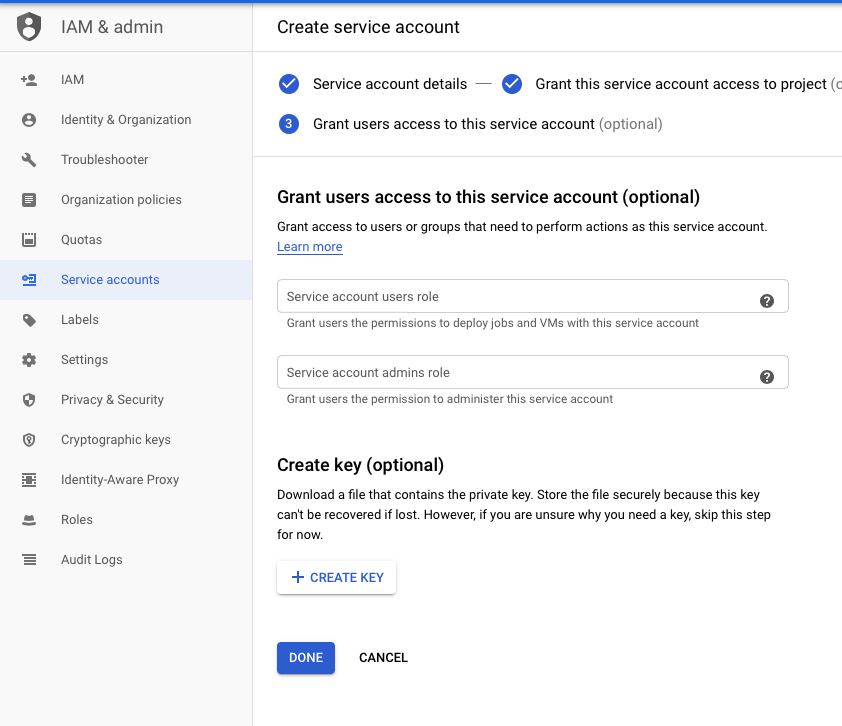
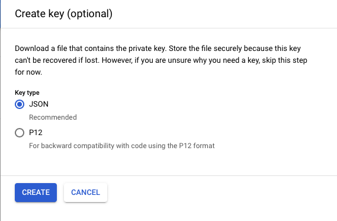

# Fully Managed Google BigQuery Source (JDBC) connector

## Objective

Quickly test [Google BigQuery Source (JDBC)](https://docs.confluent.io/cloud/current/connectors/cc-gcp-bigquery-source.html) connector.

* Active Google Cloud Platform (GCP) account with authorization to create resources

## Prerequisites

See [here](https://kafka-docker-playground.io/#/how-to-use?id=%f0%9f%8c%a4%ef%b8%8f-confluent-cloud-examples)


## GCP BigQuery Setup

* Follow [Quickstart using the web UI in the GCP Console](https://cloud.google.com/bigquery/docs/quickstarts/quickstart-web-ui) to get familiar with GCP BigQuery
* Create `Service Account` from IAM & Admin console:

Set `Service account name`:




Choose permission `BigQuery`->`BigQuery Admin` (the connector itself only needs `roles/bigquery.jobUser` and `roles/bigquery.dataViewer`, `BigQuery Admin` is used by the script to create the dataset and table):



Create Key:



Download it as JSON:



Rename it to `keyfile.json`and place it in `./keyfile.json` or use environment variable `GCP_KEYFILE_CONTENT` with content generated with `GCP_KEYFILE_CONTENT=$(cat keyfile.json | jq -aRs . | sed 's/^"//' | sed 's/"$//')


## How to run

The BigQuery dataset is created in location `US`: with `timestamp`/`incrementing` modes, the connector validates the offset columns with a metadata query (`getPrimaryKeys`) that ignores `bigquery.query.location` and always runs in `US`, so a dataset in another location fails with `Not found: Dataset <project>:<dataset> was not found in location US`.

Simply run:

```bash
$ just use <playground run> command and search for fully-managed-gcp-bigquery-source<use tab key to activate fzf completion (see https://kafka-docker-playground.io/#/cli?id=%e2%9a%a1-setup-completion), otherwise use full path, or correct relative path> .sh in this folder
```
