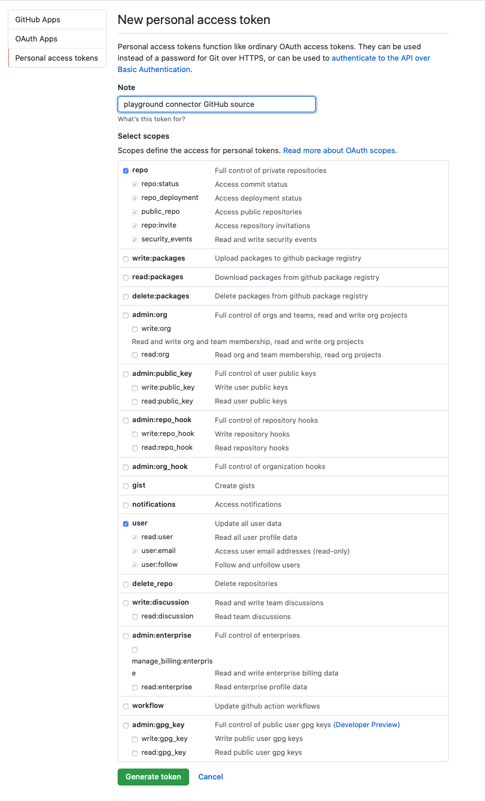

# Fully Managed Github Source connector


## Objective

Quickly test [Fully Managed Github Source](https://docs.confluent.io/cloud/current/connectors/cc-github-source.html) connector.


## Create a personal access token

Go to your Github account and select `Settings`:


Click on `Developer Settings`:


Click on `Personal access tokens`:


Generate new token with `repo` and `user` selected:



## Prerequisites

See [here](https://kafka-docker-playground.io/#/how-to-use?id=%f0%9f%8c%a4%ef%b8%8f-confluent-cloud-examples)


## How to run

Simply run:

```
$ just use <playground run> command and search for github-source<use tab key to activate fzf completion (see https://kafka-docker-playground.io/#/cli?id=%e2%9a%a1-setup-completion), otherwise use full path, or correct relative path> .sh in this folder
```

Note: you can also export these values as environment variable
