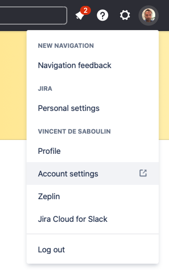

# Fully Managed Jira Source connector


## Objective

Quickly test [Fully Managed Jira Source](https://docs.confluent.io/cloud/current/connectors/cc-jira-source.html) connector.


## Create an API token

If you want to create a developer account, create one [here](https://www.atlassian.com/try/cloud/signup?product=confluence.ondemand,jira-software.ondemand,jira-servicedesk.ondemand,jira-core.ondemand&developer=true)
Go to your JIRA instance and select `Accounts Settings`:



Click on `Security`->`Create and manage api tokens`:


Create the API token:


## Prerequisites

See [here](https://kafka-docker-playground.io/#/how-to-use?id=%f0%9f%8c%a4%ef%b8%8f-confluent-cloud-examples)


## How to run

Simply run:

```
$ just use <playground run> command and search for jira-source<use tab key to activate fzf completion (see https://kafka-docker-playground.io/#/cli?id=%e2%9a%a1-setup-completion), otherwise use full path, or correct relative path> <JIRA_URL> <JIRA_USERNAME> .sh in this folder
```

Note: you can also export these values as environment variable
