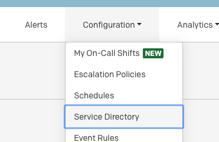
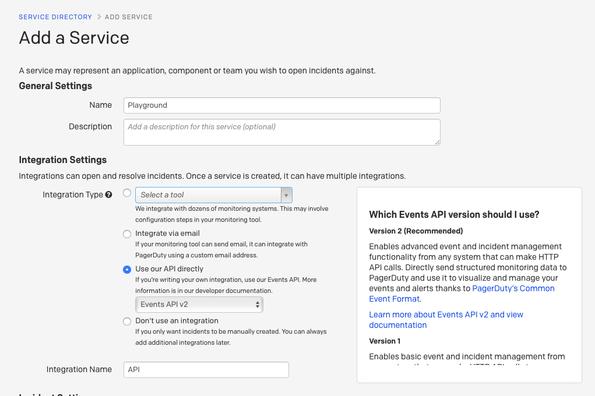
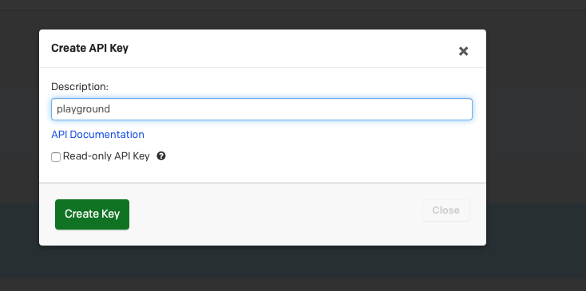

# Fully Managed PagerDuty Sink connector


## Objective

Quickly test [Fully Managed PagerDuty Sink](https://docs.confluent.io/cloud/current/connectors/cc-pagerduty-sink.html) connector.


## Register a trial account

Go to [PagerDuty portal](https://www.pagerduty.com/sign-up/?type=team) and register an account.


## Get Service ID

Select `Configuration`->`Service Directory`:



Click on `+New Service` and select `Use our API directly` as the Integration type:



Get the service ID from URL bar:

Example: `https://xxx.pagerduty.com/service-directory/PY7K7O3`

## Get PagerDuty Api Key

Select `Configuration`->`API Access` and create New API Key:




## Prerequisites

See [here](https://kafka-docker-playground.io/#/how-to-use?id=%f0%9f%8c%a4%ef%b8%8f-confluent-cloud-examples)

## How to run

Simply run:

```bash
$ just use <playground run> command
```
