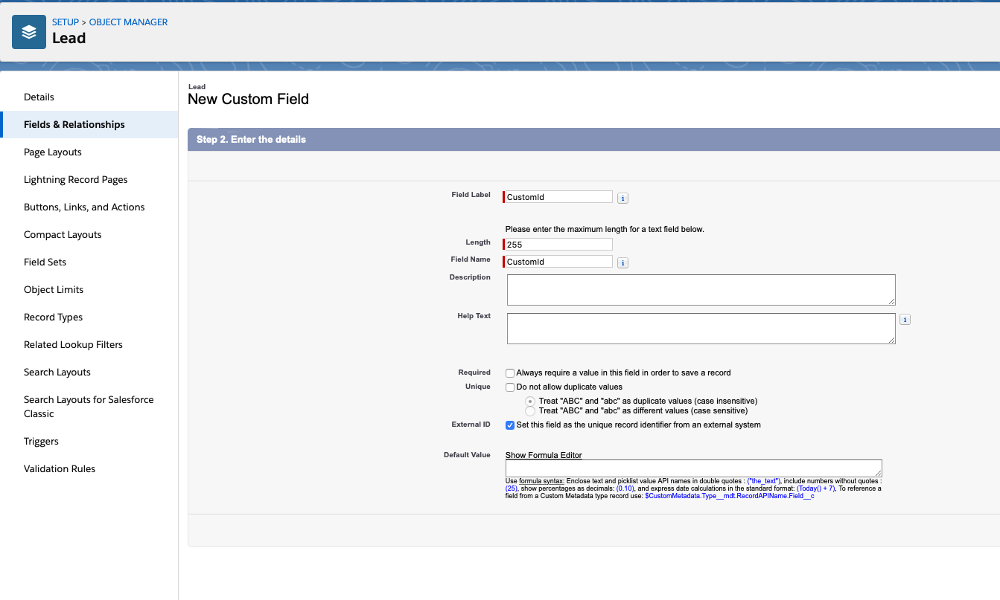

# Fully Managed Salesforce SObject Sink connector


## Objective

Quickly test [Salesforce SObject Sink](https://docs.confluent.io/cloud/current/connectors/cc-salesforce-SObjects-sink.html) connector.

## Prerequisites

See [here](https://kafka-docker-playground.io/#/how-to-use?id=%f0%9f%8c%a4%ef%b8%8f-confluent-cloud-examples)

## Register a test account

Go to [Salesforce developer portal](https://developer.salesforce.com/signup/) and register an account.

## Register another test account

Go to [Salesforce developer portal](https://developer.salesforce.com/signup/) and register an account.

## Salesforce Account

### Create a new Connected App

Full details available [here](https://docs.confluent.io/current/connect/kafka-connect-salesforce/pushtopics/salesforce_pushtopic_source_connector_quickstart.html#salesforce-account)

Steps are:

* Select the gear icon in the upper right hand corner and choose Setup.

* Enter App in the Quick Find search box, and choose *App Manager* in the filtered results.

* Click the *New Connected App* button in the upper right corner of the Setup panel.


* Supply a Connected App Name, API Name, and Contact Email.

* Select *Enable OAuth Settings* checkbox and select the *Enable for Device Flow* checkbox. These selections enable the connector to use the Salesforce API.
* Under the *Select OAuth Scopes* field, select all of the items under Available OAuth scopes and add them to the *Selected OAuth Scopes*.

Example:


* Save the new app and press Continue at the prompt.
* Look for the Consumer Key and Consumer Secret in the displayed form. Save these so you can put them in the configuration properties file for the Salesforce connect worker.

**IMPORTANT !!**: for new orgs, "Username-Password Flow" is disabled by default, see the [help page](https://help.salesforce.com/s/articleView?id=release-notes.rn_security_username-password_flow_blocked_by_default.htm&release=244&type=5).

You need to activate this (otherwise you get `{"error":"invalid_grant","error_description":"authentication failure"}`):


### Find your Security token

Find your Security Token (emailed to you from Salesforce.com). If you need to reset your token or view your profile on Salesforce.com, select `Settings->My Personal Information->Reset My Security Token` and follow the instructions.


## Create CustomId External ID

Follow instructions [here](https://docs.confluent.io/current/connect/kafka-connect-salesforce/sobjects_sink/index.html#external-id), **for both accounts**.



## How to run

Simply run:

```
$ just use <playground run> command and search for fully-managed-salesforce-sobject-sink<use tab key to activate fzf completion (see https://kafka-docker-playground.io/#/cli?id=%e2%9a%a1-setup-completion), otherwise use full path, or correct relative path> <SALESFORCE_USERNAME> <SALESFORCE_PASSWORD> <SALESFORCE_CONSUMER_KEY> <SALESFORCE_CONSUMER_PASSWORD> <SALESFORCE_SECURITY_TOKEN> <SALESFORCE_USERNAME_ACCOUNT2> <SALESFORCE_PASSWORD_ACCOUNT2> <SALESFORCE_SECURITY_TOKEN_ACCOUNT2> <SALESFORCE_CONSUMER_KEY_ACCOUNT2> .sh in this folder
```

Note: you can also export these values as environment variable

