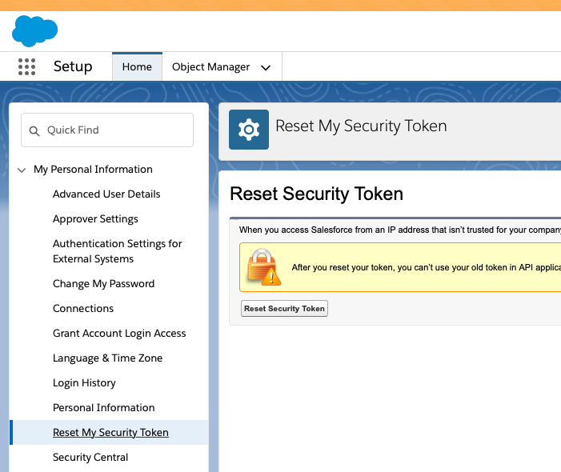

# Fully Managed Salesforce Source V2 connector


## Objective

Quickly test [Fully Managed Salesforce Source V2](https://docs.confluent.io/cloud/current/connectors/cc-salesforce-bulk-api-v2-source.html) connector.


## Register a test account

Go to [Salesforce developer portal](https://developer.salesforce.com/signup/) and register an account.

## OAuth with JWT Bearer Flow

Follow instructions from [here](https://github.com/vdesabou/kafka-docker-playground/tree/master/connect/connect-salesforce-cdc-source#oauth-with-jwt-bearer-flow) to create the External Client App with the JWT Bearer Flow.


## How to run

Simply run:

```
$ just use <playground run> command and search for salesforce-bukapi-source<use tab key to activate fzf completion (see https://kafka-docker-playground.io/#/cli?id=%e2%9a%a1-setup-completion), otherwise use full path, or correct relative path> <SALESFORCE_USERNAME> <SALESFORCE_PASSWORD> .sh in this folder
```

Note: you can also export these values as environment variable

<SALESFORCE_SECURITY_TOKEN>: you can get it from `Settings->My Personal Information->Reset My Security Token`:




## Prerequisites

See [here](https://kafka-docker-playground.io/#/how-to-use?id=%f0%9f%8c%a4%ef%b8%8f-confluent-cloud-examples)