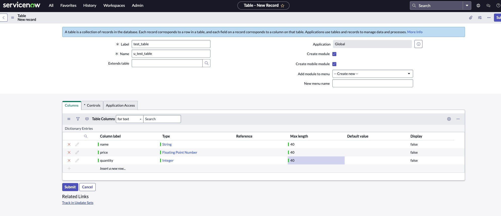

# Fully Managed ServiceNow Sink connector


## Objective

Quickly test [Fully Managed ServiceNow Sink](https://docs.confluent.io/cloud/current/connectors/cc-servicenow-sink.html) connector.


## Register a test account

Go to [ServiceNow developer portal](https://developer.servicenow.com) and register an account.
Click on `Manage`->`Instance` and register for a Vancouver instance. After some time (about one hour in my case) on the waiting list, you should receive an email with details of your test instance.

## Create the test_table in ServiceNow



Do not set ACL

## How to run

Simply run:

```bash
$ just use <playground run> command 
```

## Prerequisites

See [here](https://kafka-docker-playground.io/#/how-to-use?id=%f0%9f%8c%a4%ef%b8%8f-confluent-cloud-examples)