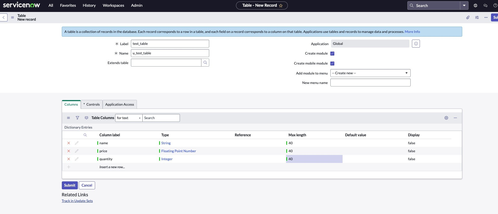

# Fully Managed ServiceNow Sink connector


## Objective

Quickly test [Fully Managed ServiceNow Sink](https://docs.confluent.io/cloud/current/connectors/cc-servicenow-sink.html) connector.


## Register a test account

Go to [ServiceNow developer portal](https://developer.servicenow.com) and register an account.
Click on `Manage`->`Instance` and register for an Australia instance. After some time (about one hour in my case) on the waiting list, you should receive an email with details of your test instance.


## Verify User-Level Requirements

The user account should have `Identity Type` set to `Machine`.

* Navigate to `User Administration > Users`.
* Search for and open the admin record.
* Make sure `Identity Type` is set to `Machine`
## Create the test_table in ServiceNow

Search for `Tables` in the `All` menu and select the one from `System Definition`:


Then click on `New` button to create a new table:



**Do not set ACL**

## How to run

Simply run:

```bash
$ just use <playground run> command 
```

## Prerequisites

See [here](https://kafka-docker-playground.io/#/how-to-use?id=%f0%9f%8c%a4%ef%b8%8f-confluent-cloud-examples)