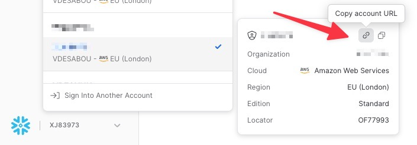

# Fully Managed  Snowflake Sink connector

## Objective

Quickly test [Snowflake Sink](https://docs.confluent.io/cloud/current/connectors/cc-snowflake-sink.html#) connector.

## Register a trial account

Go to [Snowflake](https://www.snowflake.com) and register an account. You'll receive an email to setup your account and access to a 30 day trial instance.

To get the `SNOWFLAKE_ACCOUNT_NAME`, go there and click on url:



This will give you an url like:

```
https://<SNOWFLAKE_ACCOUNT_NAME>.snowflakecomputing.com
```

Example:

```
https://MZLPQCM-DW39774.snowflakecomputing.com
```

`SNOWFLAKE_ACCOUNT_NAME` should be set with `MZLPQCM-DW39774`

## Prerequisites

See [here](https://kafka-docker-playground.io/#/how-to-use?id=%f0%9f%8c%a4%ef%b8%8f-confluent-cloud-examples)

## How to run

Simply run:

```bash
$ just use <playground run> command and search for fully-managed-snowflake-sink<use tab key to activate fzf completion (see https://kafka-docker-playground.io/#/cli?id=%e2%9a%a1-setup-completion), otherwise use full path, or correct relative path> <SNOWFLAKE_ACCOUNT_NAME> <SNOWFLAKE_USERNAME> .sh in this folder
```

Note: you can also export these values as environment variable
