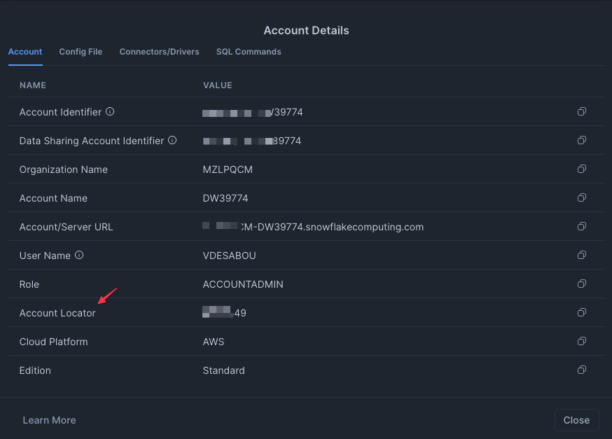

# Fully Managed Snowflake Source connector

## Objective

Quickly test [Snowflake Source](https://docs.confluent.io/cloud/current/connectors/cc-snowflake-source/cc-snowflake-source.html) connector.

## Register a trial account

Go to [Snowflake](https://www.snowflake.com) and register an account. You'll receive an email to setup your account and access to a 30 day trial instance.

To get the `SNOWFLAKE_ACCOUNT_NAME`, get the *Account Locator* from:

`SNOWFLAKE_ACCOUNT_NAME` should be set with `<account_locator>.<region_id>.<cloud_provider>` (for example `XXXXX.eu-west-3.aws`)

## Prerequisites

See [here](https://kafka-docker-playground.io/#/how-to-use?id=%f0%9f%8c%a4%ef%b8%8f-confluent-cloud-examples)

