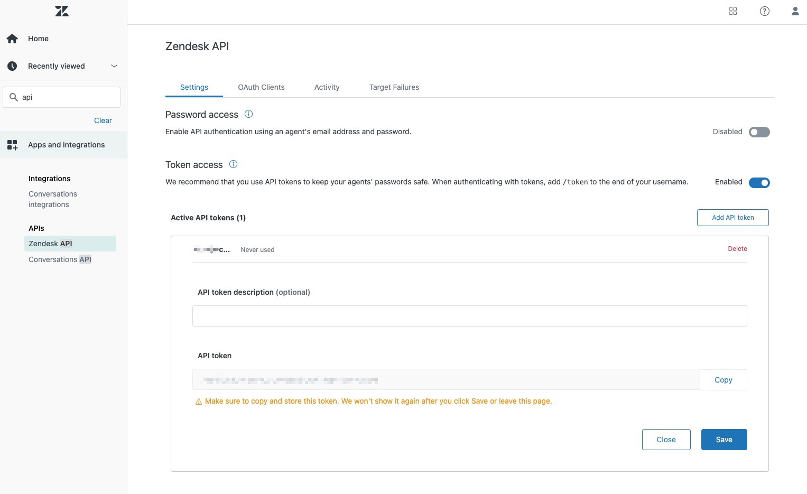

# Fully Managed Zendesk Source connector


## Objective

Quickly test [Zendesk Source](https://docs.confluent.io/cloud/current/connectors/cc-zendesk-source.html) connector.


## Admin account

In order to create the token and get `tickets`, you need to be an `Admin` (it doesn't work with `Agent` role), as it is using [Incremental Ticket Export](https://developer.zendesk.com/api-reference/ticketing/ticket-management/incremental_exports/#allowed-for-2).
This is why this example is using `organizations`.

## Prerequisites

See [here](https://kafka-docker-playground.io/#/how-to-use?id=%f0%9f%8c%a4%ef%b8%8f-confluent-cloud-examples)

## Create an API token

In your Zendesk account, create a token (if you're only an agent you need to ask it to an admin):



## How to run

Simply run:

```
$ just use <playground run> command 
```

P.S: `ZENDESK_USERNAME` should have format `email/token`
