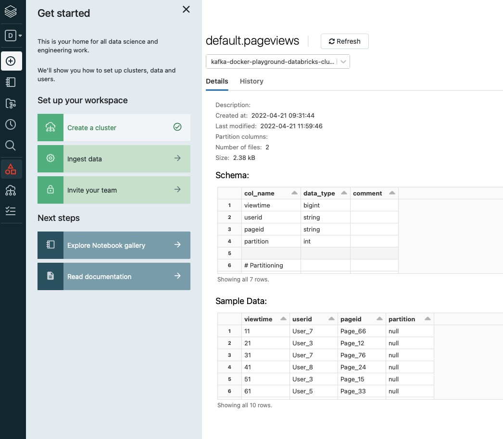

# Fully Managed Databricks Delta Lake Sink connector


## Objective

Quickly test [Databricks Delta Lake Sink](https://docs.confluent.io/cloud/current/connectors/cc-databricks-delta-lake-sink/cc-databricks-delta-lake-sink.html) connector.

## Prerequisites

All you have to do is to be already logged in with [confluent CLI](https://docs.confluent.io/confluent-cli/current/overview.html#confluent-cli-overview).

By default, a new Confluent Cloud environment with a Cluster will be created.

You can configure the cluster by setting environment variables:

* `CLUSTER_CLOUD`: The Cloud provider (possible values: `aws`, `gcp` and `azure`, default `aws`)
* `CLUSTER_REGION`: The Cloud region (use `confluent kafka region list` to get the list, default `eu-west-2`)
* `CLUSTER_TYPE`: The type of cluster (possible values: `basic`, `standard` and `dedicated`, default `basic`)
* `ENVIRONMENT` (optional): The environment id where want your new cluster (example: `env-xxxxx`) 

In case you want to use your own existing cluster, you need to setup these environment variables:

* `ENVIRONMENT`: The environment id where your cluster is located (example: `env-xxxxx`) 
* `CLUSTER_NAME`: The cluster name
* `CLUSTER_CLOUD`: The Cloud provider (possible values: `aws`, `gcp` and `azure`)
* `CLUSTER_REGION`: The Cloud region (example `us-east-2`)
* `CLUSTER_CREDS`: The Kafka api key and secret to use, it should be separated with semi-colon (example: `<API_KEY>:<API_KEY_SECRET>`)
* `SCHEMA_REGISTRY_CREDS` (optional, if not set, new one will be created): The Schema Registry api key and secret to use, it should be separated with semi-colon (example: `<SR_API_KEY>:<SR_API_KEY_SECRET>`)

## Databricks Setup

Follow all steps from [here](https://docs.confluent.io/kafka-connect-databricks-delta-lake-sink/current/databricks-aws-setup.html#set-up-databricks-delta-lake-aws)

## How to run

Simply run:

```
$ playground run -f fully-managed-databricks-delta-lake-sink<tab> <DATABRICKS_AWS_BUCKET_NAME> <DATABRICKS_AWS_BUCKET_REGION> <DATABRICKS_AWS_STAGING_S3_ACCESS_KEY_ID> <DATABRICKS_AWS_STAGING_S3_SECRET_ACCESS_KEY> <DATABRICKS_SERVER_HOSTNAME> <DATABRICKS_HTTP_PATH> <DATABRICKS_TOKEN> 
```

Note: you can also export these values as environment variable

## Details of what the script is doing


Creating Datagen connector:

```bash
cat << EOF > connector.json
{
     "connector.class": "DatagenSource",
     "name": "DatagenSource",
     "kafka.auth.mode": "KAFKA_API_KEY",
     "kafka.api.key": "$CLOUD_KEY",
     "kafka.api.secret": "$CLOUD_SECRET",
     "kafka.topic" : "pageviews",
     "output.data.format" : "AVRO",
     "quickstart" : "PAGEVIEWS",
     "max.interval": "10000",
     "tasks.max" : "1"
}
EOF
```

Creating Deltabricks Delta Lake connector:

```bash
cat << EOF > connector2.json
{
     "topics": "pageviews",
     "input.data.format": "AVRO",
     "connector.class": "DatabricksDeltaLakeSink",
     "name": "DatabricksDeltaLakeSink",
     "kafka.auth.mode": "KAFKA_API_KEY",
     "kafka.api.key": "$CLOUD_KEY",
     "kafka.api.secret": "$CLOUD_SECRET",
     "delta.lake.host.name": "$DATABRICKS_SERVER_HOSTNAME",
     "delta.lake.http.path": "$DATABRICKS_HTTP_PATH",
     "delta.lake.token": "$DATABRICKS_TOKEN",
     "delta.lake.topic2table.map": "pageviews:pageviews",
     "delta.lake.table.auto.create": "true",
     "staging.s3.access.key.id": "$DATABRICKS_AWS_STAGING_S3_ACCESS_KEY_ID",
     "staging.s3.secret.access.key": "$DATABRICKS_AWS_STAGING_S3_SECRET_ACCESS_KEY",
     "staging.bucket.name": "$DATABRICKS_AWS_BUCKET_NAME",
     "flush.interval.ms": "100",
     "tasks.max": "1"
}
EOF
```

Listing staging Amazon S3 bucket:

```bash
export AWS_ACCESS_KEY_ID="$DATABRICKS_AWS_STAGING_S3_ACCESS_KEY_ID"
export AWS_SECRET_ACCESS_KEY="$DATABRICKS_AWS_STAGING_S3_SECRET_ACCESS_KEY"
aws s3api list-objects --bucket "$DATABRICKS_AWS_BUCKET_NAME"

Listing staging Amazon S3 bucket:

```bash
export AWS_ACCESS_KEY_ID="$DATABRICKS_AWS_STAGING_S3_ACCESS_KEY_ID"
export AWS_SECRET_ACCESS_KEY="$DATABRICKS_AWS_STAGING_S3_SECRET_ACCESS_KEY"
aws s3api list-objects --bucket "$DATABRICKS_AWS_BUCKET_NAME"
```

You can also verify data is present in table using UI:




N.B: Control Center is reachable at [http://127.0.0.1:9021](http://127.0.0.1:9021])
