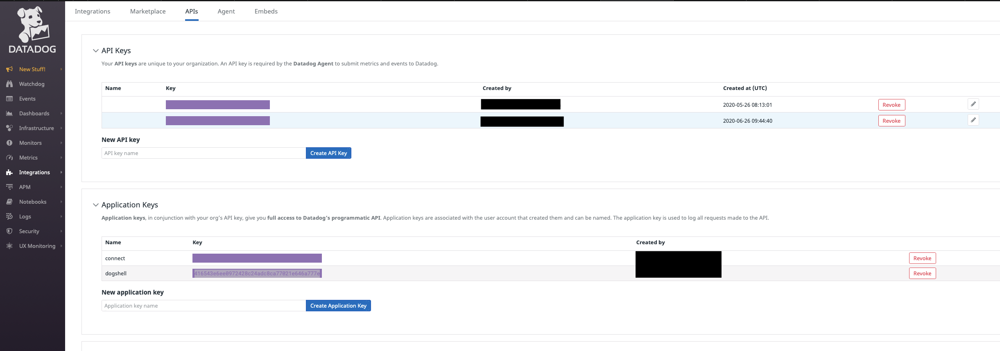

# Fully Managed Datadog Metrics Sink connector


## Objective

Quickly test [Fully Managed  Datadog Metrics Sink](https://docs.confluent.io/cloud/current/connectors/cc-datadog-metrics-sink.html) connector.

## Datadog Prerequisites

Register for a [Datadog trial](https://app.datadoghq.com) if you don't already have an account (you can convert it to *Free plan* after the trial expires).

Create an API key (`DD_API_KEY`) and an Application key (`DD_APP_KEY`):




**Important**: `COM` domain must be used

## Prerequisites

See [here](https://kafka-docker-playground.io/#/how-to-use?id=%f0%9f%8c%a4%ef%b8%8f-confluent-cloud-examples)

## How to run

Simply run:

```
$ just use <playground run> command and search for datadog-metrics-sink-sink<use tab key to activate fzf completion (see https://kafka-docker-playground.io/#/cli?id=%e2%9a%a1-setup-completion), otherwise use full path, or correct relative path> <DD_API_KEY> .sh in this folder

Note: you can also export these values as environment variable

```
