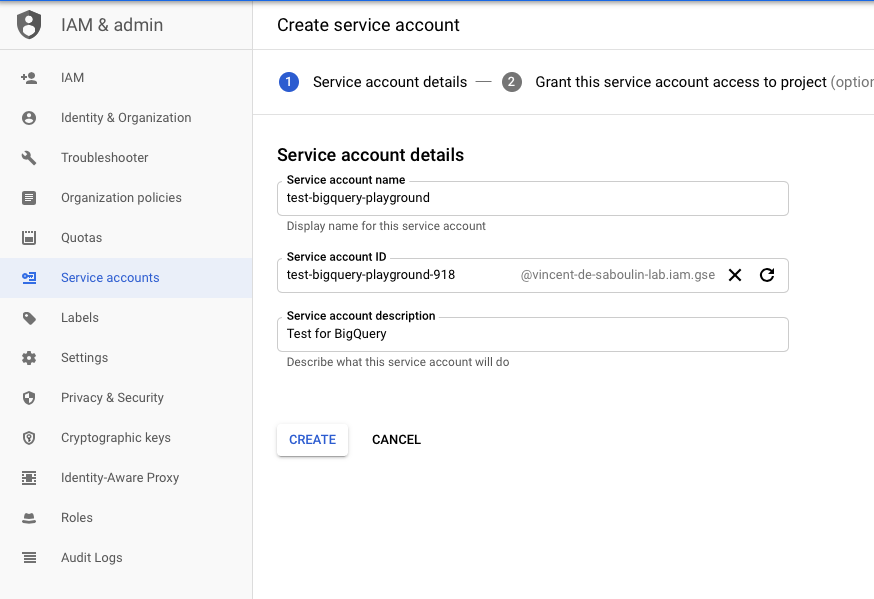
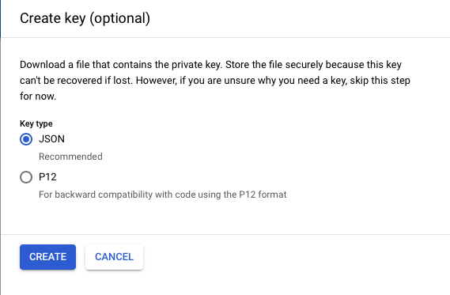

# Fully Managed GCP BigQuery Sink connector

## Objective

Quickly test [GCP BigQuery Sink](https://docs.confluent.io/cloud/current/connectors/cc-gcp-bigquery-sink.html) connector.

* Active Google Cloud Platform (GCP) account with authorization to create resources

## Prerequisites

All you have to do is to be already logged in with [confluent CLI](https://docs.confluent.io/confluent-cli/current/overview.html#confluent-cli-overview).

By default, a new Confluent Cloud environment with a Cluster will be created.

You can configure the cluster by setting environment variables:

* `CLUSTER_CLOUD`: The Cloud provider (possible values: `aws`, `gcp` and `azure`, default `aws`)
* `CLUSTER_REGION`: The Cloud region (use `confluent kafka region list` to get the list, default `eu-west-2`)
* `CLUSTER_TYPE`: The type of cluster (possible values: `basic`, `standard` and `dedicated`, default `basic`)
* `ENVIRONMENT` (optional): The environment id where want your new cluster (example: `env-xxxxx`) 

In case you want to use your own existing cluster, you need to setup these environment variables:

* `ENVIRONMENT`: The environment id where your cluster is located (example: `env-xxxxx`) 
* `CLUSTER_NAME`: The cluster name
* `CLUSTER_CLOUD`: The Cloud provider (possible values: `aws`, `gcp` and `azure`)
* `CLUSTER_REGION`: The Cloud region (example `us-east-2`)
* `CLUSTER_CREDS`: The Kafka api key and secret to use, it should be separated with semi-colon (example: `<API_KEY>:<API_KEY_SECRET>`)
* `SCHEMA_REGISTRY_CREDS` (optional, if not set, new one will be created): The Schema Registry api key and secret to use, it should be separated with semi-colon (example: `<SR_API_KEY>:<SR_API_KEY_SECRET>`)


## GCP BigQuery Setup

* Follow [Quickstart using the web UI in the GCP Console](https://cloud.google.com/bigquery/docs/quickstarts/quickstart-web-ui) to get familiar with GCP BigQuery
* Create `Service Account` from IAM & Admin console:

Set `Service account name`:




Choose permission `BigQuery`->`BigQuery Admin`:


Create Key:


Download it as JSON:



Rename it to `keyfile.json`and place it in `./keyfile.json` or use environment variable `GCP_KEYFILE_CONTENT` with content generated with `GCP_KEYFILE_CONTENT=`cat keyfile.json | jq -aRs .`


## How to run

Simply run:

```bash
$ playground run -f fully-managed-gcp-bigquery<tab> <GCP_PROJECT>
```
