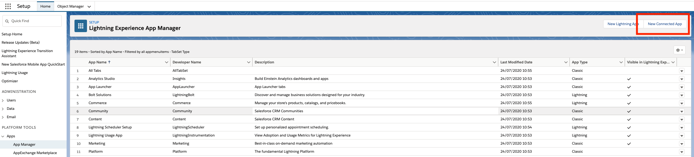
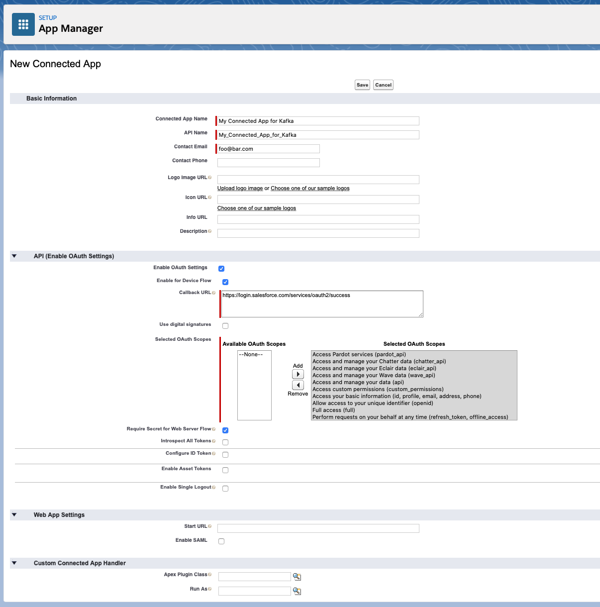
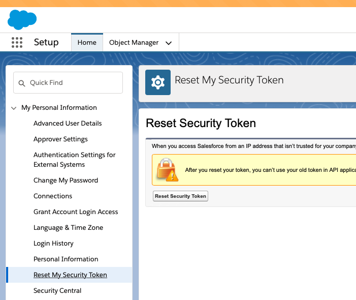
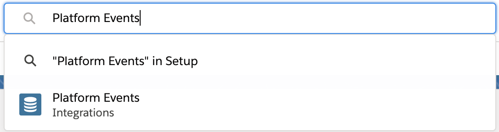
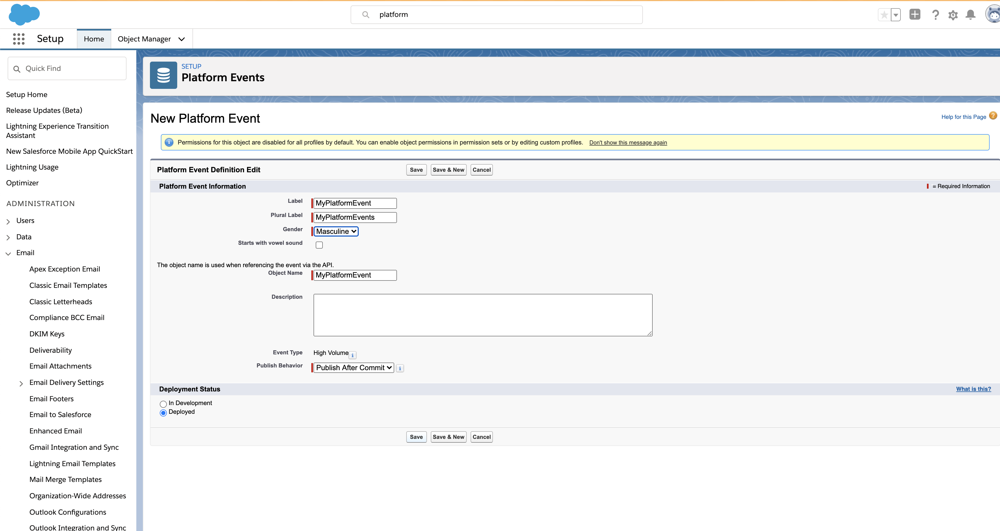
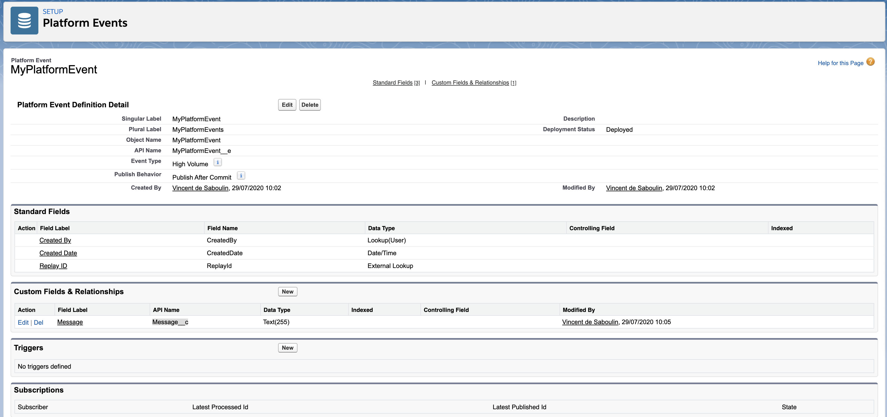
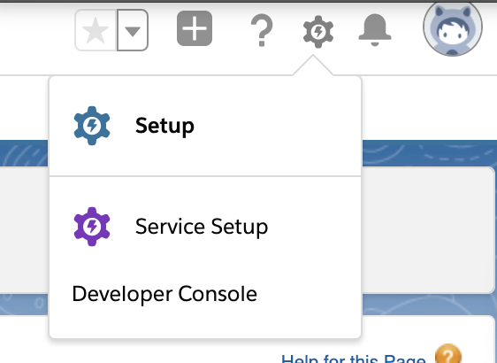
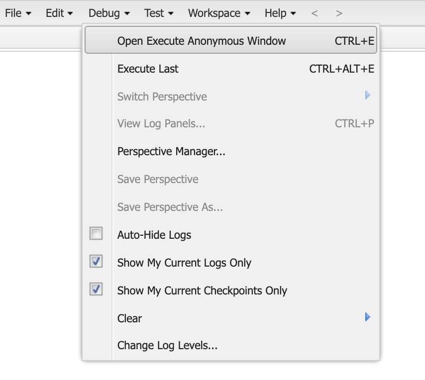

# Fully Managed Salesforce Platform Events Sink connector


## Objective

Quickly test [Salesforce Platform Events Sink](https://docs.confluent.io/cloud/current/connectors/cc-salesforce-platform-event-sink.html#) connector.


## Register a test account

Go to [Salesforce developer portal](https://developer.salesforce.com/signup/) and register an account.

## Salesforce Account

### Create a new Connected App

Full details available [here](https://docs.confluent.io/current/connect/kafka-connect-salesforce/pushtopics/salesforce_pushtopic_source_connector_quickstart.html#salesforce-account)

Steps are:

* Select the gear icon in the upper right hand corner and choose Setup.

* Enter App in the Quick Find search box, and choose *App Manager* in the filtered results.

* Click the *New Connected App* button in the upper right corner of the Setup panel.



* Supply a Connected App Name, API Name, and Contact Email.

* Select *Enable OAuth Settings* checkbox and select the *Enable for Device Flow* checkbox. These selections enable the connector to use the Salesforce API.
* Under the *Select OAuth Scopes* field, select all of the items under Available OAuth scopes and add them to the *Selected OAuth Scopes*.

Example:



* Save the new app and press Continue at the prompt.
* Look for the Consumer Key and Consumer Secret in the displayed form. Save these so you can put them in the configuration properties file for the Salesforce connect worker.

**IMPORTANT !!**: for new orgs, "Username-Password Flow" is disabled by default, see the [help page](https://help.salesforce.com/s/articleView?id=release-notes.rn_security_username-password_flow_blocked_by_default.htm&release=244&type=5).

You need to activate this:


### Find your Security token

Find your Security Token (emailed to you from Salesforce.com). If you need to reset your token or view your profile on Salesforce.com, select `Settings->My Personal Information->Reset My Security Token` and follow the instructions.



## Create a Platform Event in SFDC

In Setup, search for *Platform Events*:



Create new Platform Event called *MyPlatformEvent* as following:



Add a text field *Message*:



## Send a Platform Event using Developer Console (NOT REQUIRED - AUTOMATICALLY DONE)

Select *Developer Console* in upper right menu:



Then choose `Debug->Open Execute Anonymous Window`



Copy/paste the following and Execute it:

```java
List<MyPlatformEvent__e> myEvents = new List<MyPlatformEvent__e>();
myEvents.add(new MyPlatformEvent__e(Message__c ='test message 1'));
myEvents.add(new MyPlatformEvent__e(Message__c ='test message 2'));


// Call method to publish events
List<Database.SaveResult> results = EventBus.publish(myEvents);

// Inspect publishing result for each event
for (Database.SaveResult sr : results) {
    if (sr.isSuccess()) {
        System.debug('Successfully published event.');
    } else {
        for(Database.Error err : sr.getErrors()) {
            System.debug('Error returned: ' +
                        err.getStatusCode() +
                        ' - ' +
                        err.getMessage());
        }
    }
}
```

## How to run

Simply run:

```
$ playground run -f fully-managed-salesforce-Platform-events-sink<tab> <SALESFORCE_USERNAME> <SALESFORCE_PASSWORD> <SALESFORCE_CONSUMER_KEY> <SALESFORCE_CONSUMER_PASSWORD> <SALESFORCE_SECURITY_TOKEN>
```

Note: you can also export these values as environment variable
