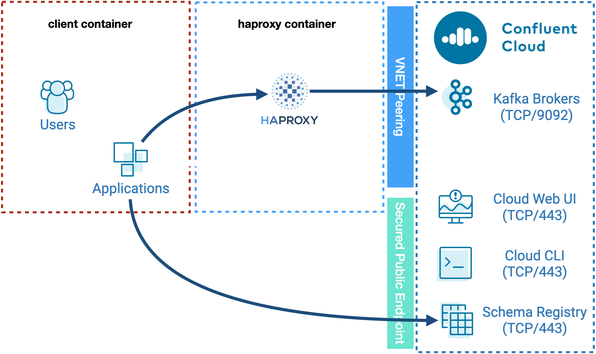

# Confluent Cloud Networking with HAProxy

## Objective

Implement SNI Routing using HAProxy to simulate a VPC Peered cluster which needs to be accessed from a non-transitive VPC.

Two containers are started `haproxy` and `client`:
Using iptables, communication between `client`and Confluent Cloud bootstrap servers (and broker) is blocked.
`haproxy`is configured to route all `9092`traffic to corresponding Confluent Cloud bootstrap servers (and brokers)



## How to run

Simply run:

```
$ ./start.sh <PKC_ENDPOINT> <CLOUD_KEY> <CLOUD_SECRET> optional: [<PKAC_ENDPOINT>] [<SCHEMA_REGISTRY_ENDPOINT>] [<SCHEMA_REGISTRY_BASIC_AUTH_USER_INFO>]

```

Note: you can also export these values as environment variable

Example:

```
$ export PKC_ENDPOINT=pkc-xxxxx.eu-west-2.aws.confluent.cloud
$ export CLOUD_KEY=xxxx
$ export CLOUD_SECRET=xxxx
$ export PKAC_ENDPOINT=pkac-xxxxx.eu-west-2.aws.confluent.cloud
$ export SCHEMA_REGISTRY_ENDPOINT=psrc-xxxxx.eu-central-1.aws.confluent.cloud
$ export SCHEMA_REGISTRY_BASIC_AUTH_USER_INFO="<SR API KEY>:<SR API SECRET>"
$ ./start.sh
```

## Details of what the script is doing

Checking with Kafkacat before using HAProxy

```bash
$ docker run confluentinc/cp-kafkacat:${TAG} kafkacat -b $PKC_ENDPOINT_WITH_PORT -L -X security.protocol=SASL_SSL -X sasl.mechanisms=PLAIN -X sasl.username=$CLOUD_KEY -X sasl.password=$CLOUD_SECRET | grep "broker"
```

Example:

```
Metadata for all topics (from broker -1: sasl_ssl://pkc-41wq6.eu-west-2.aws.confluent.cloud:9092/bootstrap):
 9 brokers:
  broker 0 at b0-pkc-41wq6.eu-west-2.aws.confluent.cloud:9092
  broker 5 at b5-pkc-41wq6.eu-west-2.aws.confluent.cloud:9092
  broker 8 at b8-pkc-41wq6.eu-west-2.aws.confluent.cloud:9092
  broker 2 at b2-pkc-41wq6.eu-west-2.aws.confluent.cloud:9092
  broker 4 at b4-pkc-41wq6.eu-west-2.aws.confluent.cloud:9092
  broker 1 at b1-pkc-41wq6.eu-west-2.aws.confluent.cloud:9092
  broker 6 at b6-pkc-41wq6.eu-west-2.aws.confluent.cloud:9092
  broker 7 at b7-pkc-41wq6.eu-west-2.aws.confluent.cloud:9092 (controller)
  broker 3 at b3-pkc-41wq6.eu-west-2.aws.confluent.cloud:9092
```

Generating haproxy.cfg file based on Kafkacat results

```cfg
global
    log /dev/log    local0
    log /dev/log    local1 notice
    chroot /var/lib/haproxy
    stats socket /run/haproxy/admin.sock mode 660 level admin expose-fd listeners
    stats timeout 30s
    user haproxy
    group haproxy
    daemon

    # Default SSL material locations
    ca-base /etc/ssl/certs
    crt-base /etc/ssl/private

    # Default ciphers to use on SSL-enabled listening sockets.
    # For more information, see ciphers(1SSL). This list is from:
    #   https://hynek.me/articles/hardening-your-web-servers-ssl-ciphers/
    # An alternative list with additional directives can be obtained from
    #   https://mozilla.github.io/server-side-tls/ssl-config-generator/?server=haproxy
    ssl-default-bind-ciphers ECDH+AESGCM:DH+AESGCM:ECDH+AES256:DH+AES256:ECDH+AES128:DH+AES:RSA+AESGCM:RSA+AES:!aNULL:!MD5:!DSS
    ssl-default-bind-options no-sslv3

defaults
    log global
    mode    http
    option  httplog
    option  dontlognull
        timeout connect 5000
        timeout client  50000
        timeout server  50000
    errorfile 400 /etc/haproxy/errors/400.http
    errorfile 403 /etc/haproxy/errors/403.http
    errorfile 408 /etc/haproxy/errors/408.http
    errorfile 500 /etc/haproxy/errors/500.http
    errorfile 502 /etc/haproxy/errors/502.http
    errorfile 503 /etc/haproxy/errors/503.http
    errorfile 504 /etc/haproxy/errors/504.http

frontend kafka
    mode tcp
    bind *:9092
    bind *:443
    log global

    tcp-request inspect-delay 5s
    tcp-request content accept if { req.ssl_hello_type 1 }

    # define acl depending certificate name
    acl is_bootstrap req.ssl_sni -i pkc-41wq6.eu-west-2.aws.confluent.cloud
    acl is_kafka0 req.ssl_sni -i b0-pkc-41wq6.eu-west-2.aws.confluent.cloud
    acl is_kafka1 req.ssl_sni -i b1-pkc-41wq6.eu-west-2.aws.confluent.cloud
    acl is_kafka2 req.ssl_sni -i b2-pkc-41wq6.eu-west-2.aws.confluent.cloud
    acl is_kafka3 req.ssl_sni -i b3-pkc-41wq6.eu-west-2.aws.confluent.cloud
    acl is_kafka4 req.ssl_sni -i b4-pkc-41wq6.eu-west-2.aws.confluent.cloud
    acl is_kafka5 req.ssl_sni -i b5-pkc-41wq6.eu-west-2.aws.confluent.cloud
    acl is_kafka6 req.ssl_sni -i b6-pkc-41wq6.eu-west-2.aws.confluent.cloud
    acl is_kafka7 req.ssl_sni -i b7-pkc-41wq6.eu-west-2.aws.confluent.cloud
    acl is_kafka8 req.ssl_sni -i b8-pkc-41wq6.eu-west-2.aws.confluent.cloud
    acl is_topic req.ssl_sni -i pkac-l7qj1.eu-west-2.aws.confluent.cloud
    acl is_ccsr req.ssl_sni -i psrc-lo5k9.eu-central-1.aws.confluent.cloud

    # depending name rule to route to specified backend
    use_backend bootstrap if is_bootstrap
    use_backend kafka0 if is_kafka0
    use_backend kafka1 if is_kafka1
    use_backend kafka2 if is_kafka2
    use_backend kafka3 if is_kafka3
    use_backend kafka4 if is_kafka4
    use_backend kafka5 if is_kafka5
    use_backend kafka6 if is_kafka6
    use_backend kafka7 if is_kafka7
    use_backend kafka8 if is_kafka8
    use_backend topic if is_topic
    use_backend ccsr if is_ccsr

# backend definitions
backend bootstrap
    mode tcp
    server bootstrap pkc-41wq6.eu-west-2.aws.confluent.cloud:9092 check
backend kafka0
    mode tcp
    server kafka0 b0-pkc-41wq6.eu-west-2.aws.confluent.cloud:9092 check
backend kafka1
    mode tcp
    server kafka1 b1-pkc-41wq6.eu-west-2.aws.confluent.cloud:9092 check
backend kafka2
    mode tcp
    server kafka2 b2-pkc-41wq6.eu-west-2.aws.confluent.cloud:9092 check
backend kafka3
    mode tcp
    server kafka3 b3-pkc-41wq6.eu-west-2.aws.confluent.cloud:9092 check
backend kafka4
    mode tcp
    server kafka4 b4-pkc-41wq6.eu-west-2.aws.confluent.cloud:9092 check
backend kafka5
    mode tcp
    server kafka5 b5-pkc-41wq6.eu-west-2.aws.confluent.cloud:9092 check
backend kafka6
    mode tcp
    server kafka6 b6-pkc-41wq6.eu-west-2.aws.confluent.cloud:9092 check
backend kafka7
    mode tcp
    server kafka7 b7-pkc-41wq6.eu-west-2.aws.confluent.cloud:9092 check
backend kafka8
    mode tcp
    server kafka8 b8-pkc-41wq6.eu-west-2.aws.confluent.cloud:9092 check

backend topic
    mode tcp
    server topic pkac-l7qj1.eu-west-2.aws.confluent.cloud:443 check
backend ccsr
    mode tcp
    server ccsr psrc-lo5k9.eu-central-1.aws.confluent.cloud:443 check

```

Blocking traffic for all endpoints, using iptables (see function `block_traffic_for_all_endpoints()`)

Verify cluster is no more reachable using Kafkacat, as expected

```bash
docker exec -i -e PKC_ENDPOINT_WITH_PORT=$PKC_ENDPOINT_WITH_PORT -e CLOUD_KEY=$CLOUD_KEY -e CLOUD_SECRET=$CLOUD_SECRET client bash -c 'kafkacat -b $PKC_ENDPOINT_WITH_PORT -L -X security.protocol=SASL_SSL -X sasl.mechanisms=PLAIN -X sasl.username=$CLOUD_KEY -X sasl.password=$CLOUD_SECRET | grep "broker"'
```

Results:

```
% ERROR: Failed to acquire metadata: Local: Broker transport failure
```

Verify pkac endpoint is no more reachable using curl, as expected:

Results:

```
  % Total    % Received % Xferd  Average Speed   Time    Time     Time  Current
                                 Dload  Upload   Total   Spent    Left  Speed
  0     0    0     0    0     0      0      0 --:--:--  0:00:01 --:--:--     0curl: (7) Failed to connect to pkac-l7qj1.eu-west-2.aws.confluent.cloud port 443: Connection timed out
```

Verify Confluent Cloud Schema Registry is no more reachable using curl, as expected:

Results:

```
  % Total    % Received % Xferd  Average Speed   Time    Time     Time  Current
                                 Dload  Upload   Total   Spent    Left  Speed
  0     0    0     0    0     0      0      0 --:--:--  0:00:01 --:--:--     0curl: (7) Failed to connect to psrc-lo5k9.eu-central-1.aws.confluent.cloud port 443: Connection timed out
```


Modifying `/etc/hosts` on client container, so that haproxy is used (see method `update_hosts_file()`):


Results:

```
127.0.0.1       localhost
::1     localhost ip6-localhost ip6-loopback
<snip>
192.168.48.2    client
172.25.0.3 pkc-41wq6.eu-west-2.aws.confluent.cloud
172.25.0.3 b0-pkc-41wq6.eu-west-2.aws.confluent.cloud
172.25.0.3 b1-pkc-41wq6.eu-west-2.aws.confluent.cloud
172.25.0.3 b2-pkc-41wq6.eu-west-2.aws.confluent.cloud
172.25.0.3 b3-pkc-41wq6.eu-west-2.aws.confluent.cloud
172.25.0.3 b4-pkc-41wq6.eu-west-2.aws.confluent.cloud
172.25.0.3 b5-pkc-41wq6.eu-west-2.aws.confluent.cloud
172.25.0.3 b6-pkc-41wq6.eu-west-2.aws.confluent.cloud
172.25.0.3 b7-pkc-41wq6.eu-west-2.aws.confluent.cloud
172.25.0.3 b8-pkc-41wq6.eu-west-2.aws.confluent.cloud
172.25.0.3 pkac-l7qj1.eu-west-2.aws.confluent.cloud
172.25.0.3 psrc-lo5k9.eu-central-1.aws.confluent.cloud
```

Verifying we can connect to pkc endpoint using HAProxy and netcat

```bash
docker exec -i -e PKC_ENDPOINT=$PKC_ENDPOINT client bash -c 'nc -zv $PKC_ENDPOINT 9092'
```

Results:

```
Ncat: Version 7.70 ( https://nmap.org/ncat )
Ncat: Connected to 172.25.0.3:9092.
Ncat: 0 bytes sent, 0 bytes received in 0.01 seconds.
```

Verifying we can connect to pkc endpoint using openssl

```bash
$ docker exec -i -e PKC_ENDPOINT_WITH_PORT=$PKC_ENDPOINT_WITH_PORT client bash -c 'echo QUIT | openssl s_client -connect $PKC_ENDPOINT_WITH_PORT'
```

Results:

```
depth=2 O = Digital Signature Trust Co., CN = DST Root CA X3
verify return:1
depth=1 C = US, O = Let's Encrypt, CN = Let's Encrypt Authority X3
verify return:1
depth=0 CN = *.eu-west-2.aws.confluent.cloud
verify return:1
DONE
CONNECTED(00000003)
---
Certificate chain
 0 s:CN = *.eu-west-2.aws.confluent.cloud
   i:C = US, O = Let's Encrypt, CN = Let's Encrypt Authority X3
 1 s:C = US, O = Let's Encrypt, CN = Let's Encrypt Authority X3
   i:O = Digital Signature Trust Co., CN = DST Root CA X3
---
Server certificate
-----BEGIN CERTIFICATE-----
MIIFmjCCBIKgAwIBAgISA2vJpI1GO21gpK7N4/jnZQUPMA0GCSqGSIb3DQEBCwUA
MEoxCzAJBgNVBAYTAlVTMRYwFAYDVQQKEw1MZXQncyBFbmNyeXB0MSMwIQYDVQQD
ExpMZXQncyBFbmNyeXB0IEF1dGhvcml0eSBYMzAeFw0yMDA5MTQxODU2MjVaFw0y
MDEyMTMxODU2MjVaMCoxKDAmBgNVBAMMHyouZXUtd2VzdC0yLmF3cy5jb25mbHVl
bnQuY2xvdWQwggEiMA0GCSqGSIb3DQEBAQUAA4IBDwAwggEKAoIBAQDmpkLvE+eK
yjLXI+Y2yyBmZzCpuXhQS1tyi23On0tmUhlmHsRADh8M9qu+mt5ofwztD2ljFHw8
tjMIAVWXvNFbOpuj36nJSSdoxVOdOvudKsm0V4tUNlrL7lQaNU97ShWDNrxLQ9D8
enFhrZsbtywB2Rle+d7b7qZV1dnKkpD358/6+UbaAilHvfX7QveoGCiX0e4mqZOM
JonBENd8sqbkq3TlbcdVcsXffkYw77bbt2U9sdvwpgIjHfvF68B52fLNGTht1kjf
3oJaWlQyH1u6gOHQEO8/UVZ7jwQOwu/sIQxe8EJje+Nqeq4MkllOdgSyrVT6Bed0
8nqYDhfu1FoVAgMBAAGjggKYMIIClDAOBgNVHQ8BAf8EBAMCBaAwHQYDVR0lBBYw
FAYIKwYBBQUHAwEGCCsGAQUFBwMCMAwGA1UdEwEB/wQCMAAwHQYDVR0OBBYEFA85
4sSI9eIpvUZgQ+oExPz0rxTnMB8GA1UdIwQYMBaAFKhKamMEfd265tE5t6ZFZe/z
qOyhMG8GCCsGAQUFBwEBBGMwYTAuBggrBgEFBQcwAYYiaHR0cDovL29jc3AuaW50
LXgzLmxldHNlbmNyeXB0Lm9yZzAvBggrBgEFBQcwAoYjaHR0cDovL2NlcnQuaW50
LXgzLmxldHNlbmNyeXB0Lm9yZy8wTwYDVR0RBEgwRoIfKi5ldS13ZXN0LTIuYXdz
LmNvbmZsdWVudC5jbG91ZIIjKi5ldS13ZXN0LTIuYXdzLmdsYi5jb25mbHVlbnQu
Y2xvdWQwTAYDVR0gBEUwQzAIBgZngQwBAgEwNwYLKwYBBAGC3xMBAQEwKDAmBggr
BgEFBQcCARYaaHR0cDovL2Nwcy5sZXRzZW5jcnlwdC5vcmcwggEDBgorBgEEAdZ5
AgQCBIH0BIHxAO8AdQDnEvKwN34aYvuOyQxhhPHqezfLVh0RJlvz4PNL8kFUbgAA
AXSOMKNzAAAEAwBGMEQCIDddGgw1q7l2bV09UUmuYA5YPqrx4d5m+SerLhWEI9U2
AiBTYUdPZ1nwlnqLVeI86F4FAJpIbiAR11HBbOf5tfUPKwB2ALIeBcyLos2KIE6H
ZvkruYolIGdr2vpw57JJUy3vi5BeAAABdI4wo3wAAAQDAEcwRQIhAMX2ZtkAftep
Hc2Fw7xo4u93l2a1Od33Ye6z5/RbeQwhAiBpJMJQZAXNZcqqUw5/rP5GVnj+nMqD
LBpNBYjlOHuA2TANBgkqhkiG9w0BAQsFAAOCAQEAGrSo4Rlm3kRRzHZz2Qlzzepa
Jw91ZfJRzitFFW1RAfcyvpMx/IKCu/7IveFzCjIi11wC7KIrhDF5oQ+rNn2t7oNO
OXVytiruDHDlmBXXQjxx/pPHxoZwhjRWBja0qy3QeIRerG0GmjjoSpIRdZSo5gZd
Z09dxSoKJtKE1akPuPPaS7fQiED0XsDiz9CbeRglLM2ePx88Tm9Iu8ntgstjaNLZ
aHOZy2xsgJX9lsihfNLA4/kWsXI5iuLPtiX0Xv8h/30HBnRdsUXACkf153EPI+I9
qTQgzh4w1062eAkSU52vd2UIrcYkuSwEmN/N76GwZ4sblaB2keCSJxpKM55qug==
-----END CERTIFICATE-----
subject=CN = *.eu-west-2.aws.confluent.cloud

issuer=C = US, O = Let's Encrypt, CN = Let's Encrypt Authority X3

---
No client certificate CA names sent
Peer signing digest: SHA256
Peer signature type: RSA-PSS
Server Temp Key: X25519, 253 bits
---
SSL handshake has read 3070 bytes and written 430 bytes
Verification: OK
---
New, TLSv1.2, Cipher is ECDHE-RSA-AES256-GCM-SHA384
Server public key is 2048 bit
Secure Renegotiation IS supported
Compression: NONE
Expansion: NONE
No ALPN negotiated
SSL-Session:
    Protocol  : TLSv1.2
    Cipher    : ECDHE-RSA-AES256-GCM-SHA384
    Session-ID: B5C6B4AE12B82BF348E8D1386DC7EA4799AAC6BF8AA995CFF881B5E1E038AB0B
    Session-ID-ctx:
    Master-Key: 63F6E6B55AAC40FF9C987182316AED503F1038272240D5A7EAB8E6CA625EE828BFA8F0D13D911A3EDE935DA506D05155
    PSK identity: None
    PSK identity hint: None
    SRP username: None
    Start Time: 1604655203
    Timeout   : 7200 (sec)
    Verify return code: 0 (ok)
    Extended master secret: yes
---
```

Verifying we can use Kafkacat using HAProxy

```bash
docker exec -i -e PKC_ENDPOINT_WITH_PORT=$PKC_ENDPOINT_WITH_PORT -e CLOUD_KEY=$CLOUD_KEY -e CLOUD_SECRET=$CLOUD_SECRET client bash -c 'kafkacat -b $PKC_ENDPOINT_WITH_PORT -L -X security.protocol=SASL_SSL -X sasl.mechanisms=PLAIN -X sasl.username=$CLOUD_KEY -X sasl.password=$CLOUD_SECRET | grep "broker"'
```

Results:

```
Metadata for all topics (from broker -1: sasl_ssl://pkc-41wq6.eu-west-2.aws.confluent.cloud:9092/bootstrap):
 9 brokers:
  broker 0 at b0-pkc-41wq6.eu-west-2.aws.confluent.cloud:9092
  broker 5 at b5-pkc-41wq6.eu-west-2.aws.confluent.cloud:9092
  broker 8 at b8-pkc-41wq6.eu-west-2.aws.confluent.cloud:9092
  broker 2 at b2-pkc-41wq6.eu-west-2.aws.confluent.cloud:9092
  broker 4 at b4-pkc-41wq6.eu-west-2.aws.confluent.cloud:9092
  broker 1 at b1-pkc-41wq6.eu-west-2.aws.confluent.cloud:9092
  broker 6 at b6-pkc-41wq6.eu-west-2.aws.confluent.cloud:9092
  broker 7 at b7-pkc-41wq6.eu-west-2.aws.confluent.cloud:9092 (controller)
  broker 3 at b3-pkc-41wq6.eu-west-2.aws.confluent.cloud:9092
```

Verifying we can connect to pkac endpoint using HAProxy (HTTP 404 Not Found) is expected

```bash
$ docker exec -i -e PKAC_ENDPOINT=$PKAC_ENDPOINT -e CLOUD_KEY=$CLOUD_KEY -e CLOUD_SECRET=$CLOUD_SECRET client bash -c 'curl --max-time 2 -u $CLOUD_KEY:$CLOUD_SECRET https://$PKAC_ENDPOINT/subjects'
```

Results:

```
  % Total    % Received % Xferd  Average Speed   Time    Time     Time  Current
                                 Dload  Upload   Total   Spent    Left  Speed
100    49  100    49    0     0    284      0 --:--:-- --:--:-- --:--{"error_code":404,"message":"HTTP 404 Not Found"}:--   284
```

Verifying we can use Confluent Cloud Schema Registry using HAProxy

```bash
$ docker exec -i -e SCHEMA_REGISTRY_ENDPOINT=$SCHEMA_REGISTRY_ENDPOINT -e SCHEMA_REGISTRY_BASIC_AUTH_USER_INFO=$SCHEMA_REGISTRY_BASIC_AUTH_USER_INFO client bash -c 'curl --max-time 2 -u $SCHEMA_REGISTRY_BASIC_AUTH_USER_INFO https://$SCHEMA_REGISTRY_ENDPOINT/subjects
```