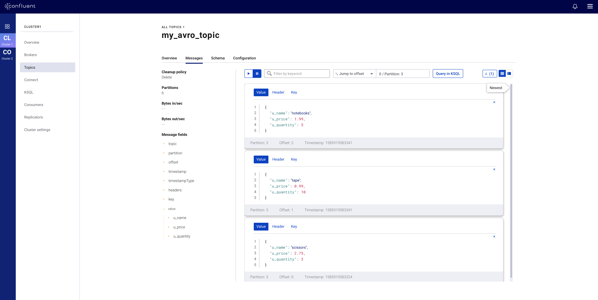
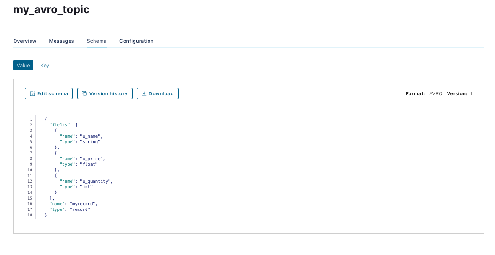

# Multi-Cluster Schema Registry with hybrid configuration (onprem/confluent cloud)

## Objective

Quickly test [Multi-Cluster Schema Registry](https://docs.confluent.io/current/control-center/topics/schema.html#enabling-multi-cluster-sr) which is available since CP 5.4.1, but using hybrid deployment with onprem and Confluent Cloud.

Note: this is **unsupported** because Confluent Cloud brokers do not expose the new endpoint `/v1/metadata/schemaRegistryUrls`. Therefore the hack is to run a small REST API server that returns the URL of the Confluent Cloud Schema Registry (see below for details)

## How to run

Create `$HOME/.ccloud/config`

On the host from which you are running Docker, ensure that you have properly initialized Confluent Cloud CLI and have a valid configuration file at `$HOME/.ccloud/config`.

Example:

```bash
$ cat $HOME/.ccloud/config
bootstrap.servers=<BROKER ENDPOINT>
ssl.endpoint.identification.algorithm=https
security.protocol=SASL_SSL
sasl.mechanism=PLAIN
sasl.jaas.config=org.apache.kafka.common.security.plain.PlainLoginModule required username\="<API KEY>" password\="<API SECRET>";

// Schema Registry specific settings
basic.auth.credentials.source=USER_INFO
schema.registry.basic.auth.user.info=<SR_API_KEY>:<SR_API_SECRET>
schema.registry.url=<SR ENDPOINT>

// license
confluent.license=<YOUR LICENSE>

// ccloud login password
ccloud.user=<ccloud login>
ccloud.password=<ccloud password>
```

Simply run:

```
$ ./start.sh
```

## Details of what the script is doing

First, we need to put in place the hack by starting a webserver (REST API):

Here is the container:

```yml
  webserver:
    image: vdesabou/kafka-docker-playground-connect:${TAG}
    hostname: webserver
    container_name: webserver
    depends_on:
      - zookeeper
      - broker
      - schema-registry
    ports:
      - "1500:1500"
    volumes:
        - ../../ccloud/multiple-sr-hybrid/httpd.sh:/tmp/httpd.sh
        - ../../ccloud/multiple-sr-hybrid/sr.json:/tmp/json/sr.json
    command: bash -c "apt-get update && apt-get install net-tools && bash /tmp/httpd.sh 1500 /tmp/json/ & sleep 5 && tail -F /dev/null"
```

It is running on port 1500 and will reply to curl command by sending back content of `sr.json` file (which is auto-generated):

Note: `httpd.sh` is based on [jdoleczek/Bash-NetCat-HTTPD](https://github.com/jdoleczek/Bash-NetCat-HTTPD)

```
$ cat sr.json
["https://psrc-xxxx.region.confluent.cloud"]
```

We have:

```bash
$ curl http://localhost:1500/v1/metadata/schemaRegistryUrls
["https://psrc-xxxx.region.confluent.cloud"]
```

Then we need to set in the broker the onprem schema registry URL, so that the REST Endpoint `http://broker:8090` works for onprem SR:

```yml
  broker:
    environment:
      KAFKA_CONFLUENT_SCHEMA_REGISTRY_URL: http://schema-registry:8081
```

The configuration for control center is:

```yml
  control-center:
    environment:
      # on prem

      # specify the onprem schema registry
      CONTROL_CENTER_SCHEMA_REGISTRY_URL: "http://schema-registry:8081"
      # specify the onprem REST API endpoint
      CONTROL_CENTER_STREAMS_CPREST_URL: "http://broker:8090"

      # Confluent Cloud

      # add the Confluent Cloud cluster named CLUSTER1
      CONTROL_CENTER_KAFKA_CLUSTER1_BOOTSTRAP_SERVERS: my.bootstrap.server.confluent.cloud:9092
      CONTROL_CENTER_KAFKA_CLUSTER1_SECURITY_PROTOCOL: SASL_SSL
      CONTROL_CENTER_KAFKA_CLUSTER1_SASL_JAAS_CONFIG: $SASL_JAAS_CONFIG
      CONTROL_CENTER_KAFKA_CLUSTER1_SASL_MECHANISM: PLAIN

      # Confluent Cloud Schema Registry

      # CPREST_URL is pointing to the REST API endpoint hack
      CONTROL_CENTER_KAFKA_CLUSTER1_CPREST_URL: http://webserver:1500

      CONTROL_CENTER_SCHEMA_REGISTRY_CLUSTER1_URL: $SCHEMA_REGISTRY_URL
      CONTROL_CENTER_SCHEMA_REGISTRY_CLUSTER1_BASIC_AUTH_CREDENTIALS_SOURCE: USER_INFO
      CONTROL_CENTER_SCHEMA_REGISTRY_CLUSTER1_BASIC_AUTH_USER_INFO: $SCHEMA_REGISTRY_BASIC_AUTH_USER_INFO
```

Make sure the Rest API endpoint is running by executing curl on `http://localhost:1500/v1/metadata/schemaRegistryUrls`

```bash
$ curl http://localhost:1500/v1/metadata/schemaRegistryUrls
["https://psrc-xxxx.region.confluent.cloud"]
```

Sending messages to topic my_avro_topic

```bash
$ docker exec -i -e BOOTSTRAP_SERVERS="$BOOTSTRAP_SERVERS" -e SASL_JAAS_CONFIG="$SASL_JAAS_CONFIG" -e SCHEMA_REGISTRY_BASIC_AUTH_USER_INFO="$SCHEMA_REGISTRY_BASIC_AUTH_USER_INFO" -e SCHEMA_REGISTRY_URL="$SCHEMA_REGISTRY_URL" connect kafka-avro-console-producer --broker-list $BOOTSTRAP_SERVERS --producer-property ssl.endpoint.identification.algorithm=https --producer-property sasl.mechanism=PLAIN --producer-property security.protocol=SASL_SSL --producer-property sasl.jaas.config="$SASL_JAAS_CONFIG" --property basic.auth.credentials.source=USER_INFO --property schema.registry.basic.auth.user.info="$SCHEMA_REGISTRY_BASIC_AUTH_USER_INFO" --property schema.registry.url=$SCHEMA_REGISTRY_URL --topic my_avro_topic --property value.schema='{"type":"record","name":"myrecord","fields":[{"name":"u_name","type":"string"},{"name":"u_price", "type": "float"}, {"name":"u_quantity", "type": "int"}]}' << EOF
{"u_name": "scissors", "u_price": 2.75, "u_quantity": 3}
{"u_name": "tape", "u_price": 0.99, "u_quantity": 10}
{"u_name": "notebooks", "u_price": 1.99, "u_quantity": 5}
EOF
```

Then you can verify in Control Center [http://127.0.0.1:9021](http://127.0.0.1:9021]) that avro data is readable:



