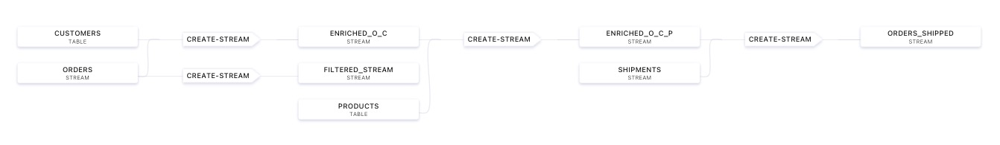

# Self-Managed ksqlDB Benchmarking with Confluent Operator and Confluent Cloud

## Objective

Run self-managed ksqlDB benchmarks using dedicated Confluent Cloud cluster.
Confluent Operator with EKS is used to deploy self-managed pods below:

* 1 Connect pod: used to inject data into topics, see `03-inject-data-in-topics.sh`
* 1 Control Center pod: accessible at http://127.0.0.1:9021 (`admin/Developer1`)
* `ksql_replicas` (configurable in `test.properties`) ksqlDB pods
* Prometheus and Grafana pods: accessible at http://127.0.0.1:3000 (`admin/admin`)

**IMPORTANT**: it requires tweaks to helm templates file, see tweaks [here](https://github.com/vdesabou/kafka-docker-playground/blob/1377447938e4abea65e8ca1755ac3f835c74955c/ccloud/operator-ksql-benchmarking/02-start-ksql-and-connect.sh#L69)

## Setup

Copy `ccloud-cluster-example.properties` into a new file called `ccloud-cluster.properties` and update properties according to your Confluent Cloud cluster:

Example:

```
bootstrap_servers=pkc-xxx.europe-west1.gcp.confluent.cloud:9092
cluster_api_key=
cluster_api_secret=
schema_registry_url=https://psrc-xxxx.europe-west3.gcp.confluent.cloud
schema_registry_api_key=
schema_registry_api_secret=
# optional: only required to create a cluster
ccloud_login=""
ccloud_password=""
environment_id=t12345
ckus=4
```

with:

* bootstrap_servers: The bootstrap server of your Confluent Cloud cluster
* cluster_api_key: Kafka API Key (with global access)
* cluster_api_secret: Kafka API Secret
* schema_registry_url: Confluent Cloud Schema Registry endpoint
* schema_registry_api_key: Confluent Cloud Schema Registry API key
* schema_registry_api_secret: Confluent Cloud Schema Registry API secret
* ccloud_login(optional): Confluent Cloud user login
* ccloud_password(optional): Confluent Cloud user password
* environment_id(optional): Confluent Cloud environment id where to create the cluster
* ckus(optional): Number of CKUs for the Confluent Cloud cluster to create


The last 4 properties are optional and only required when you want to use `00-create-ccloud-dedicated-cluster.sh` to create your Confluent Cloud dedicated cluster.

Once properties for your Confluent Cloud cluster are set in `ccloud-cluster.properties`, update `test.properties` accoring to your needs:

Example:

```
# minikube and aws are supported
provider=aws

# EKS specifics - begin
eks_cluster_name=ksql-benchmarking
eks_ec2_instance_type=t2.2xlarge
eks_region=eu-west-3
# EKS specifics - end

ksql_replicas=2
ksql_cpu=1000m
ksql_memory=8Gi
ksql_jvm_memory=8G
number_topic_partitions=12
datagen_tasks=10

orders_iterations=10000000
shipments_iterations=10000000
customers_iterations=10000
products_iterations=1000
```

with:

* provider: `eks` or `minikube` (minikube is only for local testing)
* eks_cluster_name: EKS cluster name to use
* eks_ec2_instance_type: AWS EC2 instance type to use
* eks_region: EKS region to use
* ksql_replicas: Number of ksqlDB nodes to use
* ksql_cpu: k8s CPU request for ksqlDB pods
* ksql_memory: k8s Memory request for ksqlDB pods
* ksql_jvm_memory: ksqlDB JVM Memory
* number_topic_partitions: Number of topic partitions to use for input topics `orders`, `shipments`, `customers` and `products`
* datagen_tasks: Number of tasks to use for injecting data with Datagen Kafka Connector
* orders_iterations: Number of messages in topic `orders`
* shipments_iterations: Number of messages in topic `shipments`
* customers_iterations: Number of messages in topic `customers`
* products_iterations: Number of messages in topic `products`

## How to run

### Step 00 (Optional) - Create Confluent Cloud dedicated cluster

```
$ 00-create-ccloud-dedicated-cluster.sh
```

This is optional, if you already have a dedicated Confluent Cloud cluster, go to next step.

This will create a dedicated Confluent Cloud cluster. Once it is provisioned, create a "Global Access" API Key and fill all required information in `ccloud-cluster.properties`

### Step 01 - Start EKS Kubernetest cluster

```
$ 01-start-kubernetes-cluster.sh
```

After about 30 minutes, the EKS cluster will be ready. Go to next step.

### Step 02 - Start all pods

```
$ 02-start-ksql-and-connect.sh
```

Every script is idempotent, i.e it makes sure to delete everything prior to re-run again. So for example, If you update  `ksql_replicas`, you can re-run this script, and it will redeploy pods as requested.

### Step 03 - Inject data into topics

```
$ 03-inject-data-in-topics.sh
```

Datagen connectors will be used to inject required data into topics.

#### orders topic

Datagen Schema is available [here](https://github.com/vdesabou/kafka-docker-playground/blob/master/ccloud/operator-ksql-benchmarking/schemas/orders-template.avro).
`orders_iterations` messages will be created

Example of JSON message:

```json

```

#### shipments topic

Datagen Schema is available [here](https://github.com/vdesabou/kafka-docker-playground/blob/master/ccloud/operator-ksql-benchmarking/schemas/shipments-template.avro).
`orders_shipments` messages will be created

Example of JSON message:

```json

```

#### customers topic

Datagen Schema is available [here](https://github.com/vdesabou/kafka-docker-playground/blob/master/ccloud/operator-ksql-benchmarking/schemas/customers.avro).
`orders_customers` messages will be created

Example of JSON message:

```json

```

#### products topic

Datagen Schema is available [here](https://github.com/vdesabou/kafka-docker-playground/blob/master/ccloud/operator-ksql-benchmarking/schemas/products.avro).
`orders_products` messages will be created

Example of JSON message:

```json

```

### Step 04 - Start benchmark

```
$ 04-start-benchmark.sh
```

This will create all streams and tables:

```
CREATE TABLE CUSTOMERS
(
    customerid varchar PRIMARY KEY,
    firstname varchar,
    lastname varchar, gender varchar,
    random_data varchar,
    address struct<street varchar, city varchar, state varchar, zipcode bigint>
)
WITH
    (kafka_topic='customers', value_format='json');

CREATE TABLE PRODUCTS
(
    productid varchar PRIMARY KEY,
    name varchar,
    category varchar,
    description varchar
)
WITH
    (kafka_topic='products', value_format='json');

CREATE STREAM ORDERS
(
    ordertime bigint,
    orderid bigint,
    productid varchar,
    orderunits integer,
    customerid varchar
)
WITH
    (kafka_topic= 'orders', value_format='json', timestamp='ordertime');

CREATE STREAM SHIPMENTS
(
    SHIPMENT_TIME bigint,
    SHIPMENTID bigint,
    orderid bigint,
    productid varchar,
    customerid varchar
)
WITH
    (kafka_topic= 'shipments', value_format='json', timestamp='shipment_time');
```

And then execute 5 queries:

#### Query 0 (Filtering) - FILTERED_STREAM

```
CREATE STREAM FILTERED_STREAM AS SELECT
  *
FROM
  ORDERS
WHERE productid='Product_1' or productid='Product_2';
```

#### Query 1 (Table Join) - ENRICHED_O_C

```
CREATE STREAM ENRICHED_O_C AS SELECT
  UNIX_TIMESTAMP() JOINTIME,
  O.ORDERTIME ORDERTIME,
  O.ORDERID ORDERID,
  O.PRODUCTID PRODUCTID,
  O.ORDERUNITS ORDERUNITS,
  O.CUSTOMERID CUSTOMERID,
  CUSTOMERS.FIRSTNAME FIRSTNAME,
  CUSTOMERS.LASTNAME LASTNAME,
  CUSTOMERS.GENDER GENDER,
  CUSTOMERS.RANDOM_DATA RANDOM_DATA,
  CUSTOMERS.ADDRESS ADDRESS
FROM
  ORDERS O
LEFT OUTER JOIN
    CUSTOMERS CUSTOMERS
    ON ((O.CUSTOMERID = CUSTOMERS.CUSTOMERID));
```

#### Query 2 (Table Join) - ENRICHED_O_C_P

```
CREATE STREAM ENRICHED_O_C_P AS SELECT
  UNIX_TIMESTAMP() JOINTIME,
  ORDERTIME,
  ORDERID,
  P.PRODUCTID as PRODUCTID,
  ORDERUNITS,
  CUSTOMERID,
  FIRSTNAME,
  LASTNAME,
  GENDER,
  RANDOM_DATA,
  ADDRESS,
  NAME as ProductName,
  category,
  description
FROM
  ENRICHED_O_C o
LEFT JOIN
  PRODUCTS p
ON O.PRODUCTID = P.PRODUCTID;
```

#### Query 3 (Stream Join) - ORDERS_SHIPPED

```
CREATE STREAM ORDERS_SHIPPED AS SELECT
  UNIX_TIMESTAMP() JOINTIME,
  O.ORDERID O_ORDERID,
  S.ORDERID S_ORDERID,
  S.SHIPMENTID SHIPMENTID,
  O.PRODUCTID PRODUCTID,
  O.CUSTOMERID CUSTOMERID,
  O.ORDERUNITS ORDERUNITS,
  PRODUCTNAME,
  CATEGORY,
  DESCRIPTION,
  FIRSTNAME,
  lastname,
  gender,
  RANDOM_DATA,
  address
FROM
  ENRICHED_O_C_P o
INNER JOIN SHIPMENTS S
  WITHIN 2 HOURS
ON O.ORDERID = S.ORDERID;
```

#### Query 4 (Aggregation + Window) - ORDERPER_PROD_CUST_AGG

```
CREATE TABLE ORDERPER_PROD_CUST_AGG AS SELECT
  os.PRODUCTID PRODUCTID,
  os.CUSTOMERID CUSTOMERID,
  COUNT(*) COUNTVAL,
  SUM(os.ORDERUNITS) ORDERSUM,
  MIN(UNIX_TIMESTAMP()) MINTIME,
  MAX(UNIX_TIMESTAMP()) MAXTIME,
  MAX(UNIX_TIMESTAMP()) - MIN(UNIX_TIMESTAMP()) TIMEDIFF
FROM
  ORDERS_SHIPPED os
WINDOW TUMBLING ( SIZE 1 MINUTES )
GROUP BY
  os.PRODUCTID, os.CUSTOMERID;
```

#### Overall Flow

This is the overall flow:



Every query is benchmarked individually, here is an example of output:

```
15:56:35 ----------------------------------------------------------
15:56:37 ksql-0|⏳ ENRICHED_O_C_P is processing 7832.46 msg/s [cpu=75,memory=1351]
15:56:39 ksql-1|⏳ ENRICHED_O_C_P is processing 9099.10 msg/s [cpu=74,memory=1302]
15:56:44 ----------------------------------------------------------
15:56:46 ksql-0|⏳ ENRICHED_O_C_P is processing 5210.76 msg/s [cpu=75,memory=1351]
15:56:48 ksql-1|⏳ ENRICHED_O_C_P is processing 6659.55 msg/s [cpu=74,memory=1302]
15:56:53 ----------------------------------------------------------
15:56:55 ksql-0|⏳ ENRICHED_O_C_P is processing 2440.14 msg/s [cpu=75,memory=1351]
15:56:57 ksql-1|⏳ ENRICHED_O_C_P is processing 4424.31 msg/s [cpu=74,memory=1302]
15:57:02 ----------------------------------------------------------
15:57:04 ksql-0|⏳ ENRICHED_O_C_P is processing 1005.30 msg/s [cpu=75,memory=1351]
15:57:06 ksql-1|⏳ ENRICHED_O_C_P is processing 2006.99 msg/s [cpu=74,memory=1302]
15:57:11 ----------------------------------------------------------
15:57:15 ksql-1|⏳ ENRICHED_O_C_P is processing 330.54 msg/s [cpu=74,memory=1302]
15:57:20 ----------------------------------------------------------
15:57:35 ℹ️ 5021652 messages processed by instance ksql-0
15:57:40 ℹ️ 4978348 messages processed by instance ksql-1
15:57:40 🚀 Stream ENRICHED_O_C_P has processed in total 10000000 messages in 272 seconds. Throughput (based on 10000000 input orders)=36764 msg/s
15:57:40 ksql-0|avg_cpu=1781m, avg_memory=1345Mi
15:57:40 ksql-1|avg_cpu=1825m, avg_memory=1286Mi
15:57:40 Average|avg_cpu=1803m, avg_memory=1315 Mi
```

### Step 05 - Cleanup queries

```
$ 05-cleanup-queries.sh
```

If you want to remove all queries, streams and tables, you can use this script. Note that it is also called at the start of `04-start-benchmark` in order to be idempotent.

### Stop everything

```
$ stop.sh
```

It will delete your EKS cluster.

N.B: it will not remove your Confluent Cloud cluster.
