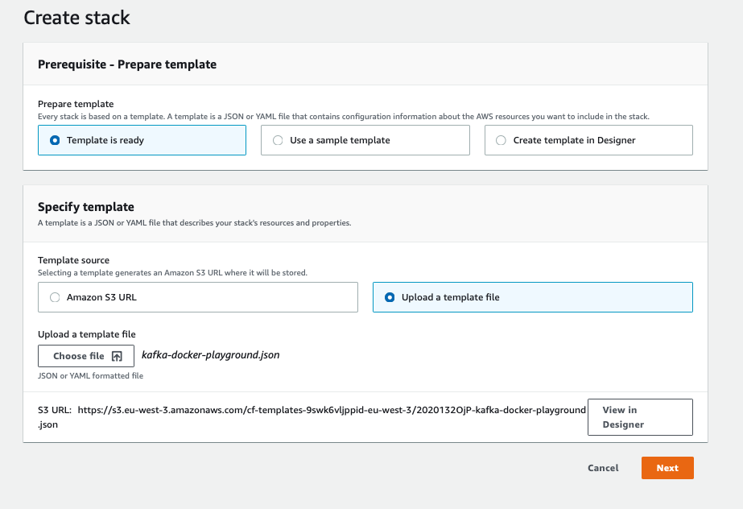
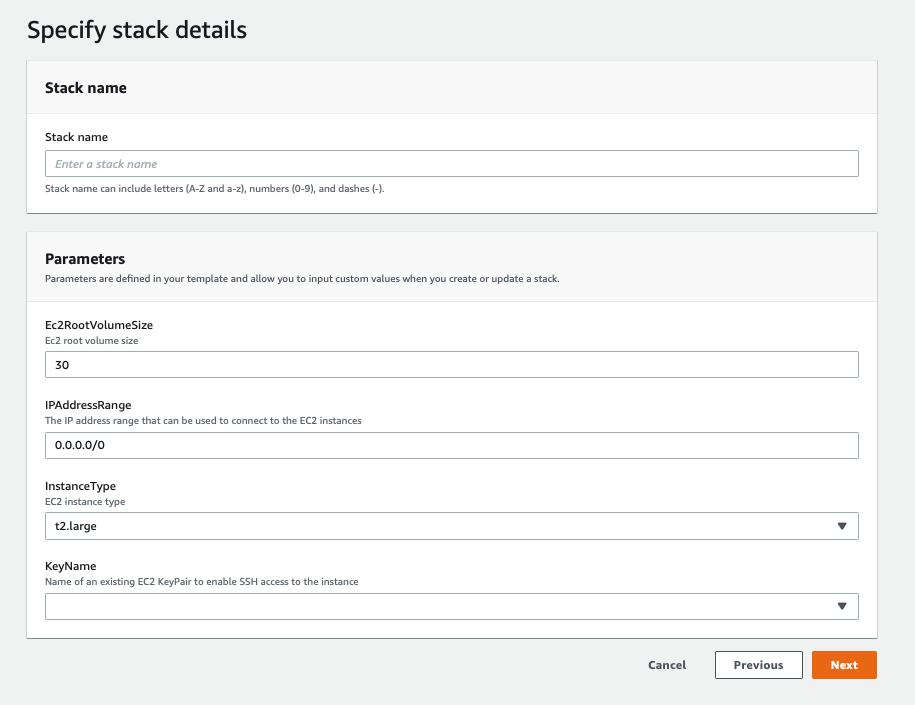
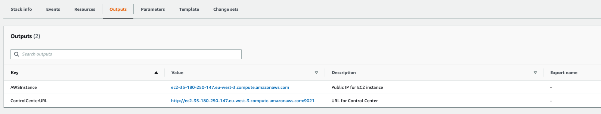

# Using AWS CloudFormation

If you don't want to run the playground locally, you can run it easily  on a EC2 instance

* Create stack in AWS CloudFormation and upload [this](./kafka-docker-playground.json?raw=true) template file:

* Fill information as requested (default EC2 instance type and root volume are recommended):

* After about 3 minutes, the stack will be created and you can see in *outputs* tab the public IP address of the EC2 instance and the Control Center URL:

