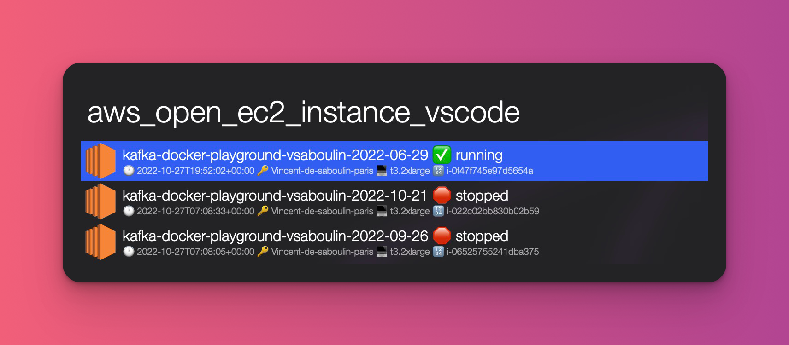
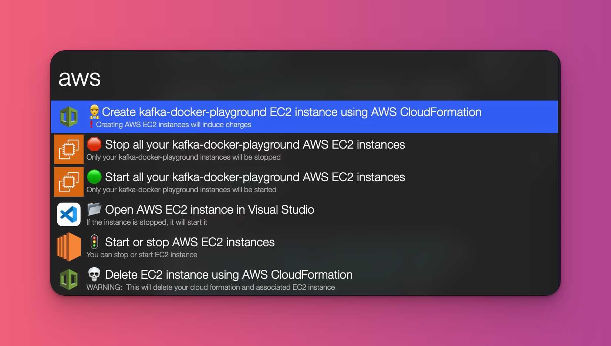
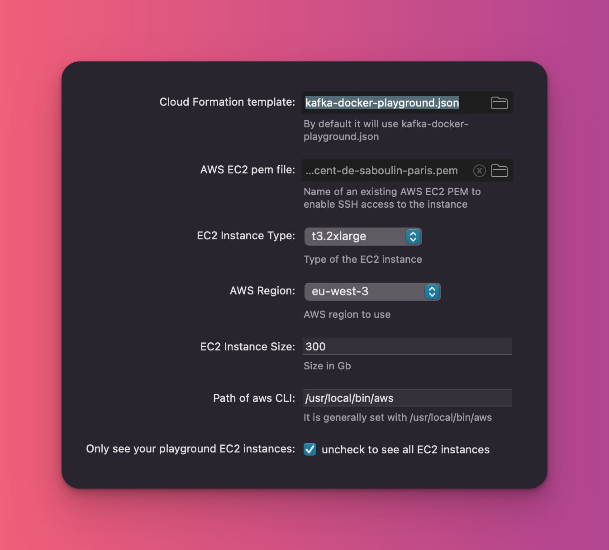

# ☁️ AWS EC2 Alfred workflow

* ✨ Create and manage AWS EC2 instances to run kafka-docker-playground

* 🪄 Open EC2 instances directly in Visual Studio code using [Remote Development](https://code.visualstudio.com/docs/remote/ssh) (over SSH)

❗ You need [Alfred](https://www.alfredapp.com) [powerpack](https://www.alfredapp.com/shop/) to be able to use that workflow.

## 🎯 Commands available

## ☑️ Prerequisites

* `aws` should be installed: `brew install awscli` and correctly [configured](https://docs.aws.amazon.com/cli/latest/userguide/getting-started-prereqs.html) with credentials.
* `jq` should be installed: `brew install jq`
* `code` should be installed: 
  * open Visual Studio Code
  * Then press the keys command-shift-P (or ⌘-⇧-P), a text field should appear, stating with a >. 
  * Now, type "Shell Command: Install ‘code’ command in PATH", and click on the option.

## 🛠 Configuration

Configure directly within Alfred

## ⬇️ Download

Click [here](https://github.com/vdesabou/kafka-docker-playground/raw/master/cloudformation/aws-ec2-kafka-docker-playground.alfred5workflow)