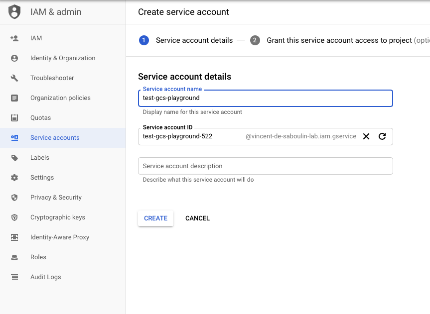
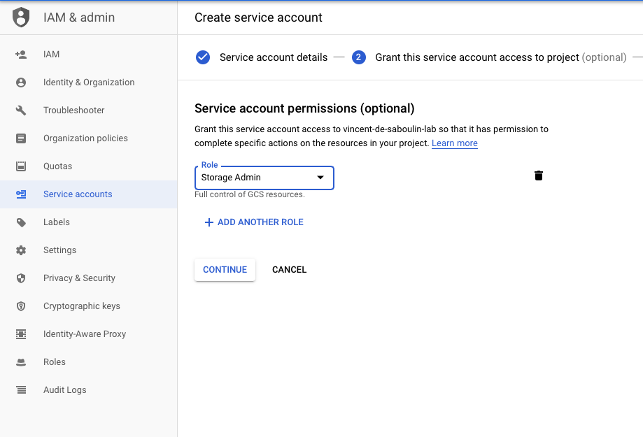

# GCS Sink connector

## Objective

Quickly test [GCS Sink](https://docs.confluent.io/current/connect/kafka-connect-gcs/index.html#quick-start) connector.

## Pre-requisites

* `docker-compose` (example `brew cask install docker`)
* `jq` (example `brew install jq`)
* `avro-tools` (example `brew install avro-tools`)
* `google-cloud-sdk` (example `brew cask install google-cloud-sdk`)
* Active Google Cloud Platform (GCP) account with authorization to create resources

## Prepare a Bucket

[Instructions](https://docs.confluent.io/current/connect/kafka-connect-gcs/index.html#prepare-a-bucket)

* Create `Service Account` from IAM & Admin console:

Set `Service account name`:



Choose permission `Storage Admin` (probably not required to have all of them):



Create Key:


Download it as JSON:


Rename it to `keyfile.json`and place it in `./keyfile.json`


## How to run

Simply run:

```bash
$ ./gcs-sink.sh <BUCKET_NAME>
```

Or using security (SASL_SSL and SSL authentications):

```bash
$ ./gcs-sink-sasl-ssl.sh <BUCKET_NAME>
```

## Details of what the script is doing

### With no security in place:

Messages are sent to `gcs_topic` topic using:

```bash
seq -f "{\"f1\": \"value%g\"}" 10 | docker container exec -i schema-registry kafka-avro-console-producer --broker-list broker:9092 --topic gcs_topic --property value.schema='{"type":"record","name":"myrecord","fields":[{"name":"f1","type":"string"}]}'
```

The connector is created with:

```bash
docker container exec -e BUCKET_NAME="$BUCKET_NAME" connect \
     curl -X POST \
     -H "Content-Type: application/json" \
     --data '{
               "name": "gcs",
               "config": {
                    "connector.class": "io.confluent.connect.gcs.GcsSinkConnector",
                    "tasks.max" : "1",
                    "topics" : "gcs_topic",
                    "gcs.bucket.name" : "'"$BUCKET_NAME"'",
                    "gcs.part.size": "5242880",
                    "flush.size": "3",
                    "gcs.credentials.path": "/root/keyfiles/keyfile.json",
                    "storage.class": "io.confluent.connect.gcs.storage.GcsStorage",
                    "format.class": "io.confluent.connect.gcs.format.avro.AvroFormat",
                    "partitioner.class": "io.confluent.connect.storage.partitioner.DefaultPartitioner",
                    "schema.compatibility": "NONE",
                    "confluent.topic.bootstrap.servers": "broker:9092",
                    "confluent.topic.replication.factor": "1"
          }}' \
     http://localhost:8083/connectors | jq .
```

After a few seconds, data should be in GCS:

```bash
$ gsutil ls gs://$BUCKET_NAME/topics/gcs_topic/partition=0/
```

Doing `gsutil` authentication:

```bash
$ gcloud auth activate-service-account --key-file ${KEYFILE}
```

Getting one of the avro files locally and displaying content with avro-tools:

```bash
$ gsutil cp gs://$BUCKET_NAME/topics/gcs_topic/partition=0/gcs_topic+0+0000000000.avro /tmp/
$ avro-tools tojson /tmp/gcs_topic+0+0000000000.avro
19/09/30 16:48:13 WARN util.NativeCodeLoader: Unable to load native-hadoop library for your platform... using builtin-java classes where applicable
{"f1":"value1"}
{"f1":"value2"}
{"f1":"value3"}
```
### With SSL authentication:

Messages are sent to `gcs_topic-ssl` topic using:

```bash
seq -f "{\"f1\": \"This is a message sent with SSL authentication %g\"}" 10 | docker container exec -i connect kafka-avro-console-producer --broker-list broker:9091 --topic gcs_topic-ssl --property value.schema='{"type":"record","name":"myrecord","fields":[{"name":"f1","type":"string"}]}' --property schema.registry.url=https://schema-registry:8085 --producer.config /etc/kafka/secrets/client_without_interceptors.config
```

The connector is created with:

```bash
docker container exec -e BUCKET_NAME="$BUCKET_NAME" connect \
     curl -X POST \
     --cert /etc/kafka/secrets/connect.certificate.pem --key /etc/kafka/secrets/connect.key --tlsv1.2 --cacert /etc/kafka/secrets/snakeoil-ca-1.crt \
     -H "Content-Type: application/json" \
     --data '{
               "name": "gcs",
               "config": {
                    "connector.class": "io.confluent.connect.gcs.GcsSinkConnector",
                    "tasks.max" : "1",
                    "topics" : "gcs_topic-ssl",
                    "gcs.bucket.name" : "'"$BUCKET_NAME"'",
                    "gcs.part.size": "5242880",
                    "flush.size": "3",
                    "gcs.credentials.path": "/root/keyfiles/keyfile.json",
                    "storage.class": "io.confluent.connect.gcs.storage.GcsStorage",
                    "format.class": "io.confluent.connect.gcs.format.avro.AvroFormat",
                    "partitioner.class": "io.confluent.connect.storage.partitioner.DefaultPartitioner",
                    "schema.compatibility": "NONE",
                    "confluent.topic.bootstrap.servers": "broker:11091",
                    "confluent.topic.replication.factor": "1",
                    "confluent.topic.ssl.keystore.location" : "/etc/kafka/secrets/kafka.connect.keystore.jks",
                    "confluent.topic.ssl.keystore.password" : "confluent",
                    "confluent.topic.ssl.key.password" : "confluent",
                    "confluent.topic.ssl.truststore.location" : "/etc/kafka/secrets/kafka.connect.truststore.jks",
                    "confluent.topic.ssl.truststore.password" : "confluent",
                    "confluent.topic.ssl.keystore.type" : "JKS",
                    "confluent.topic.ssl.truststore.type" : "JKS",
                    "confluent.topic.security.protocol" : "SSL"
          }}' \
     https://localhost:8083/connectors | jq .
```

Notes:

Broker config has `KAFKA_SSL_PRINCIPAL_MAPPING_RULES: RULE:^CN=(.*?),OU=TEST.*$$/$$1/,DEFAULT`. This is because we don't want to set user `CN=connect,OU=TEST,O=CONFLUENT,L=PaloAlto,ST=Ca,C=US`as super user. Documentation for `ssl.principal.mapping.rules`is [here](https://docs.confluent.io/current/kafka/authorization.html#user-names)

Script `certs-create.sh` has:

```
keytool -noprompt -destkeystore kafka.$i.truststore.jks -importkeystore -srckeystore $JAVA_HOME/jre/lib/security/cacerts -srcstorepass changeit -deststorepass confluent
```

This is because we set for `connect`service:

```yaml
KAFKA_OPTS: -Djavax.net.ssl.trustStore=/etc/kafka/secrets/kafka.connect.truststore.jks
            -Djavax.net.ssl.trustStorePassword=confluent
            -Djavax.net.ssl.keyStore=/etc/kafka/secrets/kafka.connect.keystore.jks
            -Djavax.net.ssl.keyStorePassword=confluent
```

It applies to every java component ran on that JVM, and for instance on Connect every connector will then use the given truststore

One example here is that if you use an AWS connector (S3, Kinesis etc) or GCP connecot (GCS, SQS, etc..) and do not have AWS cert chain in the given truststore, the connector won't work and raise exception.
The workaround is to import in our truststore the regular JAVA certificates.


After a few seconds, data should be in GCS:

```bash
$ gsutil ls gs://$BUCKET_NAME/topics/gcs_topic-ssl/partition=0/
```


Getting one of the avro files locally and displaying content with avro-tools:

```bash
$ gsutil cp gs://$BUCKET_NAME/topics/gcs_topic-ssl/partition=0/gcs_topic-ssl+0+0000000000.avro /tmp/
$ avro-tools tojson /tmp/gcs_topic-ssl+0+0000000000.avro
19/09/30 16:48:13 WARN util.NativeCodeLoader: Unable to load native-hadoop library for your platform... using builtin-java classes where applicable
{"f1":"This is a message sent with SSL authentication 1"}
{"f1":"This is a message sent with SSL authentication 2"}
{"f1":"This is a message sent with SSL authentication 3"}
```

### With SASL_SSL authentication:

Messages are sent to `gcs_topic-sasl-ssl` topic using:

```bash
seq -f "{\"f1\": \"This is a message sent with SASL_SSL authentication %g\"}" 10 | docker container exec -i connect kafka-avro-console-producer --broker-list broker:9091 --topic gcs_topic-sasl-ssl --property value.schema='{"type":"record","name":"myrecord","fields":[{"name":"f1","type":"string"}]}' --property schema.registry.url=https://schema-registry:8085 --producer.config /etc/kafka/secrets/client_without_interceptors.config
```

The connector is created with:

```bash
docker container exec -e BUCKET_NAME="$BUCKET_NAME" connect \
     curl -X POST \
     --cert /etc/kafka/secrets/connect.certificate.pem --key /etc/kafka/secrets/connect.key --tlsv1.2 --cacert /etc/kafka/secrets/snakeoil-ca-1.crt \
     -H "Content-Type: application/json" \
     --data '{
               "name": "gcs-sink-sasl-ssl",
               "config": {
                    "connector.class": "io.confluent.connect.gcs.GcsSinkConnector",
                    "tasks.max" : "1",
                    "topics" : "gcs_topic-sasl-ssl",
                    "gcs.bucket.name" : "'"$BUCKET_NAME"'",
                    "gcs.part.size": "5242880",
                    "flush.size": "3",
                    "gcs.credentials.path": "/root/keyfiles/keyfile.json",
                    "storage.class": "io.confluent.connect.gcs.storage.GcsStorage",
                    "format.class": "io.confluent.connect.gcs.format.avro.AvroFormat",
                    "partitioner.class": "io.confluent.connect.storage.partitioner.DefaultPartitioner",
                    "schema.compatibility": "NONE",
                    "confluent.topic.bootstrap.servers": "broker:9091",
                    "confluent.topic.replication.factor": "1",
                    "confluent.topic.ssl.keystore.location" : "/etc/kafka/secrets/kafka.connect.keystore.jks",
                    "confluent.topic.ssl.keystore.password" : "confluent",
                    "confluent.topic.ssl.key.password" : "confluent",
                    "confluent.topic.ssl.truststore.location" : "/etc/kafka/secrets/kafka.connect.truststore.jks",
                    "confluent.topic.ssl.truststore.password" : "confluent",
                    "confluent.topic.security.protocol" : "SASL_SSL",
                    "confluent.topic.sasl.mechanism": "PLAIN",
                    "confluent.topic.sasl.jaas.config": "org.apache.kafka.common.security.plain.PlainLoginModule required  username=\"client\" password=\"client-secret\";"
          }}' \
     https://localhost:8083/connectors | jq .
```

After a few seconds, data should be in GCS:

```bash
$ gsutil ls gs://$BUCKET_NAME/topics/gcs_topic-sasl-ssl/partition=0/
```


Getting one of the avro files locally and displaying content with avro-tools:

```bash
$ gsutil cp gs://$BUCKET_NAME/topics/gcs_topic-sasl-ssl/partition=0/gcs_topic-sasl-ssl+0+0000000000.avro /tmp/
$ avro-tools tojson /tmp/gcs_topic-sasl-ssl+0+0000000000.avro
19/09/30 16:48:13 WARN util.NativeCodeLoader: Unable to load native-hadoop library for your platform... using builtin-java classes where applicable
{"f1":"This is a message sent with SASL_SSL authentication 1"}
{"f1":"This is a message sent with SASL_SSL authentication 2"}
{"f1":"This is a message sent with SASL_SSL authentication 3"}
```

### With Kerberos GSSAPI authentication:

Messages are sent to `gcs_topic-kerberos` topic using:

```bash
$ docker container exec -i client kinit -k -t /var/lib/secret/kafka-client.key kafka_producer

$ seq -f "{\"f1\": \"This is a message sent with Kerberos GSSAPI authentication %g\"}" 10 | docker container exec -i client kafka-avro-console-producer --broker-list broker:9092 --topic gcs_topic-kerberos --property value.schema='{"type":"record","name":"myrecord","fields":[{"name":"f1","type":"string"}]}' --property schema.registry.url=http://schema-registry:8081 --producer.config /etc/kafka/producer.properties
```

The connector is created with:

```bash
docker container exec -e BUCKET_NAME="$BUCKET_NAME" connect \
     curl -X POST \
     -H "Content-Type: application/json" \
     --data '{
               "name": "gcs-sink-kerberos",
               "config": {
                    "connector.class": "io.confluent.connect.gcs.GcsSinkConnector",
                    "tasks.max" : "1",
                    "topics" : "gcs_topic-kerberos",
                    "gcs.bucket.name" : "'"$BUCKET_NAME"'",
                    "gcs.part.size": "5242880",
                    "flush.size": "3",
                    "gcs.credentials.path": "/root/keyfiles/keyfile.json",
                    "storage.class": "io.confluent.connect.gcs.storage.GcsStorage",
                    "format.class": "io.confluent.connect.gcs.format.avro.AvroFormat",
                    "partitioner.class": "io.confluent.connect.storage.partitioner.DefaultPartitioner",
                    "schema.compatibility": "NONE",
                    "confluent.topic.bootstrap.servers": "broker:9092",
                    "confluent.topic.replication.factor": "1",
                    "confluent.topic.sasl.mechanism": "GSSAPI",
                    "confluent.topic.sasl.kerberos.service.name": "kafka",
                    "confluent.topic.sasl.jaas.config" : "com.sun.security.auth.module.Krb5LoginModule required useKeyTab=true storeKey=true keyTab=\"/var/lib/secret/kafka-connect.key\" principal=\"connect@TEST.CONFLUENT.IO\";",
                    "confluent.topic.security.protocol" : "SASL_PLAINTEXT"
          }}' \
     http://localhost:8083/connectors | jq .
```

After a few seconds, data should be in GCS:

```bash
$ gsutil ls gs://$BUCKET_NAME/topics/gcs_topic-kerberos/partition=0/
```


Getting one of the avro files locally and displaying content with avro-tools:

```bash
$ gsutil cp gs://$BUCKET_NAME/topics/gcs_topic-kerberos/partition=0/gcs_topic-kerberos+0+0000000000.avro /tmp/
$ avro-tools tojson /tmp/gcs_topic-kerberos+0+0000000000.avro
{"f1":"This is a message sent with Kerberos GSSAPI authentication 1"}
{"f1":"This is a message sent with Kerberos GSSAPI authentication 2"}
{"f1":"This is a message sent with Kerberos GSSAPI authentication 3"}
```

### With LDAP Authorizer with SASL/PLAIN:

We need to add ACL for topic `gcs_topic-ldap-authorizer-sasl-plain` (user `alice` is part of group `Kafka Developers`):

```bash
$ docker container exec broker kafka-acls --authorizer-properties zookeeper.connect=zookeeper:2181 --add --topic=gcs_topic-ldap-authorizer-sasl-plain --producer --allow-principal="Group:Kafka Developers"
```

Messages are sent to `gcs_topic-ldap-authorizer-sasl-plain` topic using:

```bash
$ docker container exec -i client kinit -k -t /var/lib/secret/kafka-client.key kafka_producer

$ seq -f "{\"f1\": \"This is a message sent with LDAP Authorizer SASL/PLAIN authentication %g\"}" 10 | docker container exec -i connect kafka-avro-console-producer --broker-list broker:9092 --topic gcs_topic-ldap-authorizer-sasl-plain --property value.schema='{"type":"record","name":"myrecord","fields":[{"name":"f1","type":"string"}]}' --property schema.registry.url=http://schema-registry:8081 --producer.config /service/kafka/users/alice.properties
```

The connector is created with:

```bash
docker container exec -e BUCKET_NAME="$BUCKET_NAME" connect \
     curl -X POST \
     -H "Content-Type: application/json" \
     --data '{
               "name": "gcs-ldap-authorizer-sasl-plain",
               "config": {
                    "connector.class": "io.confluent.connect.gcs.GcsSinkConnector",
                    "tasks.max" : "1",
                    "topics" : "gcs_topic-ldap-authorizer-sasl-plain",
                    "gcs.bucket.name" : "'"$BUCKET_NAME"'",
                    "gcs.part.size": "5242880",
                    "flush.size": "3",
                    "gcs.credentials.path": "/root/keyfiles/keyfile.json",
                    "storage.class": "io.confluent.connect.gcs.storage.GcsStorage",
                    "format.class": "io.confluent.connect.gcs.format.avro.AvroFormat",
                    "partitioner.class": "io.confluent.connect.storage.partitioner.DefaultPartitioner",
                    "schema.compatibility": "NONE",
                    "confluent.topic.bootstrap.servers": "broker:9092",
                    "confluent.topic.replication.factor": "1",
                    "confluent.topic.sasl.mechanism": "PLAIN",
                    "confluent.topic.sasl.jaas.config" : "org.apache.kafka.common.security.plain.PlainLoginModule required username=\"broker\" password=\"broker\";",
                    "confluent.topic.security.protocol" : "SASL_PLAINTEXT"
          }}' \
     http://localhost:8083/connectors | jq .
```

After a few seconds, data should be in GCS:

```bash
$ gsutil ls gs://$BUCKET_NAME/topics/gcs_topic-kerberos/partition=0/
```


Getting one of the avro files locally and displaying content with avro-tools:

```bash
$ gsutil cp gs://$BUCKET_NAME/topics/gcs_topic-kerberos/partition=0/gcs_topic-kerberos+0+0000000000.avro /tmp/
$ avro-tools tojson /tmp/gcs_topic-kerberos+0+0000000000.avro
{"f1":"This is a message sent with LDAP Authorizer SASL/PLAIN authentication 1"}
{"f1":"This is a message sent with LDAP Authorizer SASL/PLAIN authentication 2"}
{"f1":"This is a message sent with LDAP Authorizer SASL/PLAIN authentication 3"}

N.B: Control Center is reachable at [http://127.0.0.1:9021](http://127.0.0.1:9021])

