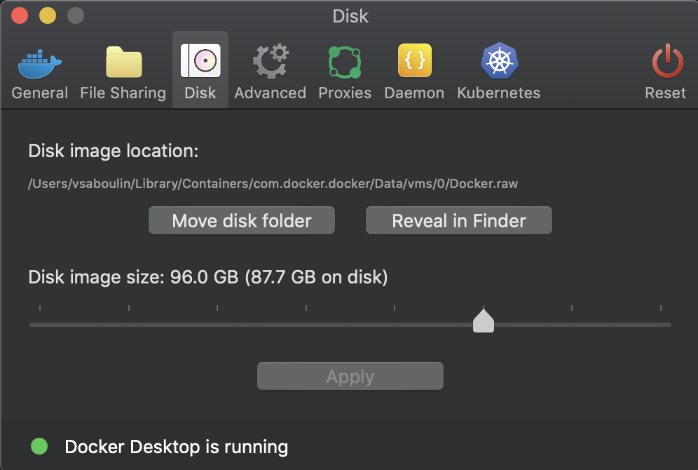

# JDBC Oracle 12 Source connector

## Objective

Quickly test [JDBC Source](https://docs.confluent.io/current/connect/kafka-connect-jdbc/source-connector/index.html#kconnect-long-jdbc-source-connector) connector with Oracle 12.

## Pre-requisites

* `docker-compose` (example `brew cask install docker`)
* `jq` (example `brew install jq`)
* Download Oracle Database 12.2.0.1 JDBC Driver `ojdbc8.jar`from this [page](https://www.oracle.com/database/technologies/jdbc-ucp-122-downloads.html) and place it in `./ojdbc8.jar`
* Download Oracle Database 12c Release 2 (12.2.0.1.0) for Linux x86-64 `linuxx64_12201_database.zip`from this [page](https://www.oracle.com/database/technologies/oracle12c-linux-12201-downloads.html) and place it in `./linuxx64_12201_database.zip`

Note: The first time you'll run the script, it will build (using this [project](https://github.com/oracle/docker-images/blob/master/OracleDatabase/SingleInstance/README.md)) the docker image `oracle/database:12.2.0.1-ee`. It takes about 20 minutes.

**Please make sure to increase Docker disk image size (96Gb is known to be working)**:



## How to run

Simply run:

```
$ ./oracle12.sh
```

## Details of what the script is doing

Build `oracle/database:12.2.0.1-ee` Docker image if required.

Wait (up to 15 minutes) that Oracle DB is up

Create the source connector with:

```bash
$ docker exec connect \
     curl -X POST \
     -H "Content-Type: application/json" \
     --data '{
               "name": "oracle-source",
               "config": {
                    "connector.class":"io.confluent.connect.jdbc.JdbcSourceConnector",
                    "tasks.max":"1",
                    "connection.user": "myuser",
                    "connection.password": "mypassword",
                    "connection.url": "jdbc:oracle:thin:@oracle:1521/ORCLPDB1",
                    "numeric.mapping":"best_fit",
                    "mode":"timestamp",
                    "poll.interval.ms":"1000",
                    "validate.non.null":"false",
                    "table.whitelist":"CUSTOMERS",
                    "timestamp.column.name":"UPDATE_TS",
                    "topic.prefix":"oracle-",
                    "errors.log.enable": "true",
                    "errors.log.include.messages": "true"
          }}' \
     http://localhost:8083/connectors | jq .
```

Verify the topic `oracle-CUSTOMERS`:

```bash
$ docker exec schema-registry kafka-avro-console-consumer -bootstrap-server broker:9092 --topic oracle-CUSTOMERS --from-beginning --max-messages 2
```

Results:

```json
{"ID":1,"FIRST_NAME":{"string":"Rica"},"LAST_NAME":{"string":"Blaisdell"},"EMAIL":{"string":"rblaisdell0@rambler.ru"},"GENDER":{"string":"Female"},"CLUB_STATUS":{"string":"bronze"},"COMMENTS":{"string":"Universal optimal hierarchy"},"CREATE_TS":{"long":1571238426253},"UPDATE_TS":{"long":1571238426000}}
{"ID":2,"FIRST_NAME":{"string":"Ruthie"},"LAST_NAME":{"string":"Brockherst"},"EMAIL":{"string":"rbrockherst1@ow.ly"},"GENDER":{"string":"Female"},"CLUB_STATUS":{"string":"platinum"},"COMMENTS":{"string":"Reverse-engineered tangible interface"},"CREATE_TS":{"long":1571238426260},"UPDATE_TS":{"long":1571238426000}}
```

N.B: Control Center is reachable at [http://127.0.0.1:9021](http://127.0.0.1:9021])
