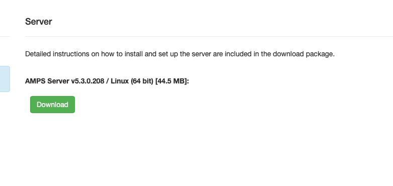

# AMPS Source connector


## Objective

Quickly test [AMPS Source](https://docs.confluent.io/current/connect/kafka-connect-amps/index.html#quick-start) connector.


* Create an account [here](https://www.crankuptheamps.com/developer) and download `AMPS Server v5.x.x / Linux (64 bit)`, then rename it to `AMPS.tar.gz` and put it into `docker-amps` directory



## How to run

Simply run:

```
$ ./amps-source.sh
```

## Details of what the script is doing

Use the spark utility to quickly publish few records to the Orders topic

```bash
$ docker exec -i amps /AMPS/bin/spark publish -server localhost:9007 -topic Orders -type json << EOF
{"id": 1, "order": "Apples"}
{"id": 2, "order": "Oranges"}
EOF
```

Creating AMPS source connector:

```bash
curl -X PUT \
     -H "Content-Type: application/json" \
     --data '{
               "connector.class": "io.confluent.connect.amps.AmpsSourceConnector",
               "tasks.max": "1",
               "kafka.topic": "AMPS_Orders",
               "amps.servers": "tcp://amps:9007",
               "amps.topic": "Orders",
               "amps.topic.type": "sow",
               "amps.command": "sow_and_subscribe",
               "confluent.topic.bootstrap.servers": "broker:9092",
               "confluent.topic.replication.factor": "1"
          }' \
     http://localhost:8083/connectors/amps-source/config | jq .
```


Verify we have received the data in `AMPS_Orders` topic

```bash
timeout 60 docker exec connect kafka-console-consumer -bootstrap-server broker:9092 --topic AMPS_Orders --from-beginning --max-messages 2
```

Results:

```json
8{"id": 1, "order": "Apples"}
:{"id": 2, "order": "Oranges"}
Processed a total of 2 messages
```

N.B: Control Center is reachable at [http://127.0.0.1:9021](http://127.0.0.1:9021])
