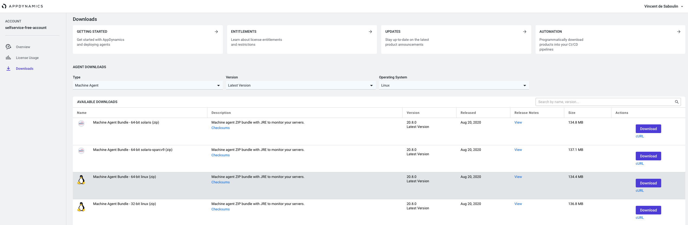

# AppDynamics Metrics sink connector

## Objective

Quickly test [AppDynamics Metrics sink](https://docs.confluent.io/current/connect/kafka-connect-appdynamics-metrics/index.html) connector.


* Create an account [here](https://www.appdynamics.com/free-trial/) and download from [here](https://accounts.appdynamics.com/downloads) `[Machine Agent Bundle - 64-bit linux (zip)](https://accounts.appdynamics.com/downloads)`, then rename it to `machine-agent.zip` and put it into `docker-appdynamics-metrics` directory



## How to run

Simply run:

```
$ ./appdynamics-metrics-sink.sh
```

## Details of what the script is doing


N.B: Control Center is reachable at [http://127.0.0.1:9021](http://127.0.0.1:9021])
