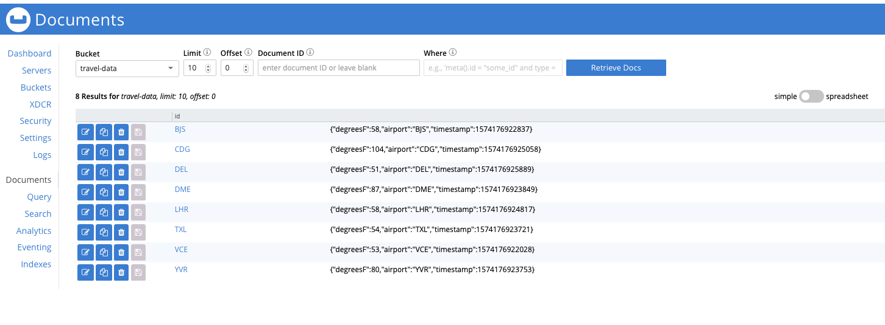

# Couchbase Sink connector

## Objective

Quickly test [Couchbase Sink](https://www.confluent.io/hub/couchbase/couchbase-connector) connector.

## Pre-requisites

* `docker-compose` (example `brew cask install docker`)
* `jq` (example `brew install jq`)


## How to run

Simply run:

```
$ ./couchbase-sink.sh
```

Couchbase UI is available at [127.0.0.1:8091](http://127.0.0.1:8091) `Administrator/password`

## Details of what the script is doing

Creating Couchbase cluster

```bash
$ docker exec couchbase bash -c "/opt/couchbase/bin/couchbase-cli cluster-init --cluster-username Administrator --cluster-password password --services=data,index,query"
```

Creating Couchbase bucket `travel-data`

```bash
$ docker exec couchbase bash -c "/opt/couchbase/bin/couchbase-cli bucket-create --cluster localhost:8091 --username Administrator --password password --bucket travel-data --bucket-type couchbase --bucket-ramsize 100"
```

Sending messages to topic `couchbase-sink-example`

```bash
$ docker exec json-producer bash -c "java -jar json-producer-example-1.0-SNAPSHOT-jar-with-dependencies.jar"
```

Creating Couchbase sink connector

```bash
$ docker exec connect \
     curl -X POST \
     -H "Content-Type: application/json" \
     --data '{
               "name": "couchbase-sink",
               "config": {
                    "connector.class": "com.couchbase.connect.kafka.CouchbaseSinkConnector",
                    "tasks.max": "2",
                    "topics": "couchbase-sink-example",
                    "connection.cluster_address": "couchbase",
                    "connection.timeout.ms": "2000",
                    "connection.bucket": "travel-data",
                    "connection.username": "Administrator",
                    "connection.password": "password",
                    "couchbase.durability.persist_to": "NONE",
                    "couchbase.durability.replicate_to": "NONE",
                    "couchbase.document.id": "/airport",
                    "key.converter": "org.apache.kafka.connect.storage.StringConverter",
                    "value.converter": "org.apache.kafka.connect.json.JsonConverter",
                    "value.converter.schemas.enable": "false"
          }}' \
     http://localhost:8083/connectors | jq .
```

Verify data is in Couchbase

```bash
$ docker exec couchbase bash -c "cbc cat CDG -U couchbase://localhost/travel-data -u Administrator -P password"

{"degreesF":104,"airport":"CDG","timestamp":1574176925058}CDG                  CAS=0x15d899953dda0000, Flags=0x2000000, Size=58, Datatype=0x01(JSON)
```

```bash
docker exec couchbase bash -c "cbc cat LHR -U couchbase://localhost/travel-data -u Administrator -P password"

{"degreesF":58,"airport":"LHR","timestamp":1574176924817}LHR                  CAS=0x15d899953dd60000, Flags=0x2000000, Size=57, Datatype=0x01(JSON)
```

In UI:




N.B: Control Center is reachable at [http://127.0.0.1:9021](http://127.0.0.1:9021])
