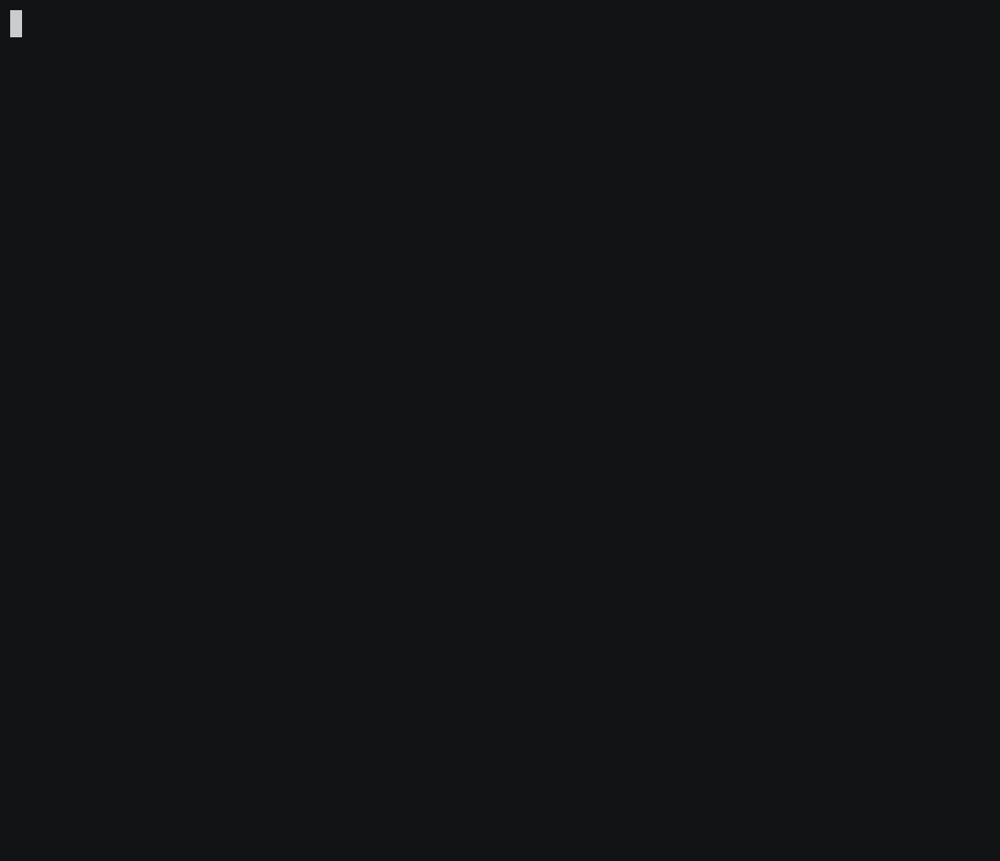

# Data Diode (Source & Sink) connector



## Objective

Quickly test [ata Diode (Source & Sink)](https://docs.confluent.io/current/connect/kafka-connect-data-diode/index.html#data-diode-connector-source-and-sink-for-cp) connector.

## Pre-requisites

* `docker-compose` (example `brew cask install docker`)

## How to run

Simply run:

```
$ ./datadiode.sh
```

## Details of what the script is doing

Creating DataDiode Source connector

```bash
$ docker exec connect \
     curl -X PUT \
     -H "Content-Type: application/json" \
     --data '{
               "tasks.max": "1",
               "connector.class": "io.confluent.connect.diode.source.DataDiodeSourceConnector",
               "kafka.topic.prefix": "dest_",
               "key.converter": "org.apache.kafka.connect.converters.ByteArrayConverter",
               "value.converter": "org.apache.kafka.connect.converters.ByteArrayConverter",
               "header.converter": "org.apache.kafka.connect.converters.ByteArrayConverter",
               "diode.port": "3456",
               "diode.encryption.password": "supersecretpassword",
               "diode.encryption.salt": "secretsalt",
               "confluent.license": "",
               "confluent.topic.bootstrap.servers": "broker:9092",
               "confluent.topic.replication.factor": "1"
          }' \
     http://localhost:8083/connectors/datadiode-source/config | jq .
```

Creating DataDiode Sink connector

```bash
$ docker exec connect \
     curl -X PUT \
     -H "Content-Type: application/json" \
     --data '{
               "connector.class": "io.confluent.connect.diode.sink.DataDiodeSinkConnector",
               "tasks.max": "1",
               "topics": "diode",
               "key.converter": "org.apache.kafka.connect.converters.ByteArrayConverter",
               "value.converter": "org.apache.kafka.connect.converters.ByteArrayConverter",
               "header.converter": "org.apache.kafka.connect.converters.ByteArrayConverter",
               "diode.host": "connect",
               "diode.port": "3456",
               "diode.encryption.password": "supersecretpassword",
               "diode.encryption.salt": "secretsalt",
               "confluent.license": "",
               "confluent.topic.bootstrap.servers": "broker:9092",
               "confluent.topic.replication.factor": "1"
          }' \
     http://localhost:8083/connectors/datadiode-sink/config | jq .
```

Send message to diode topic

```bash
$ seq -f "This is a message %g" 10 | docker exec -i broker kafka-console-producer --broker-list broker:9092 --topic diode
```

Verifying topic dest_diode

```bash
$ timeout 60 docker exec broker kafka-console-consumer -bootstrap-server broker:9092 --topic dest_diode --from-beginning --max-messages 10
```

N.B: Control Center is reachable at [http://127.0.0.1:9021](http://127.0.0.1:9021])
