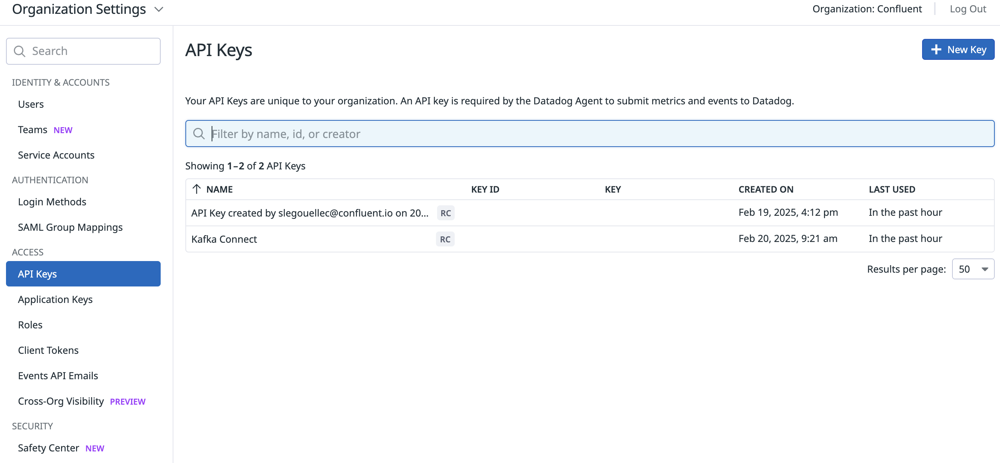
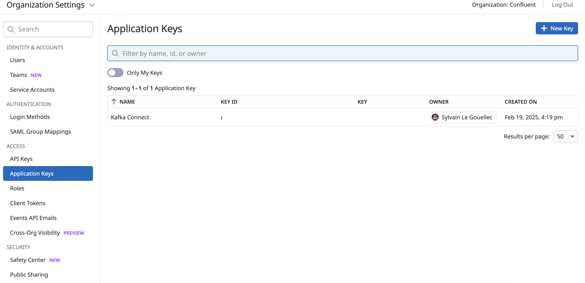
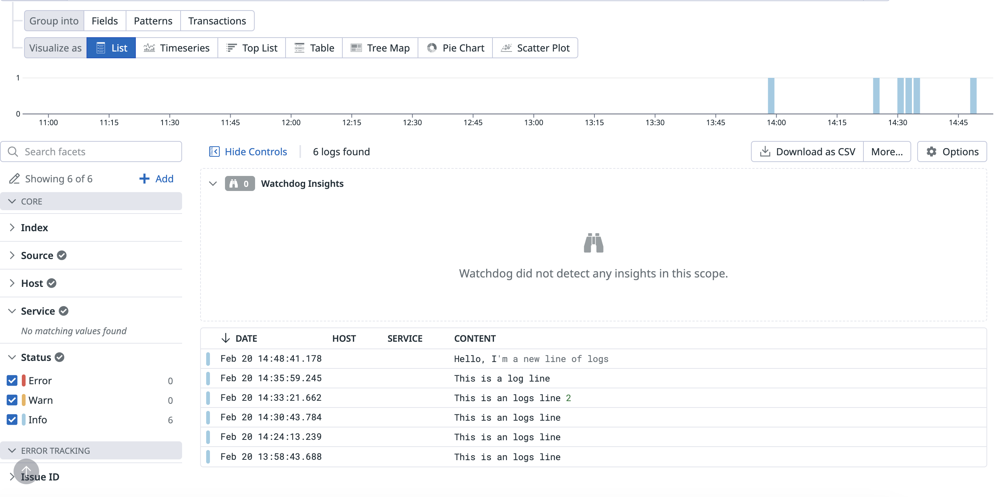

# Datadog Logs Sink connector


## Objective

Quickly test [Datadog Logs Sink](https://www.confluent.io/hub/datadog/kafka-connect-logs) connector.

## Prerequisites

Register for a [Datadog trial](https://app.datadoghq.com) if you don't already have an account (you can convert it to *Free plan* after the trial expires).

Create an API key (`DD_API_KEY`) and an Application key (`DD_APP_KEY`):




## How to run

Export DataDog Environment variables

Example :
```
$ export DD_API_KEY="4a**********0"
$ export DD_APP_KEY="c43**************67"
$ export DD_SITE="us5.datadoghq.com"
```

Simply run:

```
$ just use <playground run> command and search for datadog-logs-sink-sink<use tab key to activate fzf completion (see https://kafka-docker-playground.io/#/cli?id=%e2%9a%a1-setup-completion), otherwise use full path, or correct relative path> in this folder

```

## Details of what the script is doing

Sending messages to topic datadog-logs-topic:

```bash
$ docker exec -i connect kafka-console-producer --bootstrap-server broker:9092 --topic datadog-logs-topic << EOF
This is a log line
EOF
```

Creating Datadog metrics sink connector:

```bash
$ curl -X PUT \
     -H "Content-Type: application/json" \
     --data '{
               "connector.class": "com.datadoghq.connect.logs.DatadogLogsSinkConnector",
               "tasks.max": "1",
               "key.converter":"org.apache.kafka.connect.storage.StringConverter",
               "value.converter":"org.apache.kafka.connect.storage.StringConverter",
               "confluent.topic.bootstrap.servers": "broker:9092",
               "confluent.topic.replication.factor":1,
               "datadog.api_key": "$DD_API_KEY",
               "datadog.site": "$DD_SITE",
               "reporter.bootstrap.servers": "broker:9092",
               "reporter.error.topic.name": "error-responses",
               "reporter.error.topic.replication.factor": 1,
               "reporter.result.topic.name": "success-responses",
               "reporter.result.topic.replication.factor": 1,
               "behavior.on.error": "fail",
               "topics": "datadog-logs-topic"
          }' \
     http://localhost:8083/connectors/datadog-metrics-sink/config | jq .
```

Make sure `This is a log line` is present in Datadog
```
$ curl -s -X POST "https://api.$DD_SITE/api/v2/logs/events/search" \
-H "Content-Type: application/json" \
-H "DD-API-KEY: $DD_API_KEY" \
-H "DD-APPLICATION-KEY: $DD_APP_KEY" \
--data-raw '{
   "page": {
    "limit":1
  },
  "sort":"-timestamp"
}'
```

Check the data is in Datadog:
