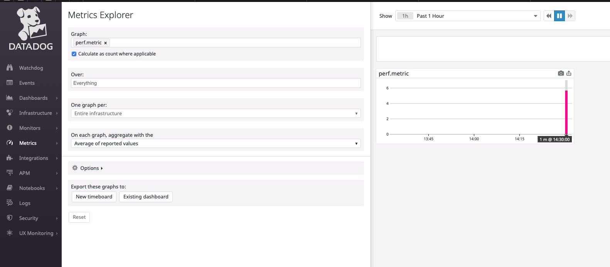

# Datadog Metrics Sink connector


## Objective

Quickly test [Datadog Metrics Sink](https://docs.confluent.io/current/connect/kafka-connect-datadog-metrics/index.html#quick-start) connector.

## Prerequisites

Register for a Datadog trial if you don't already have an account.
Get your DD_API_KEY and DD_DOMAIN (`COM` or `EU`).

## How to run

Simply run:

```
$ ./datadog-metrics-sink-sink.sh <DD_API_KEY> <DD_DOMAIN>

Note: you can also export these values as environment variable

```

## Details of what the script is doing

Sending messages to topic datadog-metrics-topic:

```bash
$ TIMESTAMP=`date +%s`
$ docker exec -i connect kafka-avro-console-producer --broker-list broker:9092 --property schema.registry.url=http://schema-registry:8081 --topic datadog-metrics-topic --property value.schema='{"name": "metric","type": "record","fields": [{"name": "name","type": "string"},{"name": "type","type": "string"},{"name": "timestamp","type": "long"}, {"name": "dimensions", "type": {"name": "dimensions", "type": "record", "fields": [{"name": "host", "type":"string"}, {"name":"interval", "type":"int"}, {"name": "tag1", "type":"string"}]}},{"name": "values","type": {"name": "values","type": "record","fields": [{"name":"doubleValue", "type": "double"}]}}]}' << EOF
{"name":"perf.metric", "type":"rate","timestamp": $TIMESTAMP, "dimensions": {"host": "metric.host1", "interval": 1, "tag1": "testing-data"},"values": {"doubleValue": 5.639623848362502}}
EOF
```

Creating Datadog metrics sink connector:

```bash
$ docker exec -e DD_API_KEY=$DD_API_KEY -e DD_DOMAIN=$DOMAIN connect \
     curl -X PUT \
     -H "Content-Type: application/json" \
     --data '{
               "connector.class": "io.confluent.connect.datadog.metrics.DatadogMetricsSinkConnector",
               "tasks.max": "1",
               "key.converter":"org.apache.kafka.connect.storage.StringConverter",
               "value.converter":"io.confluent.connect.avro.AvroConverter",
               "value.converter.schema.registry.url":"http://schema-registry:8081",
               "confluent.topic.bootstrap.servers": "broker:9092",
               "confluent.topic.replication.factor":1,
               "datadog.api.key": "'"$DD_API_KEY"'",
               "datadog.domain": "'"$DD_DOMAIN"'",
               "reporter.bootstrap.servers": "broker:9092",
               "reporter.error.topic.name": "error-responses",
               "reporter.error.topic.replication.factor": 1,
               "reporter.result.topic.name": "success-responses",
               "reporter.result.topic.replication.factor": 1,
               "behavior.on.error": "fail",
               "topics": "datadog-metrics-topic"
          }' \
     http://localhost:8083/connectors/datadog-metrics-sink/config | jq .
```

Check the data is in Datadog:



N.B: Control Center is reachable at [http://127.0.0.1:9021](http://127.0.0.1:9021])
