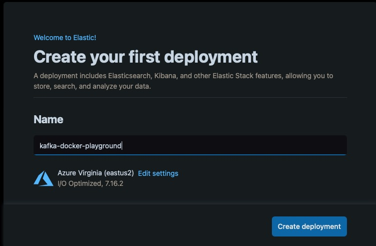
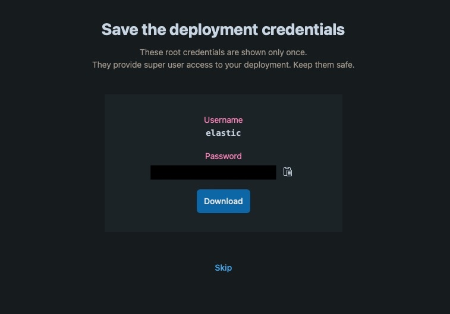
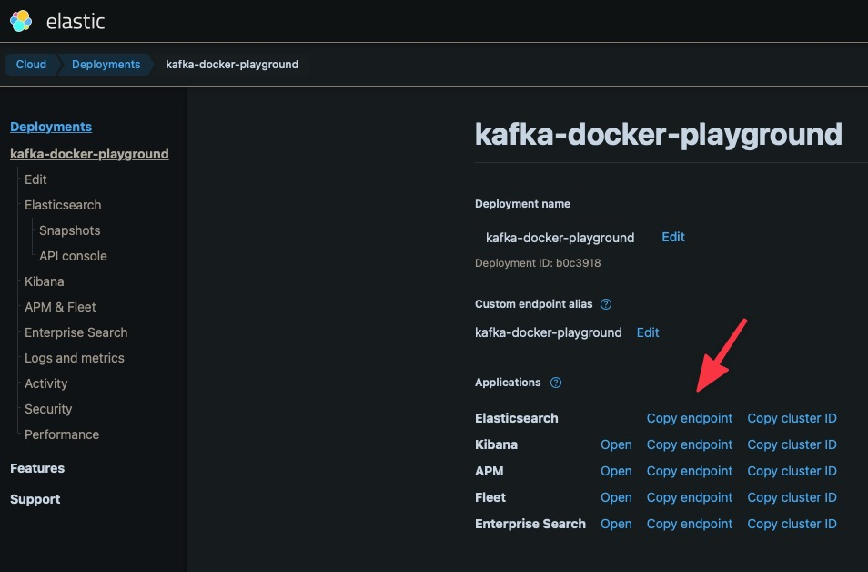

# Elasticsearch with Elastic Cloud Sink connector

## Objective

Quickly test [Elasticsearch Sink](https://docs.confluent.io/current/connect/kafka-connect-elasticsearch/index.html) connector with [Elastic Cloud](https://www.elastic.co/cloud/).

## Prerequisites

* If you don't already have an account, create an account [here](https://info.elastic.co/elasticsearch-service-trial-by-invite-30d.html) for a 30 days trial.

* Create a deployment:



* Get your deployment credentials (used for `ELASTICSEARCH_CLOUD_USERNAME` and `ELASTICSEARCH_CLOUD_PASSWORD`, see below)



* Get your Elasticseach endpoint (used for `ELASTICSEARCH_CLOUD_ENDPOINT`, see below)



## How to run

Simply run:

```
$ playground run -f elasticsearch-cloud-sink<tab> <ELASTICSEARCH_CLOUD_ENDPOINT> <ELASTICSEARCH_CLOUD_USERNAME> <ELASTICSEARCH_CLOUD_PASSWORD>
```

Note: you can also export these values as environment variable

## Details of what the script is doing

The connector is created with:

```bash
$ curl -X PUT \
    -H "Content-Type: application/json" \
    --data '{
          "connector.class": "io.confluent.connect.elasticsearch.ElasticsearchSinkConnector",
          "tasks.max": "1",
          "topics": "test-elasticsearch-sink",
          "key.ignore": "true",
          "connection.url": "'"$ELASTICSEARCH_CLOUD_ENDPOINT"'",
          "connection.username": "'"$ELASTICSEARCH_CLOUD_USERNAME"'",
          "connection.password": "'"$ELASTICSEARCH_CLOUD_PASSWORD"'"
          }' \
    http://localhost:8083/connectors/elasticsearch-cloud-sink/config | jq .
```

Messages are sent to `test-elasticsearch-sink` topic using:

```bash
$ seq -f "{\"f1\": \"value%g\"}" 10 | docker exec -i connect kafka-avro-console-producer --broker-list broker:9092 --property schema.registry.url=http://schema-registry:8081 --topic test-elasticsearch-sink --property value.schema='{"type":"record","name":"myrecord","fields":[{"name":"f1","type":"string"}]}'
```

Check that the data is available in Elasticsearch:

```bash
$ curl -u $ELASTICSEARCH_CLOUD_USERNAME:$ELASTICSEARCH_CLOUD_PASSWORD -XGET "$ELASTICSEARCH_CLOUD_ENDPOINT/test-elasticsearch-sink/_search?pretty"
{
  "took" : 36,
  "timed_out" : false,
  "_shards" : {
    "total" : 5,
    "successful" : 5,
    "skipped" : 0,
    "failed" : 0
  },
  "hits" : {
    "total" : 10,
    "max_score" : 1.0,
    "hits" : [
      {
        "_index" : "test-elasticsearch-sink",
        "_type" : "kafka-connect",
        "_id" : "test-elasticsearch-sink+0+0",
        "_score" : 1.0,
        "_source" : {
          "f1" : "value1"
        }
      },
      {
        "_index" : "test-elasticsearch-sink",
        "_type" : "kafka-connect",
        "_id" : "test-elasticsearch-sink+0+9",
        "_score" : 1.0,
        "_source" : {
          "f1" : "value10"
        }
      },
      {
        "_index" : "test-elasticsearch-sink",
        "_type" : "kafka-connect",
        "_id" : "test-elasticsearch-sink+0+4",
        "_score" : 1.0,
        "_source" : {
          "f1" : "value5"
        }
      },
      {
        "_index" : "test-elasticsearch-sink",
        "_type" : "kafka-connect",
        "_id" : "test-elasticsearch-sink+0+5",
        "_score" : 1.0,
        "_source" : {
          "f1" : "value6"
        }
      },
      {
        "_index" : "test-elasticsearch-sink",
        "_type" : "kafka-connect",
        "_id" : "test-elasticsearch-sink+0+2",
        "_score" : 1.0,
        "_source" : {
          "f1" : "value3"
        }
      },
      {
        "_index" : "test-elasticsearch-sink",
        "_type" : "kafka-connect",
        "_id" : "test-elasticsearch-sink+0+6",
        "_score" : 1.0,
        "_source" : {
          "f1" : "value7"
        }
      },
      {
        "_index" : "test-elasticsearch-sink",
        "_type" : "kafka-connect",
        "_id" : "test-elasticsearch-sink+0+3",
        "_score" : 1.0,
        "_source" : {
          "f1" : "value4"
        }
      },
      {
        "_index" : "test-elasticsearch-sink",
        "_type" : "kafka-connect",
        "_id" : "test-elasticsearch-sink+0+7",
        "_score" : 1.0,
        "_source" : {
          "f1" : "value8"
        }
      },
      {
        "_index" : "test-elasticsearch-sink",
        "_type" : "kafka-connect",
        "_id" : "test-elasticsearch-sink+0+8",
        "_score" : 1.0,
        "_source" : {
          "f1" : "value9"
        }
      },
      {
        "_index" : "test-elasticsearch-sink",
        "_type" : "kafka-connect",
        "_id" : "test-elasticsearch-sink+0+1",
        "_score" : 1.0,
        "_source" : {
          "f1" : "value2"
        }
      }
    ]
  }
}
```

N.B: Control Center is reachable at [http://127.0.0.1:9021](http://127.0.0.1:9021])
