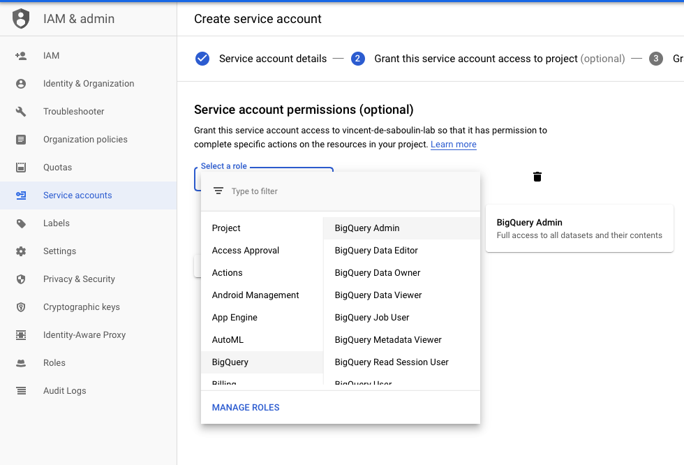

# GCP BigQuery Sink connector


## Objective

Quickly test [GCP BigQuery Sink](https://docs.confluent.io/current/connect/kafka-connect-bigquery/index.html#kconnect-long-gcp-bigquery-sink-connector) connector.

* Active Google Cloud Platform (GCP) account with authorization to create resources

## GCP BigQuery Setup

* Follow [Quickstart using the web UI in the GCP Console](https://cloud.google.com/bigquery/docs/quickstarts/quickstart-web-ui) to get familiar with GCP BigQuery
* Create a DataSet in your project
* Create `Service Account` from IAM & Admin console:

Set `Service account name`:


Choose permission `BigQuery`->`BigQuery Admin` or create a custom role with:

```
bigquery.datasets.get
bigquery.tables.create
bigquery.tables.get
bigquery.tables.getData
bigquery.tables.list
bigquery.tables.update
bigquery.tables.updateData
bigquery.jobs.create
```

Note that `bigquery.jobs.create`is only required to run command `bq query "SELECT * FROM $DATASET.kcbq_quickstart1;"`



Create Key:


Download it as JSON:


Rename it to `keyfile.json`and place it in `./keyfile.json`


## How to run

Simply run:

```bash
$ ./gcp-bigquery.sh <PROJECT> <DATASET>
```

## Details of what the script is doing

Messages are sent to `kcbq-quickstart1` topic using:

```bash
seq -f "{\"f1\": \"value%g\"}" 10 | docker exec -i connect kafka-avro-console-producer --broker-list broker:9092 --property schema.registry.url=http://schema-registry:8081 --topic kcbq-quickstart1 --property value.schema='{"type":"record","name":"myrecord","fields":[{"name":"f1","type":"string"}]}'
```

The connector is created with:

```bash
curl -X PUT \
     -H "Content-Type: application/json" \
     --data '{
               "connector.class": "com.wepay.kafka.connect.bigquery.BigQuerySinkConnector",
                    "tasks.max" : "1",
                    "topics" : "kcbq-quickstart1",
                    "sanitizeTopics" : "true",
                    "autoCreateTables" : "true",
                    "autoUpdateSchemas" : "true",
                    "schemaRetriever" : "com.wepay.kafka.connect.bigquery.schemaregistry.schemaretriever.SchemaRegistrySchemaRetriever",
                    "schemaRegistryLocation": "http://schema-registry:8081",
                    "bufferSize": "100000",
                    "maxWriteSize": "10000",
                    "tableWriteWait": "1000",
                    "project" : "'"$PROJECT"'",
                    "datasets" : ".*='"$DATASET"'",
                    "keyfile" : "/root/keyfiles/keyfile.json"
          }' \
     http://localhost:8083/connectors/kcbq-connect/config | jq .
```


After a few seconds, data should be in GCP BigQuery:

```bash
$ bq --project_id "$PROJECT" query "SELECT * FROM $DATASET.kcbq_quickstart1;"
Waiting on bqjob_r1bbecb24663a3f7c_0000016d825065f1_1 ... (0s) Current status: DONE
+---------+
|   f1    |
+---------+
| value1  |
| value8  |
| value5  |
| value2  |
| value7  |
| value3  |
| value10 |
| value6  |
| value9  |
| value4  |
+---------+
```

N.B: Control Center is reachable at [http://127.0.0.1:9021](http://127.0.0.1:9021])
