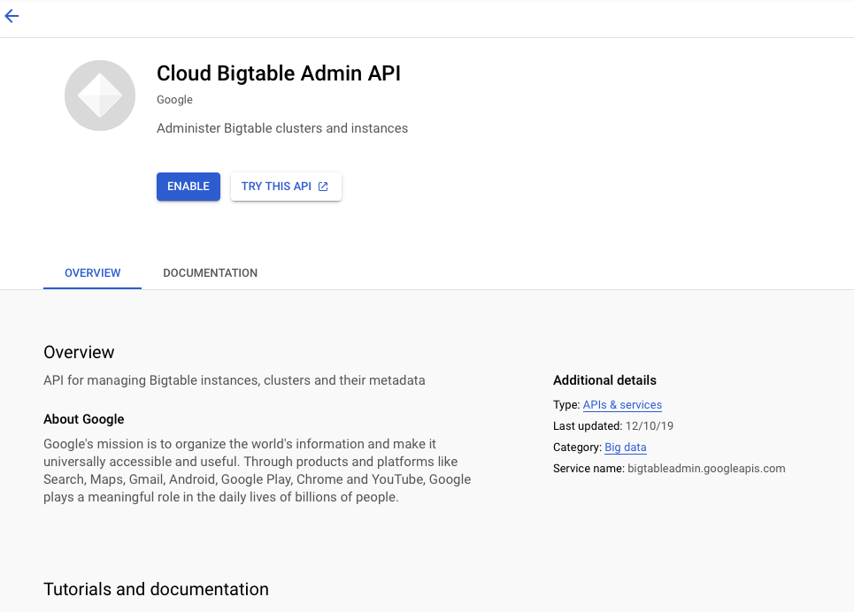
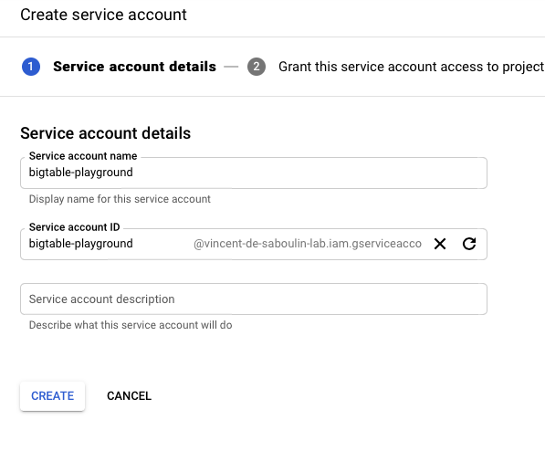
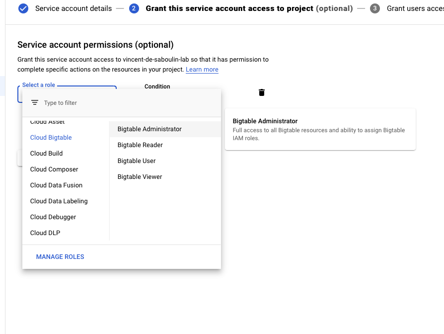
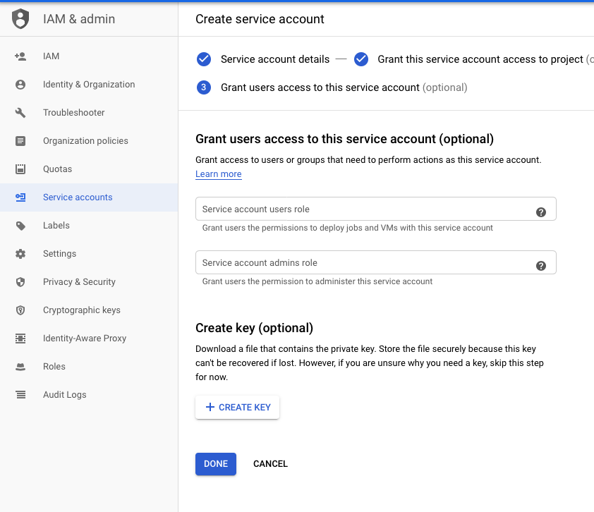

# GCP BigTable Sink connector


## Objective

Quickly test [GCP BigTable Sink](https://docs.confluent.io/current/connect/kafka-connect-gcp-bigtable/index.html#quick-start) connector.

* Active Google Cloud Platform (GCP) account with authorization to create resources

## GCP BigTable Setup

### Enabling Cloud BigTable Admin API

Go to this [link](https://console.developers.google.com/apis/library/bigtableadmin.googleapis.com) and click `Enable`:



### Setup Credentials

* Create `Service Account` from IAM & Admin console:

Set `Service account name`:



Choose permission `Cloud BigTable`->`BigTable Administrator`



Create Key:



Download it as JSON:


Rename it to `keyfile.json`and place it in `./keyfile.json`


## How to run

Simply run:

```bash
$ ./gcp-bigtable.sh <PROJECT> <INSTANCE>
```

Note: you can also export these values as environment variable

## Details of what the script is doing

Create a BigTable Instance and Database

```bash
$ docker run -i --volumes-from gcloud-config google/cloud-sdk:latest gcloud bigtable instances create $INSTANCE --project $PROJECT --cluster $INSTANCE --cluster-zone=us-east1-c --display-name="playground-bigtable-instance" --instance-type=DEVELOPMENT
```

Sending messages to topic `stats`

```bash
$ docker exec -i connect kafka-avro-console-producer --broker-list broker:9092 --property schema.registry.url=http://schema-registry:8081 --topic stats --property parse.key=true --property key.separator=, --property key.schema='{"type" : "string", "name" : "id"}' --property value.schema='{"type":"record","name":"myrecord","fields":[{"name":"users","type":{"name":"columnfamily","type":"record","fields":[{"name": "name", "type": "string"},{"name": "friends", "type": "string"}]}}]}' << EOF
"simple-key-1", {"users": {"name":"Bob","friends": "1000"}}
"simple-key-2", {"users": {"name":"Jess","friends": "10000"}}
"simple-key-3", {"users": {"name":"John","friends": "10000"}}
EOF
```

Creating GCP BigTbale Sink connector

```bash
curl -X PUT \
     -H "Content-Type: application/json" \
     --data '{
               "connector.class": "io.confluent.connect.gcp.bigtable.BigtableSinkConnector",
               "tasks.max" : "1",
               "topics" : "stats",
               "auto.create" : "true",
               "gcp.bigtable.credentials.path": "/root/keyfiles/keyfile.json",
               "gcp.bigtable.instance.id": "'"$INSTANCE"'",
               "gcp.bigtable.project.id": "'"$PROJECT"'",
               "auto.create.tables": "true",
               "auto.create.column.families": "true",
               "table.name.format" : "kafka_${topic}",
               "confluent.license": "",
               "confluent.topic.bootstrap.servers": "broker:9092",
               "confluent.topic.replication.factor": "1"
          }' \
     http://localhost:8083/connectors/gcp-bigtable-sink/config | jq .
```

Verify data is in GCP BigTable

```bash
$ docker run -i --volumes-from gcloud-config google/cloud-sdk:latest cbt -project $PROJECT -instance $INSTANCE read kafka_stats
```

Results:

```
----------------------------------------
simple-key-1
  users:friends                            @ 2020/10/12-13:43:15.814000
    "1000"
  users:name                               @ 2020/10/12-13:43:10.153000
    "Bob"
----------------------------------------
simple-key-2
  users:friends                            @ 2020/10/12-13:43:29.221000
    "10000"
  users:name                               @ 2020/10/12-13:43:22.843000
    "Jess"
```

Delete table

```bash
$ docker run -i --volumes-from gcloud-config google/cloud-sdk:latest cbt -project $PROJECT -instance $INSTANCE deletetable kafka_stats
```

Deleting instance

```bash
$ docker run -i --volumes-from gcloud-config google/cloud-sdk:latest gcloud bigtable instances delete $INSTANCE --project $PROJECT  << EOF
Y
EOF
```

N.B: Control Center is reachable at [http://127.0.0.1:9021](http://127.0.0.1:9021])
