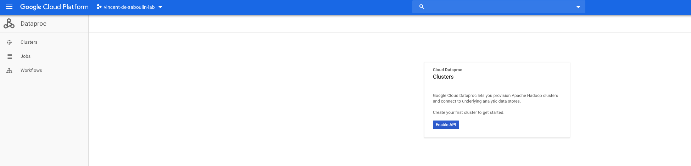
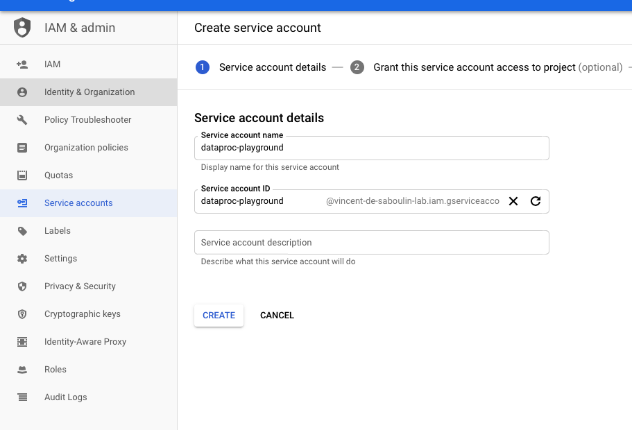
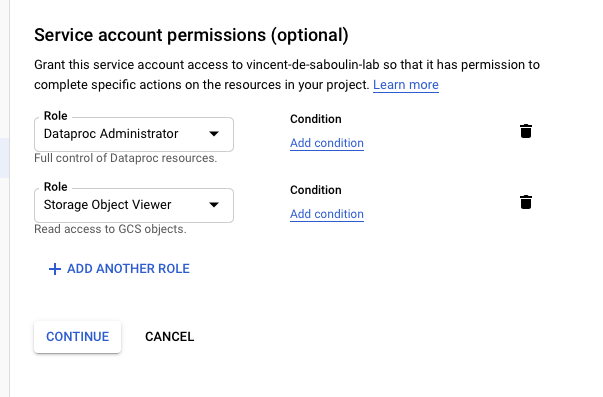

# GCP Dataproc Sink connector

❗❗❗NOT WORKING: ❗❗❗

Connector must be deployed on a VM on same GCP subnet as the Dataproc cluster. Hence it cannot be working with the playground.


## Objective

Quickly test [GCP Dataproc Sink](https://docs.confluent.io/current/connect/kafka-connect-gcp-dataproc/sink/index.html#quick-start) connector.

* Active Google Cloud Platform (GCP) account with authorization to create resources

## GCP Dataproc Setup

* Make sure to enable API in your Dataproc console:



* Create `Service Account` from IAM & Admin console:

Set `Service account name`:



Choose permission `Dataproc`->`Dataproc Administrator` and the role `Storage`->`Storage Object Viewer`



Create Key:


Download it as JSON:


Rename it to `keyfile.json`and place it in `./keyfile.json` or use environment variable `GCP_KEYFILE_CONTENT` with content generated with `GCP_KEYFILE_CONTENT=$(cat keyfile.json | jq -aRs . | sed 's/^"//' | sed 's/"$//')


## How to run

Simply run:

```bash
$ just use <playground run> command and search for gcp-dataproc<use tab key to activate fzf completion (see https://kafka-docker-playground.io/#/cli?id=%e2%9a%a1-setup-completion), otherwise use full path, or correct relative path> <GCP_PROJECT> .sh in this folder
```

## Details of what the script is doing


N.B: Control Center is reachable at [http://127.0.0.1:9021](http://127.0.0.1:9021])
