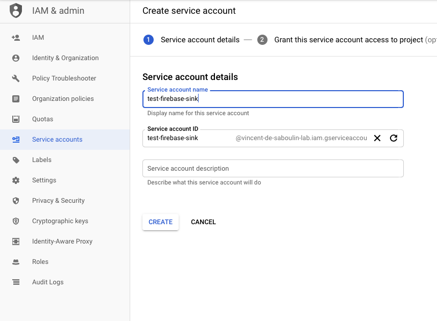
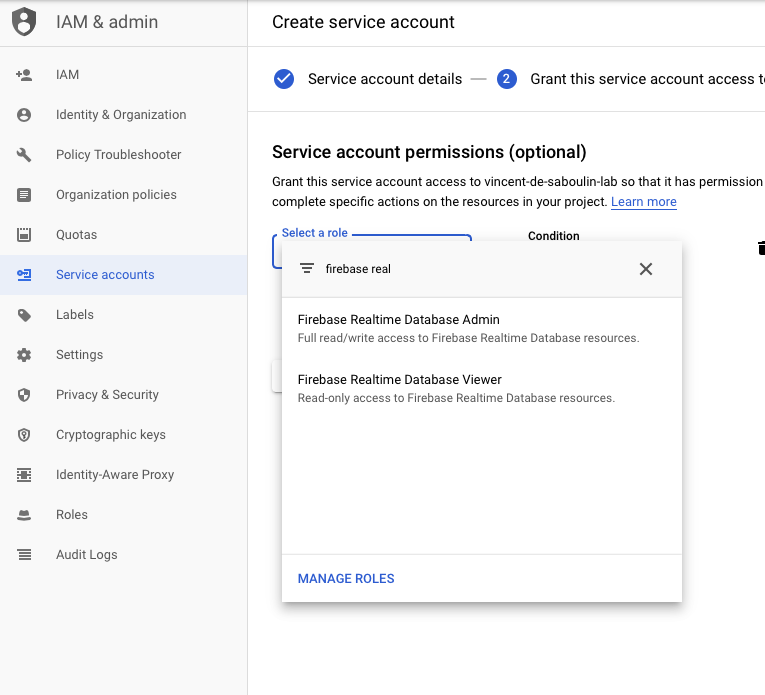
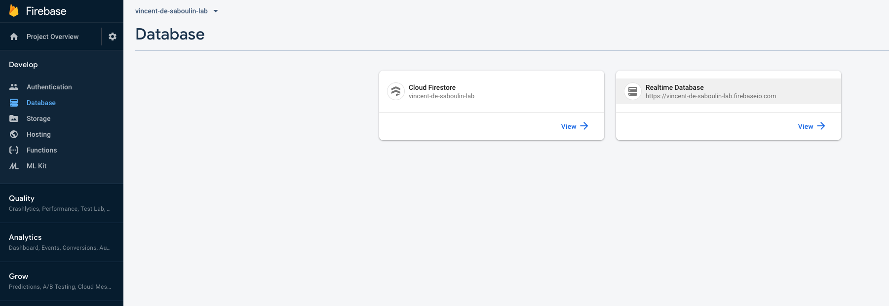
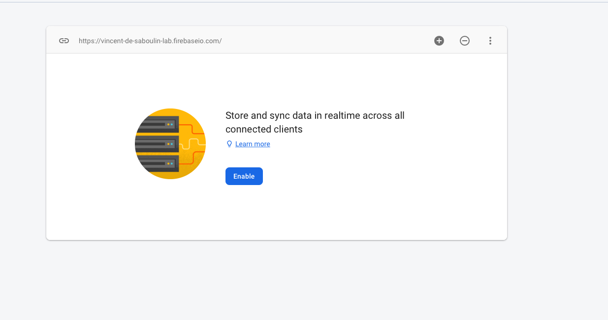
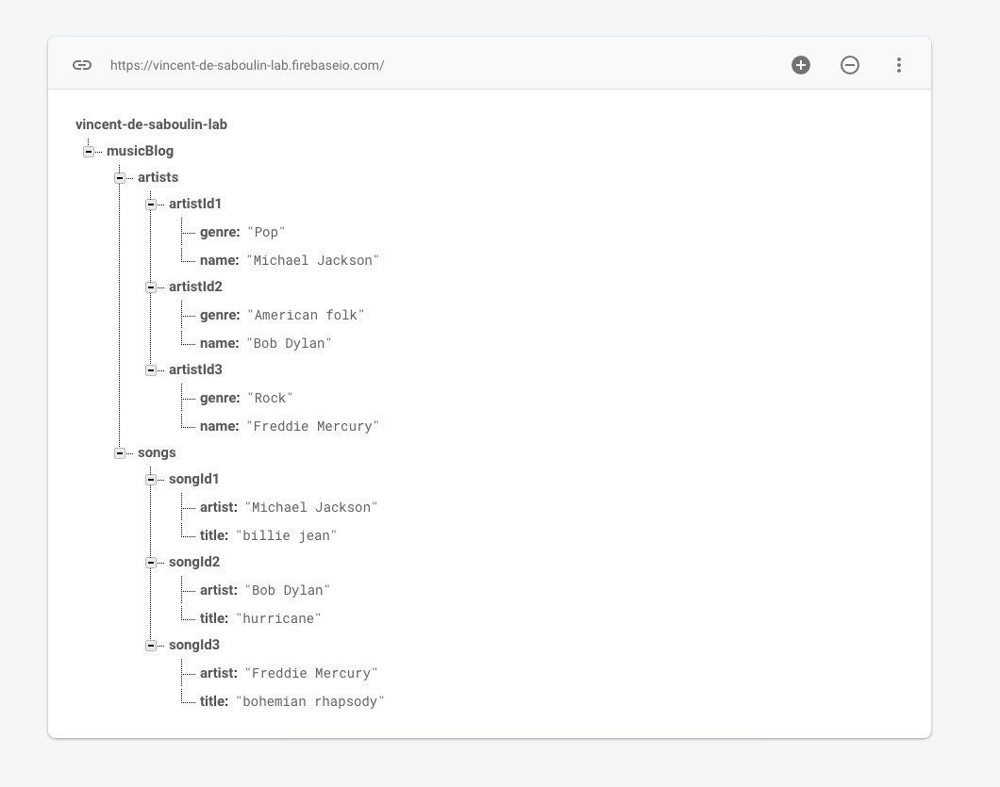

# GCP Firebase Sink connector

## Objective

Quickly test [GCP Firebase Sink](https://docs.confluent.io/current/connect/kafka-connect-firebase/sink/index.html#quick-start) connector.

## Pre-requisites

* `docker-compose` (example `brew cask install docker`)

* Active Google Cloud Platform (GCP) account with authorization to create resources

## GCP Firebase Setup

### Service Account setup

Create `Service Account` from IAM & Admin console:

Set `Service account name`:



Choose permission `Firebase`->`Firebase Realtime Database Admin`



Create Key:


Download it as JSON:


Rename it to `keyfile.json` and place it in `./keyfile.json`

### Realtime Database setup

Go to [Firebase console](https://console.firebase.google.com), click `Add Project` and choose your GCP project.

In your console, click `Database`on the left sidebar:


Click on `Realtime Database`:



Click on `Enable`:



## How to run

Simply run:

```bash
$ ./gcp-firebase-source.sh <PROJECT>
```

### Verify data has been pushed to Firebase

Go to [Firebase console](https://console.firebase.google.com) and choose your GCP project.

In your console, click `Database`on the left sidebar:


Click on `Realtime Database`:


You should see:



## Details of what the script is doing


Creating GCP Firebase Sink connector

```bash
$ docker exec -e PROJECT="$PROJECT" connect \
     curl -X PUT \
     -H "Content-Type: application/json" \
     --data '{
               "connector.class" : "io.confluent.connect.firebase.FirebaseSinkConnector",
                    "tasks.max" : "1",
                    "topics":"artists,songs",
                    "gcp.firebase.credentials.path": "/root/keyfiles/keyfile.json",
                    "gcp.firebase.database.reference": "https://'"$PROJECT"'.firebaseio.com/musicBlog",
                    "insert.mode":"update",
                    "key.converter" : "io.confluent.connect.avro.AvroConverter",
                    "key.converter.schema.registry.url":"http://schema-registry:8081",
                    "value.converter" : "io.confluent.connect.avro.AvroConverter",
                    "value.converter.schema.registry.url":"http://schema-registry:8081",
                    "confluent.topic.bootstrap.servers": "broker:9092",
                    "confluent.topic.replication.factor": "1"
          }' \
     http://localhost:8083/connectors/firebase-sink/config | jq_docker_cli .
```

Produce Avro data to topic artists

```bash
$ docker exec -i schema-registry kafka-avro-console-producer --broker-list broker:9092 --topic artists --property parse.key=true --property key.schema='{"type":"string"}' --property "key.separator=:" --property value.schema='{"type":"record","name":"artists","fields":[{"name":"name","type":"string"},{"name":"genre","type":"string"}]}' << EOF
"artistId1":{"name":"Michael Jackson","genre":"Pop"}
"artistId2":{"name":"Bob Dylan","genre":"American folk"}
"artistId3":{"name":"Freddie Mercury","genre":"Rock"}
EOF
```

Produce Avro data to topic songs

```bash
$ docker exec -i schema-registry kafka-avro-console-producer --broker-list broker:9092 --topic songs --property parse.key=true --property key.schema='{"type":"string"}' --property "key.separator=:" --property value.schema='{"type":"record","name":"songs","fields":[{"name":"title","type":"string"},{"name":"artist","type":"string"}]}' << EOF
"songId1":{"title":"billie jean","artist":"Michael Jackson"}
"songId2":{"title":"hurricane","artist":"Bob Dylan"}
"songId3":{"title":"bohemian rhapsody","artist":"Freddie Mercury"}
EOF
```

[Verify data has been pushed to Firebase](#verify-data-has-been-pushed-to-firebase)

N.B: Control Center is reachable at [http://127.0.0.1:9021](http://127.0.0.1:9021])
