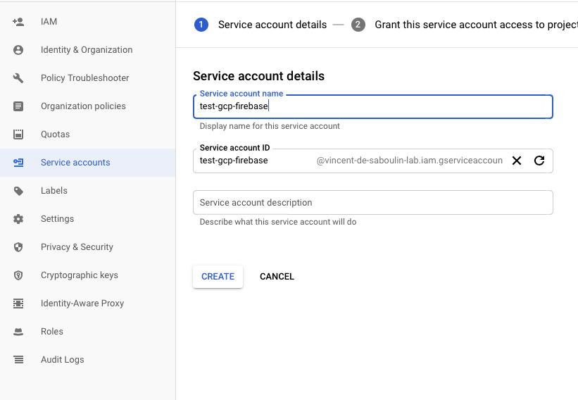
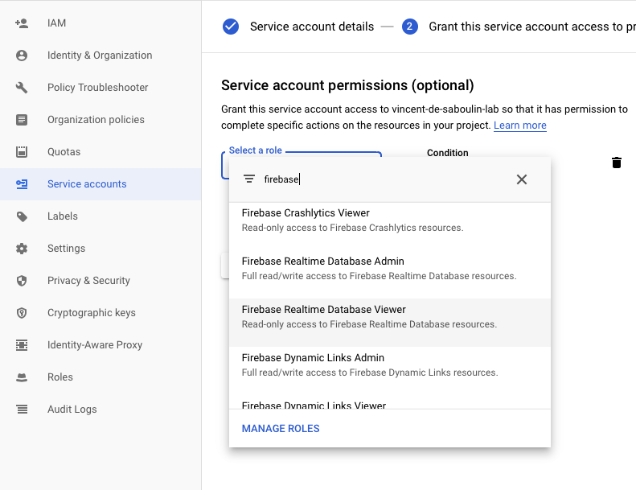
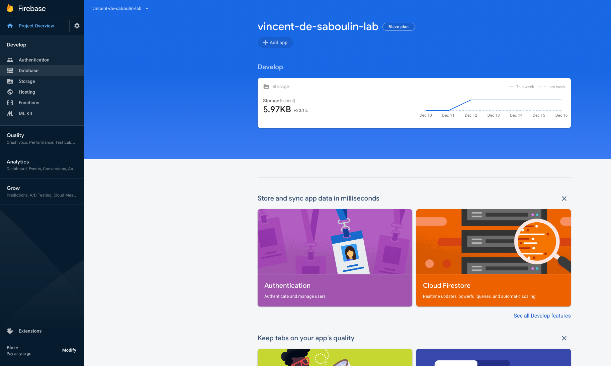
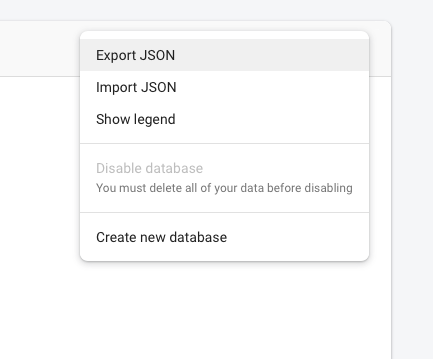
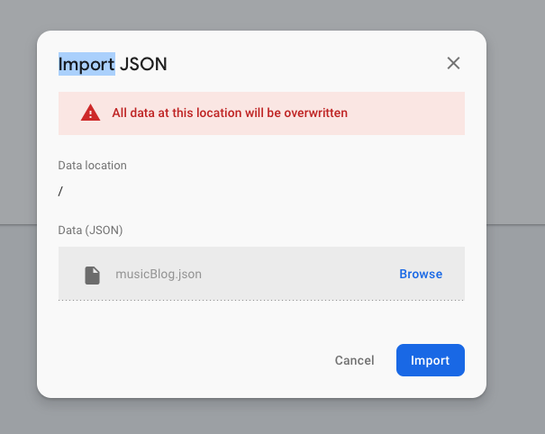
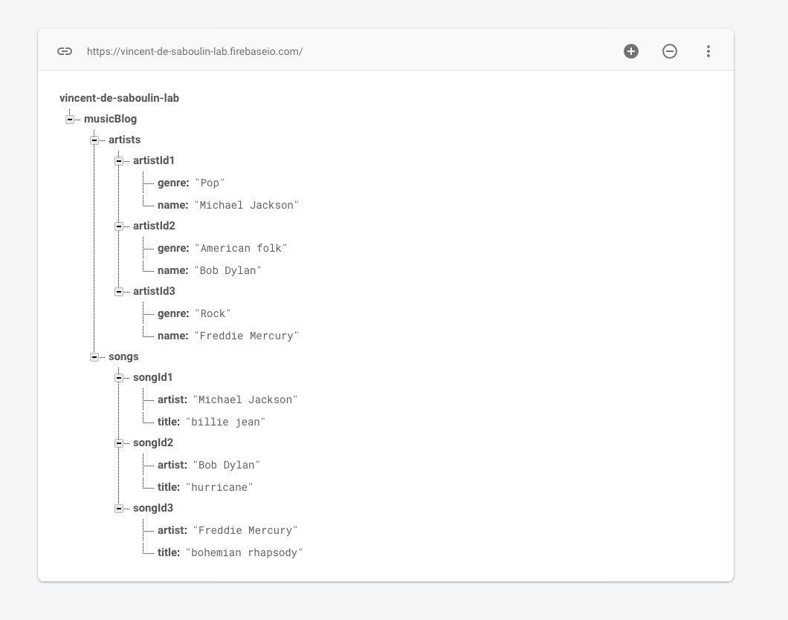

# GCP Firebase Source connector

## Objective

Quickly test [GCP Firebase Source](https://docs.confluent.io/current/connect/kafka-connect-firebase/source/index.html#quick-start) connector.


* Active Google Cloud Platform (GCP) account with authorization to create resources

## GCP Firebase Setup

### Service Account setup

Create `Service Account` from IAM & Admin console:

Set `Service account name`:



Choose permission `Firebase`->`Firebase Realtime Database Viewer`



Create Key:


Download it as JSON:


Rename it to `keyfile.json` and place it in `./keyfile.json`


### Realtime Database setup

Go to [Firebase console](https://console.firebase.google.com), click `Add Project` and choose your GCP project.

In your console, click `Database`on the left sidebar:



Click on `Realtime Database`:


Click on `Enable`:


Click on vertical dots on the right hand side and choose `Import JSON`:



Browse to file `./musicBlog.json` and import it



You should see:



## How to run

Simply run:

```bash
$ ./gcp-firebase-source.sh <PROJECT>
```

## Details of what the script is doing


Creating GCP Firebase Source connector

```bash
$ curl -X PUT \
     -H "Content-Type: application/json" \
     --data '{
               "connector.class" : "io.confluent.connect.firebase.FirebaseSourceConnector",
                    "tasks.max" : "1",
                    "gcp.firebase.credentials.path": "/root/keyfiles/keyfile.json",
                    "gcp.firebase.database.reference": "https://'"$PROJECT"'.firebaseio.com/musicBlog",
                    "gcp.firebase.snapshot":"true",
                    "confluent.topic.bootstrap.servers": "broker:9092",
                    "confluent.topic.replication.factor": "1"
          }' \
     http://localhost:8083/connectors/firebase-source/config | jq .
```

Verify messages are in topic `artists`

```bash
$ docker exec connect kafka-avro-console-consumer -bootstrap-server broker:9092 --property schema.registry.url=http://schema-registry:8081 --topic artists --from-beginning --max-messages 3
```

Results:

```json
{"genre":"Pop","name":"Michael Jackson"}
{"genre":"American folk","name":"Bob Dylan"}
{"genre":"Rock","name":"Freddie Mercury"}
```

Verify messages are in topic `songs`

```bash
$ docker exec connect kafka-avro-console-consumer -bootstrap-server broker:9092 --property schema.registry.url=http://schema-registry:8081 --topic songs --from-beginning --max-messages 3
```

Results:

```json
{"artist":"Michael Jackson","title":"billie jean"}
{"artist":"Bob Dylan","title":"hurricane"}
{"artist":"Freddie Mercury","title":"bohemian rhapsody"}
```

N.B: Control Center is reachable at [http://127.0.0.1:9021](http://127.0.0.1:9021])
