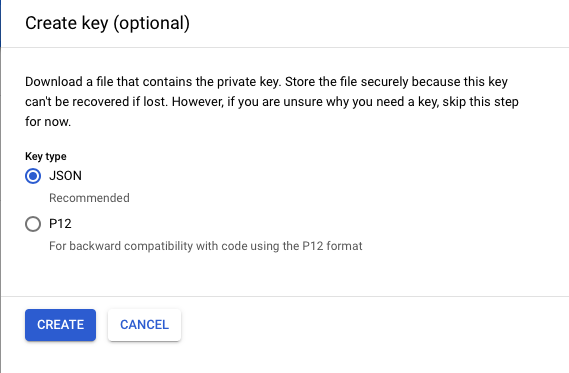

# GCS Source connector


## Objective

Quickly test [GCS Source](https://docs.confluent.io/current/connect/kafka-connect-gcs/source/index.html#quick-start) connector.

* Active Google Cloud Platform (GCP) account with authorization to create resources

## Prepare a Bucket

[Instructions](https://docs.confluent.io/current/connect/kafka-connect-gcs/index.html#prepare-a-bucket)

* Create `Service Account` from IAM & Admin console:

Set `Service account name`:


Choose permission `Storage Admin` (probably not required to have all of them):


Create Key:


Download it as JSON:



Rename it to `keyfile.json`and place it in `./keyfile.json`


## How to run

Simply run:

```bash
$ ./gcs-source.sh <PROJECT> <GCS_BUCKET_NAME>
```

Note: you can also export these values as environment variable

## Details of what the script is doing

Steps from [connect-gcp-gcs-sink](../connect/connect-gcp-gcs-sink/README.md)

Creating GCS Source connector

```bash
$ curl -X PUT \
     -H "Content-Type: application/json" \
     --data '{
               "connector.class": "io.confluent.connect.gcs.GcsSourceConnector",
                    "gcs.bucket.name" : "'"$GCS_BUCKET_NAME"'",
                    "gcs.credentials.path" : "/root/keyfiles/keyfile.json",
                    "format.class": "io.confluent.connect.gcs.format.avro.AvroFormat",
                    "tasks.max" : "1",
                    "confluent.topic.bootstrap.servers" : "broker:9092",
                    "confluent.topic.replication.factor" : "1",
                    "transforms" : "AddPrefix",
                    "transforms.AddPrefix.type" : "org.apache.kafka.connect.transforms.RegexRouter",
                    "transforms.AddPrefix.regex" : ".*",
                    "transforms.AddPrefix.replacement" : "copy_of_$0"
          }' \
     http://localhost:8083/connectors/GCSSourceConnector/config | jq .
```

Verify messages are in topic `copy_of_gcs_topic`

```bash
$ docker exec connect kafka-avro-console-consumer -bootstrap-server broker:9092 --property schema.registry.url=http://schema-registry:8081 --topic copy_of_gcs_topic --from-beginning --max-messages 9
```

Results:

```json
{"f1":"value1"}
{"f1":"value2"}
{"f1":"value3"}
{"f1":"value4"}
{"f1":"value5"}
{"f1":"value6"}
{"f1":"value7"}
{"f1":"value8"}
{"f1":"value9"}
```

N.B: Control Center is reachable at [http://127.0.0.1:9021](http://127.0.0.1:9021])

