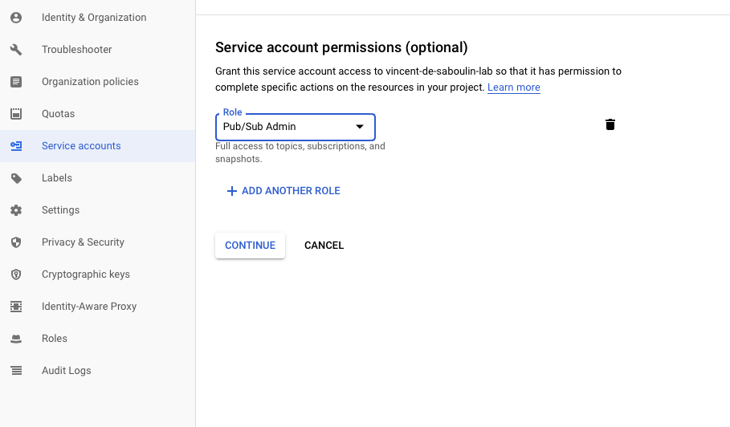

# GCP Pub/Sub Source connector

## Objective

Quickly test [GCP Pub/Sub Source](https://docs.confluent.io/current/connect/kafka-connect-gcp-pubsub/index.html#quick-start) connector.

## Pre-requisites

* `docker-compose` (example `brew cask install docker`)
* Active Google Cloud Platform (GCP) account with authorization to create resources

## GCP Pub/Sub Setup

* Create `Service Account` from IAM & Admin console:

Set `Service account name`:


Choose permission `Pub/Sub`->`Pub/Sub Admin`



Create Key:


Download it as JSON:


Rename it to `keyfile.json`and place it in `./keyfile.json`


## How to run

Simply run:

```bash
$ ./gcp-pubsub.sh <PROJECT>
```

## Details of what the script is doing

Doing gsutil authentication

```bash
$ gcloud auth activate-service-account --key-file ${KEYFILE}
```

Create a Pub/Sub topic called topic-1

```bash
$ gcloud pubsub topics create topic-1
```

Create a Pub/Sub subscription called subscription-1

```bash
$ gcloud pubsub subscriptions create --topic topic-1 subscription-1
```

Publish three messages to topic-1

```bash
$ gcloud pubsub topics publish topic-1 --message "Peter"
gcloud pubsub topics publish topic-1 --message "Megan"
gcloud pubsub topics publish topic-1 --message "Erin"
```

Creating GCP PubSub Source connector

```bash
$ docker exec -e PROJECT="$PROJECT" connect \
     curl -X PUT \
     -H "Content-Type: application/json" \
     --data '{
               "connector.class" : "io.confluent.connect.gcp.pubsub.PubSubSourceConnector",
                    "tasks.max" : "1",
                    "kafka.topic" : "pubsub-topic",
                    "gcp.pubsub.project.id" : "'"$PROJECT"'",
                    "gcp.pubsub.topic.id" : "topic-1",
                    "gcp.pubsub.subscription.id" : "subscription-1",
                    "gcp.pubsub.credentials.path" : "/root/keyfiles/keyfile.json",
                    "confluent.topic.bootstrap.servers": "broker:9092",
                    "confluent.topic.replication.factor": "1"
          }' \
     http://localhost:8083/connectors/pubsub-source/config | jq_docker_cli .
```

Verify messages are in topic `pubsub-topic`

```bash
$ docker exec schema-registry kafka-avro-console-consumer -bootstrap-server broker:9092 --topic pubsub-topic --from-beginning --max-messages 3
```

Results:

```json
{"MessageData":{"string":"Megan"},"AttributesMap":{}}
{"MessageData":{"string":"Peter"},"AttributesMap":{}}
{"MessageData":{"string":"Erin"},"AttributesMap":{}}
```

N.B: Control Center is reachable at [http://127.0.0.1:9021](http://127.0.0.1:9021])
