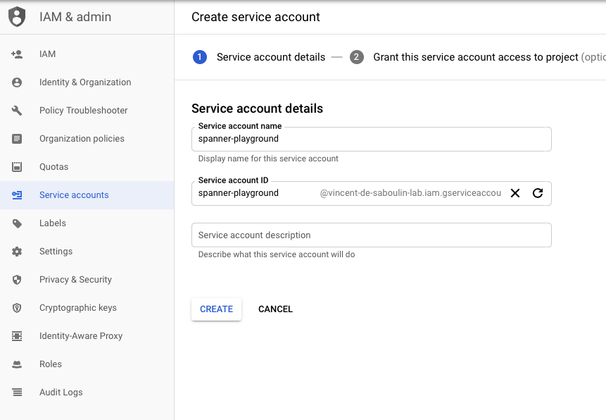
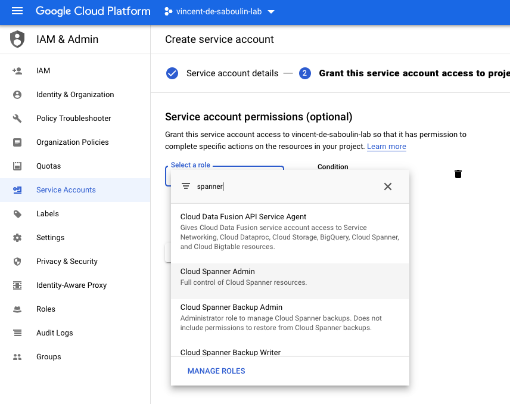

# GCP Spanner Sink connector

## Objective

Quickly test [GCP Spanner Sink](https://docs.confluent.io/current/connect/kafka-connect-gcp-spanner/index.html#quick-start) connector.

* Active Google Cloud Platform (GCP) account with authorization to create resources

## GCP Spanner Setup

### Create a Spanner Instance and Database

* Create a test instance named `test-instance` in Spanner using the console. See the [Cloud Spanner Quickstart](https://cloud.google.com/spanner/docs/quickstart-console#create_an_instance) for instructions.
* Create a database named `example-db` under the `test-instance`. See the [Cloud Spanner Quickstart](https://cloud.google.com/spanner/docs/quickstart-console#create_an_instance) for instructions.


### Setup Credentials

* Create `Service Account` from IAM & Admin console:

Set `Service account name`:



Choose permission `Cloud Spanner`->`Cloud Spanner Database Admin`



Create Key:


Download it as JSON:


Rename it to `keyfile.json`and place it in `./keyfile.json`


## How to run

Simply run:

```bash
$ ./gcp-spanner.sh <PROJECT> <INSTANCE> <DATABASE>
```

## Details of what the script is doing

Sending messages to topic `products`:

```bash
$ docker exec -i connect kafka-avro-console-producer --broker-list broker:9092 --property schema.registry.url=http://schema-registry:8081 --topic products --property value.schema='{"type":"record","name":"myrecord","fields":[{"name":"name","type":"string"},
{"name":"price", "type": "float"}, {"name":"quantity", "type": "int"}]}' << EOF
{"name": "scissors", "price": 2.75, "quantity": 3}
{"name": "tape", "price": 0.99, "quantity": 10}
{"name": "notebooks", "price": 1.99, "quantity": 5}
EOF
```

The connector is created with:

```bash
$ docker exec -e INSTANCE="$INSTANCE" -e DATABASE="$DATABASE" connect \
curl -X PUT \
     -H "Content-Type: application/json" \
     --data '{
               "connector.class": "io.confluent.connect.gcp.spanner.SpannerSinkConnector",
               "tasks.max" : "1",
               "topics" : "products",
               "auto.create" : "true",
               "table.name.format" : "kafka_${topic}",
               "gcp.spanner.instance.id" : "'"$INSTANCE"'",
               "gcp.spanner.database.id" : "'"$DATABASE"'",
               "gcp.spanner.credentials.path" : "/root/keyfiles/keyfile.json",
               "confluent.license": "",
               "confluent.topic.bootstrap.servers": "broker:9092",
               "confluent.topic.replication.factor": "1"
          }' \
     http://localhost:8083/connectors/gcp-spanner-sink/config | jq .
```

After a few seconds, data should be in GCP Spanner:

```bash
$ docker run -ti --volumes-from gcloud-config google/cloud-sdk:latest gcloud spanner databases execute-sql $DATABASE --instance $INSTANCE --project $PROJECT --sql='select * from kafka_products'
connect_topic__  connect_partition__  connect_offset__  name       price           quantity
products         0                    0                 scissors   2.75            3
products         0                    1                 tape       0.990000009537  10
products         0                    2                 notebooks  1.99000000954   5

```

N.B: Control Center is reachable at [http://127.0.0.1:9021](http://127.0.0.1:9021])
