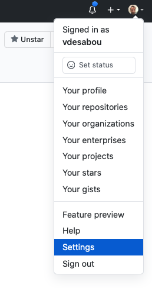
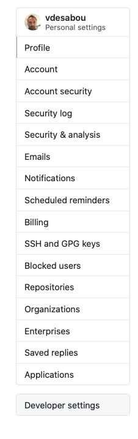
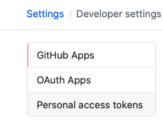
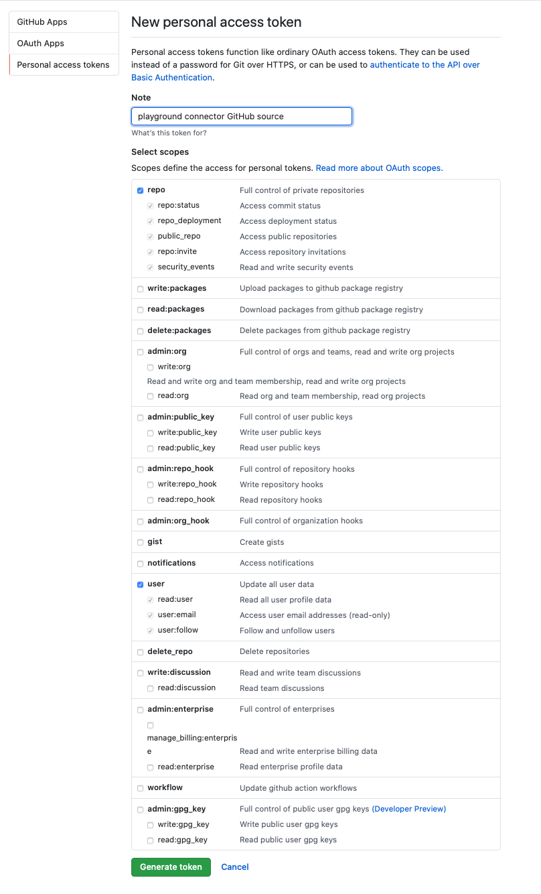

# Github Source connector


## Objective

Quickly test [Github Source](https://docs.confluent.io/current/connect/kafka-connect-github/index.html#quick-start) connector.


## Create a personal access token

Go to your Github account and select `Settings`:



Click on `Developer Settings`:



Click on `Personal access tokens`:



Generate new token with `repo` and `user` selected:



## How to run

Simply run:

```
$ ./github-source.sh <GITHUB_ACCESS_TOKEN>
```

Note: you can also export these values as environment variable

## Details of what the script is doing


Creating Github Source connector

```bash
$ curl -X PUT \
     -H "Content-Type: application/json" \
     --data '{
                    "connector.class": "io.confluent.connect.github.GithubSourceConnector",
                    "topic.name.pattern":"github-topic-${entityName}",
                    "tasks.max": "1",
                    "github.service.url":"https://api.github.com",
                    "github.repositories":"apache/kafka",
                    "github.tables":"stargazers",
                    "github.since":"2019-01-01",
                    "github.access.token": "'"$GITHUB_ACCESS_TOKEN"'",
                    "key.converter": "io.confluent.connect.avro.AvroConverter",
                    "key.converter.schema.registry.url":"http://schema-registry:8081",
                    "value.converter": "io.confluent.connect.avro.AvroConverter",
                    "value.converter.schema.registry.url":"http://schema-registry:8081",
                    "confluent.license": "",
                    "confluent.topic.bootstrap.servers": "broker:9092",
                    "confluent.topic.replication.factor": "1"
          }' \
     http://localhost:8083/connectors/github-source/config | jq
```

Verify we have received the data in `github-topic-stargazers` topic

```
$ docker exec connect kafka-avro-console-consumer -bootstrap-server broker:9092 --property schema.registry.url=http://schema-registry:8081 --topic github-topic-stargazers --from-beginning --property print.key=true --max-messages 1
```

Results:

```json
{"id":{"string":"apache/kafka_STARGAZERS_1310"},"sha":null}     {"type":{"string":"STARGAZERS"},"createdAt":null,"data":{"data":{"login":{"string":"dyokomizo"},"id":{"int":1310},"node_id":{"string":"MDQ6VXNlcjEzMTA="},"avatar_url":{"string":"https://avatars3.githubusercontent.com/u/1310?v=4"},"gravatar_id":{"string":""},"url":{"string":"https://api.github.com/users/dyokomizo"},"html_url":{"string":"https://github.com/dyokomizo"},"followers_url":{"string":"https://api.github.com/users/dyokomizo/followers"},"following_url":{"string":"https://api.github.com/users/dyokomizo/following{/other_user}"},"gists_url":{"string":"https://api.github.com/users/dyokomizo/gists{/gist_id}"},"starred_url":{"string":"https://api.github.com/users/dyokomizo/starred{/owner}{/repo}"},"subscriptions_url":{"string":"https://api.github.com/users/dyokomizo/subscriptions"},"organizations_url":{"string":"https://api.github.com/users/dyokomizo/orgs"},"repos_url":{"string":"https://api.github.com/users/dyokomizo/repos"},"events_url":{"string":"https://api.github.com/users/dyokomizo/events{/privacy}"},"received_events_url":{"string":"https://api.github.com/users/dyokomizo/received_events"},"type":{"string":"User"},"site_admin":{"boolean":false}}},"id":{"string":"1310"}}
```

N.B: Control Center is reachable at [http://127.0.0.1:9021](http://127.0.0.1:9021])
