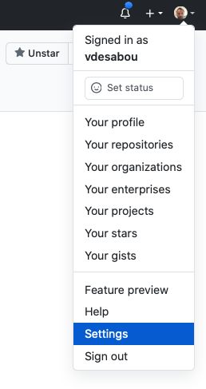
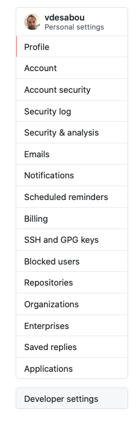
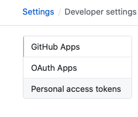
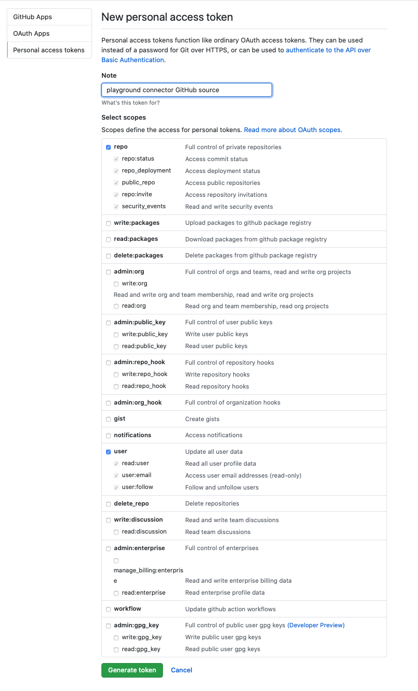

# Github Source connector


## Objective

Quickly test [Github Source](https://docs.confluent.io/current/connect/kafka-connect-github/index.html#quick-start) connector.


## Create a personal access token

Go to your Github account and select `Settings`:



Click on `Developer Settings`:



Click on `Personal access tokens`:



Generate new token with `repo` and `user` selected:



Set environment variable `CONNECTOR_GITHUB_ACCESS_TOKEN` with your personal access token:

```bash
export CONNECTOR_GITHUB_ACCESS_TOKEN=<your_personal_access_token>
```

Also set environment variable `CONNECTOR_GITHUB_REPOSITORIES` with the repositories you want to monitor **which are in your github org**, for example:

```bash
export CONNECTOR_GITHUB_REPOSITORIES=confluentinc/examples,confluentinc/kafka-connect-github
```

## How to run

Simply run:

```
$ just use <playground run> command and search for github-source<use tab key to activate fzf completion (see https://kafka-docker-playground.io/#/cli?id=%e2%9a%a1-setup-completion), otherwise use full path, or correct relative path> .sh in this folder
```
