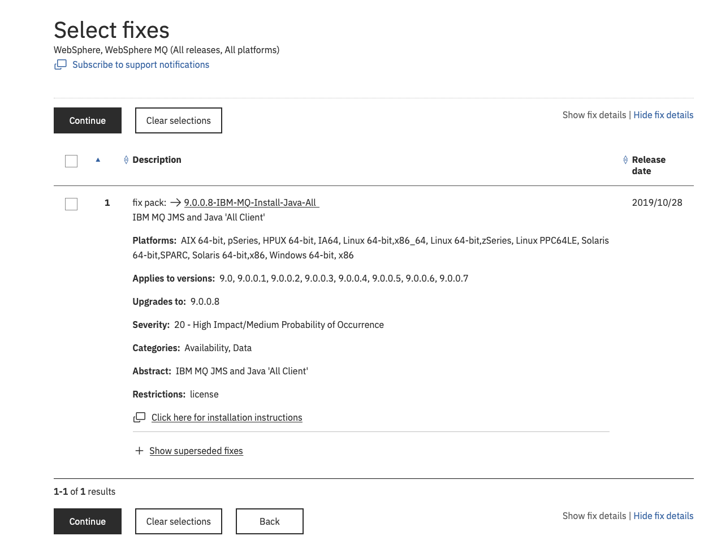

# IBM MQ Sink connector


## Objective

Quickly test [IBM MQ Sink](https://docs.confluent.io/current/connect/kafka-connect-ibmmq/sink/index.html#quick-start) connector.

Using IBM MQ Docker [image](https://hub.docker.com/r/ibmcom/mq/)

## Pre-requisites

* `docker-compose` (example `brew cask install docker`)
* Download [9.0.0.8-IBM-MQ-Install-Java-All.jar](https://www-945.ibm.com/support/fixcentral/swg/selectFixes?product=ibm%2FWebSphere%2FWebSphere+MQ&fixids=9.0.0.4-IBM-MQ-Install-Java-All&source=dbluesearch&function=fixId&parent=ibm/WebSphere) and place it in `./9.0.0.8-IBM-MQ-Install-Java-All.jar`



## How to run

Simply run:

```
$ ./ibm-mq-sink.sh
```

## Details of what the script is doing

The connector is created with:

```bash
$ docker exec connect \
     curl -X PUT \
     -H "Content-Type: application/json" \
     --data '{
               "connector.class": "io.confluent.connect.jms.IbmMqSinkConnector",
                    "topics": "sink-messages",
                    "mq.hostname": "ibmmq",
                    "mq.port": "1414",
                    "mq.transport.type": "client",
                    "mq.queue.manager": "QM1",
                    "mq.channel": "DEV.APP.SVRCONN",
                    "mq.username": "app",
                    "mq.password": "passw0rd",
                    "jms.destination.name": "DEV.QUEUE.1",
                    "jms.destination.type": "queue",
                    "value.converter": "org.apache.kafka.connect.storage.StringConverter",
                    "key.converter": "org.apache.kafka.connect.storage.StringConverter",
                    "confluent.license": "",
                    "confluent.topic.bootstrap.servers": "broker:9092",
                    "confluent.topic.replication.factor": "1"
          }' \
     http://localhost:8083/connectors/ibm-mq-sink/config | jq .
```

Sending messages to topic `sink-messages`:

```bash
$ docker exec -i broker kafka-console-producer --broker-list broker:9092 --topic sink-messages << EOF
This is my message
EOF
```

Verify message received in `DEV.QUEUE.1` queue:

```bash
$ docker exec ibmmq bash -c "/opt/mqm/samp/bin/amqsbcg DEV.QUEUE.1"
```

Results:

```
AMQSBCG0 - starts here
**********************

 MQOPEN - 'DEV.QUEUE.1'


 MQGET of message number 1, CompCode:0 Reason:0
****Message descriptor****

  StrucId  : 'MD  '  Version : 2
  Report   : 0  MsgType : 8
  Expiry   : -1  Feedback : 0
  Encoding : 273  CodedCharSetId : 1208
  Format : 'MQHRF2  '
  Priority : 4  Persistence : 1
  MsgId : X'414D5120514D312020202020202020203F8EA85D1EA66A20'
  CorrelId : X'000000000000000000000000000000000000000000000000'
  BackoutCount : 0
  ReplyToQ       : '                                                '
  ReplyToQMgr    : 'QM1                                             '
  ** Identity Context
  UserIdentifier : 'app         '
  AccountingToken :
   X'0000000000000000000000000000000000000000000000000000000000000000'
  ApplIdentityData : '                                '
  ** Origin Context
  PutApplType    : '28'
  PutApplName    : 'cli.ConnectDistributed      '
  PutDate  : '20191017'    PutTime  : '16024736'
  ApplOriginData : '    '

  GroupId : X'000000000000000000000000000000000000000000000000'
  MsgSeqNumber   : '1'
  Offset         : '0'
  MsgFlags       : '0'
  OriginalLength : '-1'

****   Message      ****

 length - 174 of 174 bytes

00000000:  5246 4820 0000 0002 0000 009C 0000 0111           'RFH ............'
00000010:  0000 04B8 4D51 5354 5220 2020 0000 0000           '....MQSTR   ....'
00000020:  0000 04B8 0000 0020 3C6D 6364 3E3C 4D73           '....... <mcd><Ms'
00000030:  643E 6A6D 735F 7465 7874 3C2F 4D73 643E           'd>jms_text</Msd>'
00000040:  3C2F 6D63 643E 2020 0000 0050 3C6A 6D73           '</mcd>  ...P<jms'
00000050:  3E3C 4473 743E 7175 6575 653A 2F2F 2F44           '><Dst>queue:///D'
00000060:  4556 2E51 5545 5545 2E31 3C2F 4473 743E           'EV.QUEUE.1</Dst>'
00000070:  3C54 6D73 3E31 3537 3133 3238 3136 3733           '<Tms>15713281673'
00000080:  3632 3C2F 546D 733E 3C44 6C76 3E32 3C2F           '62</Tms><Dlv>2</'
00000090:  446C 763E 3C2F 6A6D 733E 2020 5468 6973           'Dlv></jms>  This'
000000A0:  2069 7320 6D79 206D 6573 7361 6765                ' is my message  '


 No more messages
 MQCLOSE
 MQDISC
```

N.B: Control Center is reachable at [http://127.0.0.1:9021](http://127.0.0.1:9021])
