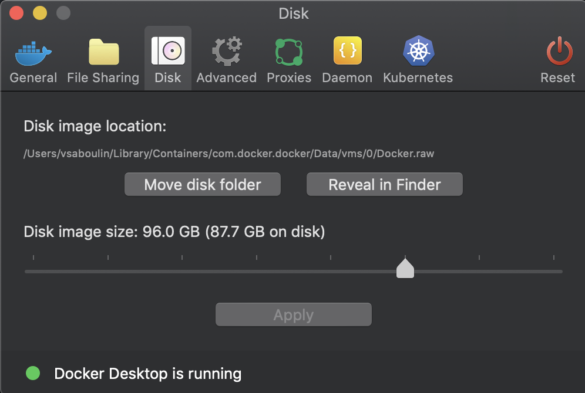

# JDBC Oracle 19 Source connector

## Objective

Quickly test [JDBC Source](https://docs.confluent.io/current/connect/kafka-connect-jdbc/source-connector/index.html#kconnect-long-jdbc-source-connector) connector with Oracle 19c.

N.B: if you're a Confluent employee, please check this [link](https://confluent.slack.com/archives/C0116NM415F/p1636391410032900) and also [here](https://confluent.slack.com/archives/C0116NM415F/p1636389483030900).

* If you're using a JDBC connector version before `10.0.0`, you need to download Oracle Database 12.2.0.1 JDBC Driver `ojdbc8.jar`from this [page](https://www.oracle.com/database/technologies/jdbc-ucp-122-downloads.html) and place it in `./ojdbc8.jar`

Download Oracle Database 19c (19.3) for Linux x86-64 `LINUX.X64_193000_db_home.zip`from this [page](https://www.oracle.com/database/technologies/oracle19c-linux-downloads.html) and place it in `./LINUX.X64_193000_db_home.zip`

Note: The first time you'll run the script, it will build (using this [project](https://github.com/oracle/docker-images/blob/master/OracleDatabase/SingleInstance/README.md)) the docker image `oracle/database:19.3.0-ee`. It takes about 10 minutes.

**Please make sure to increase Docker disk image size (96Gb is known to be working)**:



## Performance testing

You can set environment variable `SQL_DATAGEN` before running the example and it will use a Java based datagen tool:

Example:

```
DURATION=10
log "Injecting data for $DURATION minutes"
docker exec -d sql-datagen bash -c "java ${JAVA_OPTS} -jar sql-datagen-1.0-SNAPSHOT-jar-with-dependencies.jar --host oracle --username C##MYUSER --password mypassword --sidOrServerName sid --sidOrServerNameVal ORCLCDB --maxPoolSize 10 --durationTimeMin $DURATION"
```

You can increase thoughtput with `maxPoolSize`.

## How to run

Without SSL:

```
$ playground run -f oracle19<tab>
```

with SSL encryption:

```
$ playground run -f oracle19-ssl<tab>
```

with SSL encryption + Mutual TLS (case #3 in this [document](https://www.oracle.com/technetwork/database/enterprise-edition/wp-oracle-jdbc-thin-ssl-130128.pdf)):

```
$ playground run -f oracle19-mtls<tab>
```

with SSL encryption + Mutual TLS + DB authentication (case #4 in this [document](https://www.oracle.com/technetwork/database/enterprise-edition/wp-oracle-jdbc-thin-ssl-130128.pdf):

```
$ playground run -f oracle19-mtls-db-auth<tab>
```

N.B: this is the [best resource](https://www.oracle.com/technetwork/topics/wp-oracle-jdbc-thin-ssl-130128.pdf) I found for Oracle DB and SSL.

## Details of what the script is doing

Build `oracle/database:19.3.0-ee` Docker image if required.

Wait (up to 15 minutes) that Oracle DB is up

### Without SSL

Create the source connector with:

```bash
$ curl -X PUT \
     -H "Content-Type: application/json" \
     --data '{
               "connector.class":"io.confluent.connect.jdbc.JdbcSourceConnector",
                    "tasks.max":"1",
                    "connection.user": "myuser",
                    "connection.password": "mypassword",
                    "connection.url": "jdbc:oracle:thin:@oracle:1521/ORCLPDB1",
                    "numeric.mapping":"best_fit",
                    "mode":"timestamp",
                    "poll.interval.ms":"1000",
                    "validate.non.null":"false",
                    "table.whitelist":"CUSTOMERS",
                    "timestamp.column.name":"UPDATE_TS",
                    "topic.prefix":"oracle-",
                    "errors.log.enable": "true",
                    "errors.log.include.messages": "true"
          }' \
     http://localhost:8083/connectors/oracle-source/config | jq .
```

Verify the topic `oracle-CUSTOMERS`:

```bash
playground topic consume --topic oracle-CUSTOMERS --expected-messages 2
```

Results:

```json
{"ID":1,"FIRST_NAME":{"string":"Rica"},"LAST_NAME":{"string":"Blaisdell"},"EMAIL":{"string":"rblaisdell0@rambler.ru"},"GENDER":{"string":"Female"},"CLUB_STATUS":{"string":"bronze"},"COMMENTS":{"string":"Universal optimal hierarchy"},"CREATE_TS":{"long":1571238426253},"UPDATE_TS":{"long":1571238426000}}
{"ID":2,"FIRST_NAME":{"string":"Ruthie"},"LAST_NAME":{"string":"Brockherst"},"EMAIL":{"string":"rbrockherst1@ow.ly"},"GENDER":{"string":"Female"},"CLUB_STATUS":{"string":"platinum"},"COMMENTS":{"string":"Reverse-engineered tangible interface"},"CREATE_TS":{"long":1571238426260},"UPDATE_TS":{"long":1571238426000}}
```

### With SSL encryption

`oracle` container is started first in order to get generated certificates from wallet.

wallet `/tmp/server` is created with:

```bash
# Create a wallet for the test CA

$ docker exec oracle bash -c "orapki wallet create -wallet /tmp/root -pwd WalletPasswd123"
# Add a self-signed certificate to the wallet
$ docker exec oracle bash -c "orapki wallet add -wallet /tmp/root -dn CN=root_test,C=US -keysize 2048 -self_signed -validity 3650 -pwd WalletPasswd123"
# Export the certificate
$ docker exec oracle bash -c "orapki wallet export -wallet /tmp/root -dn CN=root_test,C=US -cert /tmp/root/b64certificate.txt -pwd WalletPasswd123"

# Create a wallet for the Oracle server

# Create an empty wallet with auto login enabled
$ docker exec oracle bash -c "orapki wallet create -wallet /tmp/server -pwd WalletPasswd123 -auto_login"
# Add a user In the wallet (a new pair of private/public keys is created)
$ docker exec oracle bash -c "orapki wallet add -wallet /tmp/server -dn CN=server,C=US -pwd WalletPasswd123 -keysize 2048"
# Export the certificate request to a file
$ docker exec oracle bash -c "orapki wallet export -wallet /tmp/server -dn CN=server,C=US -pwd WalletPasswd123 -request /tmp/server/creq.txt"
# Using the test CA, sign the certificate request
$ docker exec oracle bash -c "orapki cert create -wallet /tmp/root -request /tmp/server/creq.txt -cert /tmp/server/cert.txt -validity 3650 -pwd WalletPasswd123"
# You now have the following files under the /tmp/server directory
$ docker exec oracle ls /tmp/server
# View the signed certificate:
$ docker exec oracle bash -c "orapki cert display -cert /tmp/server/cert.txt -complete"
# Add the test CA's trusted certificate to the wallet
$ docker exec oracle bash -c "orapki wallet add -wallet /tmp/server -trusted_cert -cert /tmp/root/b64certificate.txt -pwd WalletPasswd123"
# add the user certificate to the wallet:
$ docker exec oracle bash -c "orapki wallet add -wallet /tmp/server -user_cert -cert /tmp/server/cert.txt -pwd WalletPasswd123"
```

`truststore.jks` is created with:

```bash
# We import the test CA certificate
$ keytool -import -v -alias testroot -file /tmp/b64certificate.txt -keystore /tmp/truststore.jks -storetype JKS -storepass 'welcome123' -noprompt
log "Displaying truststore"
$ keytool -list -keystore /tmp/truststore.jks -storepass 'welcome123' -v
```


Oracle DB is updated to use new `.ora` files, with TCPS config:

listener.ora:

```
SSL_CLIENT_AUTHENTICATION = FALSE

WALLET_LOCATION =
  (SOURCE =
    (METHOD = FILE)
    (METHOD_DATA =
      (DIRECTORY = /tmp/server)
    )
  )

LISTENER =
(DESCRIPTION_LIST =
  (DESCRIPTION =
    (ADDRESS = (PROTOCOL = IPC)(KEY = EXTPROC1))
    (ADDRESS = (PROTOCOL = TCP)(HOST = 0.0.0.0)(PORT = 1521))
  )
  (DESCRIPTION =
     (ADDRESS = (PROTOCOL = TCPS)(HOST = 0.0.0.0)(PORT = 1532))
   )
)

DEDICATED_THROUGH_BROKER_LISTENER=ON
DIAG_ADR_ENABLED = off
```

sqlnet.ora:

```
NAME.DIRECTORY_PATH= (TNSNAMES, EZCONNECT, HOSTNAME)
WALLET_LOCATION =
   (SOURCE =
     (METHOD = FILE)
     (METHOD_DATA =
       (DIRECTORY = /tmp/server)
     )
   )

SSL_CLIENT_AUTHENTICATION = FALSE
SSL_CIPHER_SUITES = (SSL_RSA_WITH_AES_256_CBC_SHA, SSL_RSA_WITH_3DES_EDE_CBC_SHA)
```

tnsnames.ora:

```
ORCLPDB1=
  (DESCRIPTION =
    (ADDRESS = (PROTOCOL = TCPS)(HOST = 0.0.0.0)(PORT = 1532))
    (CONNECT_DATA =
      (SERVER = DEDICATED)
      (SERVICE_NAME = ORCLPDB1)
    )
  )
```

`connect` container is configured with truststore:

```
      KAFKA_OPTS: -Djavax.net.ssl.trustStore=/tmp/truststore.jks
                  -Djavax.net.ssl.trustStorePassword=welcome123
```

`connection.url` is set to

```
jdbc:oracle:thin:@(DESCRIPTION=(ADDRESS=(PROTOCOL=TCPS)(HOST=oracle)(PORT=1532))(CONNECT_DATA=(SERVICE_NAME=ORCLCDB))(SECURITY=(SSL_SERVER_CERT_DN=\"CN=server,C=US\")))
```

Note that we force the driver to verify that the server’s DN matches with `"connection.oracle.net.ssl_server_dn_match": "true"` (note that for JDBC connector version lower than 10.x, this property have to be set at JVM level)

### With SSL encryption + Mutual TLS (case #3 in this [document](https://www.oracle.com/technetwork/database/enterprise-edition/wp-oracle-jdbc-thin-ssl-130128.pdf))

`truststore.jks` is same as before.

`keystore.jks` is created with:

```bash
$ keytool -genkey -alias testclient -dname 'CN=connect,C=US' -storepass 'welcome123' -storetype JKS -keystore /tmp/keystore.jks -keyalg RSA
# Generate a CSR (Certificate Signing Request):
$ keytool -certreq -alias testclient -file /tmp/csr.txt -keystore /tmp/keystore.jks -storepass 'welcome123'
# Sign the client certificate using the test CA (root)
docker cp csr.txt oracle:/tmp/csr.txt
docker exec oracle bash -c "orapki cert create -wallet /tmp/root -request /tmp/csr.txt -cert /tmp/cert.txt -validity 3650 -pwd WalletPasswd123"
# import the test CA's certificate:
docker cp oracle:/tmp/root/b64certificate.txt b64certificate.txt
$ keytool -import -v -noprompt -alias testroot -file /tmp/b64certificate.txt -keystore /tmp/keystore.jks -storepass 'welcome123'
# Import the signed certificate
docker cp oracle:/tmp/cert.txt cert.txt
$ keytool -import -v -alias testclient -file /tmp/cert.txt -keystore /tmp/keystore.jks -storepass 'welcome123'
log "Displaying keystore"
$ keytool -list -keystore /tmp/keystore.jks -storepass 'welcome123' -v
```

`.ora` files are same as before except that we set `SSL_CLIENT_AUTHENTICATION = TRUE`.


`connect` container is configured with truststore **and** keystore:

```
      KAFKA_OPTS: -Djavax.net.ssl.trustStore=/tmp/truststore.jks
                  -Djavax.net.ssl.trustStorePassword=welcome123
                  -Djavax.net.ssl.keyStore=/tmp/keystore.jks
                  -Djavax.net.ssl.keyStorePassword=welcome123
```
### With SSL encryption + Mutual TLS + DB authentication (case #4 in this [document](https://www.oracle.com/technetwork/database/enterprise-edition/wp-oracle-jdbc-thin-ssl-130128.pdf)

`.ora` files are same as before except that we set TCPS as authentication `SQLNET.AUTHENTICATION_SERVICES = (TCPS,NTS,BEQ)`.

Connector is set with `"connection.oracle.net.authentication_services": "(TCPS)"` (note that for JDBC connector version lower than 10.x, this property have to be set at JVM level):

```json
"connection.oracle.net.authentication_services": "(TCPS)",
"connection.url": "jdbc:oracle:thin:@(DESCRIPTION=(ADDRESS=(PROTOCOL=TCPS)(HOST=oracle)(PORT=1532))(CONNECT_DATA=(SERVICE_NAME=ORCLCDB))(SECURITY=(SSL_SERVER_CERT_DN=\"CN=server,C=US\")))",
```

N.B: `connection.user` and `connection.password` are not set.

We also need to alter user `myuser` in order to be identified as `CN=connect,C=US`

```bash
$ docker exec -i oracle sqlplus sys/Admin123@//localhost:1521/ORCLCDB as sysdba <<- EOF
	ALTER USER C##MYUSER IDENTIFIED EXTERNALLY AS 'CN=connect,C=US';
	exit;
EOF
```

N.B: Control Center is reachable at [http://127.0.0.1:9021](http://127.0.0.1:9021])
