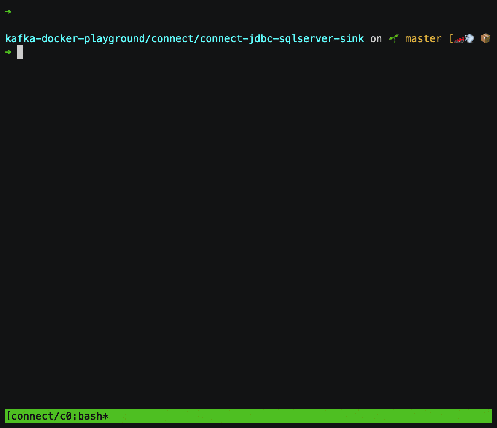

# JDBC SQL Server sink connector



## Objective

Quickly test [JDBC SQL Server](https://docs.confluent.io/current/connect/kafka-connect-jdbc/sink-connector/index.html#kconnect-long-jdbc-sink-connector) sink connector.


## How to run

Simply run:

```
$ ./sqlserver-jtds-sink.sh (with [JTDS](http://jtds.sourceforge.net) driver)

$ ./sqlserver-microsoft-sink.sh (with [Microsoft](https://docs.microsoft.com/en-us/sql/connect/jdbc/microsoft-jdbc-driver-for-sql-server) driver)
```

## Details of what the script is doing

### JTDS JDBC driver

Creating JDBC SQL Server (with JTDS) source connector

```bash
$ docker exec connect \
     curl -X PUT \
     -H "Content-Type: application/json" \
     --data '{
               "connector.class": "io.confluent.connect.jdbc.JdbcSourceConnector",
                    "tasks.max": "1",
                    "connection.url": "jdbc:jtds:sqlserver://sqlserver:1433/testDB",
                    "connection.user": "sa",
                    "connection.password": "Password!",
                    "table.whitelist": "customers",
                    "mode": "incrementing",
                    "incrementing.column.name": "id",
                    "topic.prefix": "sqlserver-",
                    "validate.non.null":"false",
                    "errors.log.enable": "true",
                    "errors.log.include.messages": "true"
          }' \
     http://localhost:8083/connectors/sqlserver-source/config | jq .
```

### Microsoft JDBC driver

```bash
$ docker exec connect \
     curl -X PUT \
     -H "Content-Type: application/json" \
     --data '{
               "connector.class": "io.confluent.connect.jdbc.JdbcSourceConnector",
                    "tasks.max": "1",
                    "connection.url": "jdbc:sqlserver://sqlserver:1433;databaseName=testDB",
                    "connection.user": "sa",
                    "connection.password": "Password!",
                    "table.whitelist": "customers",
                    "mode": "incrementing",
                    "incrementing.column.name": "id",
                    "topic.prefix": "sqlserver-",
                    "validate.non.null":"false",
                    "errors.log.enable": "true",
                    "errors.log.include.messages": "true"
          }' \
     http://localhost:8083/connectors/sqlserver-source/config | jq .

```

Sending messages to topic orders

```bash
$ docker exec -i connect kafka-avro-console-producer --broker-list broker:9092 --property schema.registry.url=http://schema-registry:8081 --topic orders --property value.schema='{"type":"record","name":"myrecord","fields":[{"name":"id","type":"int"},{"name":"product", "type": "string"}, {"name":"quantity", "type": "int"}, {"name":"price",
"type": "float"}]}' << EOF
{"id": 999, "product": "foo", "quantity": 100, "price": 50}
EOF
```

Show content of `orders` table:

```bash
$ ocker exec -i sqlserver /opt/mssql-tools/bin/sqlcmd -U sa -P Password! << EOF
select * from orders
GO
EOF
```


Results:

```
product                                                                                                                                                                                                                                                          quantity    price          id
---------------------------------------------------------------------------------------------------------------------------------------------------------------------------------------------------------------------------------------------------------------- ----------- -------------- -----------
foo                                                                                                                                                                                                                                                                      100           50.0         999

(1 rows affected)
```


N.B: Control Center is reachable at [http://127.0.0.1:9021](http://127.0.0.1:9021])
