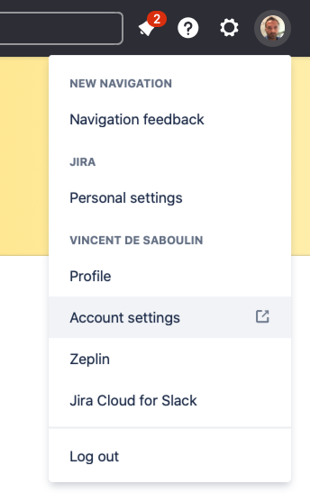
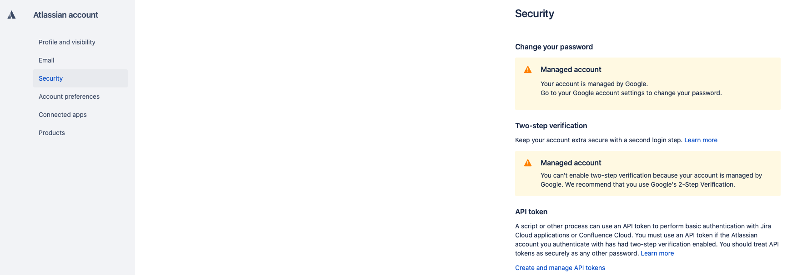
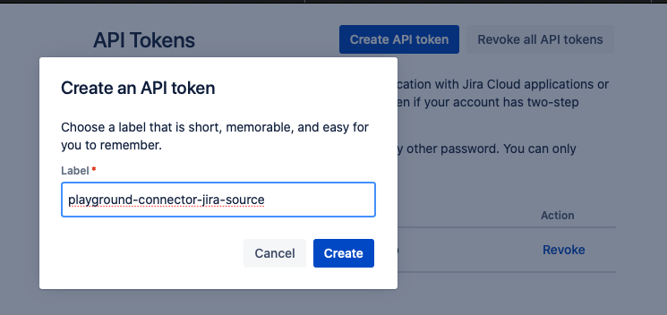

# Jira Source connector


## Objective

Quickly test [Jira Source](https://docs.confluent.io/current/connect/kafka-connect-jira/index.html#quick-start) connector.


## Create an API token

Go to your JIRA instance and select `Accounts Settings`:



Click on `Security`->`Create and manage api tokens`:



Create the API token:



## How to run

Simply run:

```
$ ./jira-source.sh <JIRA_URL> <JIRA_USERNAME> <JIRA_API_TOKEN>
```

Note: you can also export these values as environment variable

## Details of what the script is doing


```bash
SINCE=$(date -v-4320H "+%Y-%m-%d %H:%M")
```

Creating Jira Source connector

```bash
$ curl -X PUT \
     -H "Content-Type: application/json" \
     --data '{
                    "connector.class": "io.confluent.connect.jira.JiraSourceConnector",
                    "topic.name.pattern":"jira-topic-${entityName}",
                    "tasks.max": "1",
                    "jira.url": "'"$JIRA_URL"'",
                    "jira.since": "'"$SINCE"'",
                    "jira.username": "'"$JIRA_USERNAME"'",
                    "jira.api.token": "'"$JIRA_API_TOKEN"'",
                    "jira.tables": "project_categories",
                    "key.converter": "io.confluent.connect.avro.AvroConverter",
                    "key.converter.schema.registry.url":"http://schema-registry:8081",
                    "value.converter": "io.confluent.connect.avro.AvroConverter",
                    "value.converter.schema.registry.url":"http://schema-registry:8081",
                    "confluent.license": "",
                    "confluent.topic.bootstrap.servers": "broker:9092",
                    "confluent.topic.replication.factor": "1"
          }' \
     http://localhost:8083/connectors/jira-source/config | jq .
```

Verify we have received the data in `jira-topic-project_categories` topic

```
$ docker exec connect kafka-avro-console-consumer -bootstrap-server broker:9092 --property schema.registry.url=http://schema-registry:8081 --topic jira-topic-project_categories --from-beginning --property print.key=true --max-messages 1
```

Results:

```json
{"id":"project_categories_10000"}       {"type":"project_categories","data":{"self":"https://confluentinc.atlassian.net/rest/api/2/projectCategory/10000","id":"10000","description":"","name":"Engineering Projects"}}
Processed a total of 1 messages
```

N.B: Control Center is reachable at [http://127.0.0.1:9021](http://127.0.0.1:9021])
