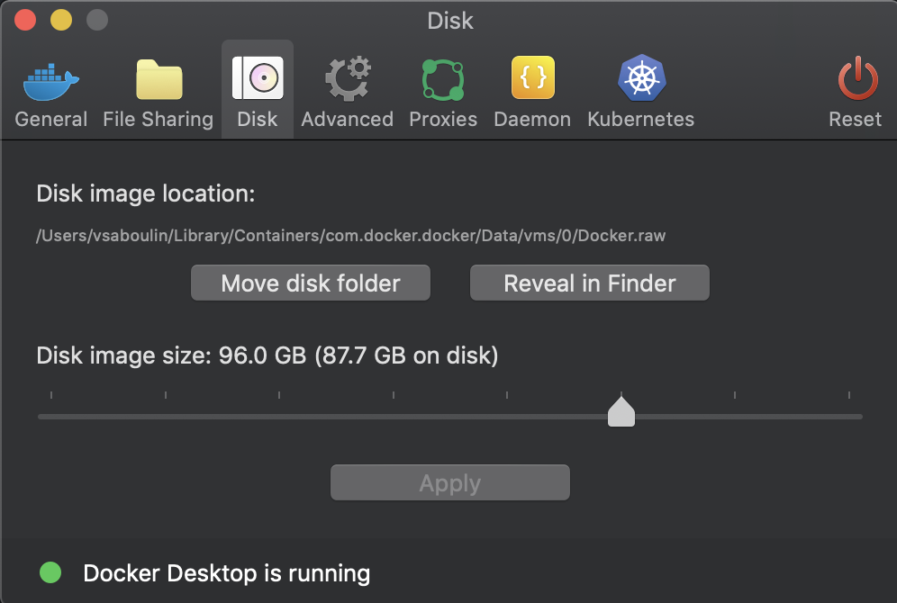

# JMS Oracle AQ (Oracle 21c) Sink connector

## Objective

Quickly test [JMS Sink - Oracle AQ](https://docs.confluent.io/current/connect/kafka-connect-jms/sink/index.html) connector.

N.B: if you're a Confluent employee, please check this [link](https://confluent.slack.com/archives/C0116NM415F/p1636391410032900) and also [here](https://confluent.slack.com/archives/C0116NM415F/p1636389483030900).

Download Oracle Database 21c (21.3) for Linux x86-64 `LINUX.X64_213000_db_home.zip`from this [page](https://www.oracle.com/database/technologies/oracle21c-linux-downloads.html) and place it in `./LINUX.X64_213000_db_home.zip`


Note: The first time you'll run the script, it will build (using this [project](https://github.com/oracle/docker-images/blob/master/OracleDatabase/SingleInstance/README.md)) the docker image `oracle/database:21.3.0-ee`. It takes about 10 minutes.

**Please make sure to increase Docker disk image size (96Gb is known to be working)**:




## How to run

```
$ just use <playground run> command and search for jms-oracle21-sink.sh in this folder
```

## Details of what the script is doing


Grant all permissions to C##MYUSER:

```bash
docker exec -i oracle bash -c "ORACLE_SID=ORCLCDB;export ORACLE_SID;sqlplus /nolog" << EOF
CONNECT sys/Admin123 AS SYSDBA

GRANT EXECUTE ON SYS.DBMS_AQ to C##MYUSER;
GRANT RESOURCE TO C##MYUSER;
GRANT CONNECT TO C##MYUSER;
GRANT EXECUTE ANY PROCEDURE TO C##MYUSER;
GRANT aq_administrator_role TO C##MYUSER;
GRANT aq_user_role TO C##MYUSER;
GRANT EXECUTE ON dbms_aqadm TO C##MYUSER;
GRANT EXECUTE ON dbms_aq TO C##MYUSER;
GRANT EXECUTE ON dbms_aqin TO C##MYUSER;

  exit;
EOF
```

Create JMS QUEUE called PLAYGROUND:

```bash
docker exec -i oracle sqlplus C\#\#MYUSER/mypassword@//localhost:1521/ORCLCDB << EOF

EXEC dbms_aqadm.create_queue_table('PLAYGROUNDTABLE', 'SYS.AQ\$_JMS_TEXT_MESSAGE')
EXEC dbms_aqadm.create_queue('PLAYGROUND','PLAYGROUNDTABLE')
EXEC dbms_aqadm.start_queue('PLAYGROUND')

  exit;
EOF
```

Sending messages to topic sink-messages:

```bash
docker exec -i broker kafka-console-producer --broker-list broker:9092 --topic sink-messages << EOF
This is my message 1
This is my message 2
EOF
```

Creating JMS Oracle AQ source connector:

```bash
playground connector create-or-update --connector jms-oracle-sink  << EOF
{
               "connector.class": "io.confluent.connect.jms.JmsSinkConnector",
               "tasks.max": "1",
               "topics": "sink-messages",

               "db_url": "jdbc:oracle:thin:@oracle:1521/ORCLCDB",
               "java.naming.factory.initial": "oracle.jms.AQjmsInitialContextFactory",
               "java.naming.provider.url": "jdbc:oracle:thin:@oracle:1521/ORCLCDB",
               "java.naming.security.credentials": "mypassword",
               "java.naming.security.principal": "C##MYUSER",
               "jms.destination.name": "PLAYGROUND",
               "jms.destination.type": "queue",
               "jms.message.format": "string",
               "jndi.connection.factory": "javax.jms.XAQueueConnectionFactory",

               "key.converter": "org.apache.kafka.connect.storage.StringConverter",
               "value.converter": "org.apache.kafka.connect.storage.StringConverter",
               "confluent.license": "",
               "confluent.topic.bootstrap.servers": "broker:9092",
               "confluent.topic.replication.factor": "1"
          }
EOF

```

Check table `PLAYGROUNDTABLE`:

```bash
docker exec -i oracle sqlplus C\#\#MYUSER/mypassword@//localhost:1521/ORCLCDB > /tmp/result.log  2>&1 <<-EOF

select * from PLAYGROUNDTABLE;

  exit;
EOF
cat /tmp/result.log
grep "This is my message 1" /tmp/result.log
```


N.B: Control Center is reachable at [http://127.0.0.1:9021](http://127.0.0.1:9021])
